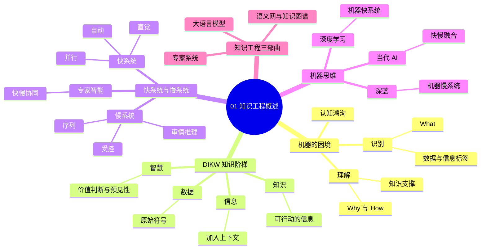
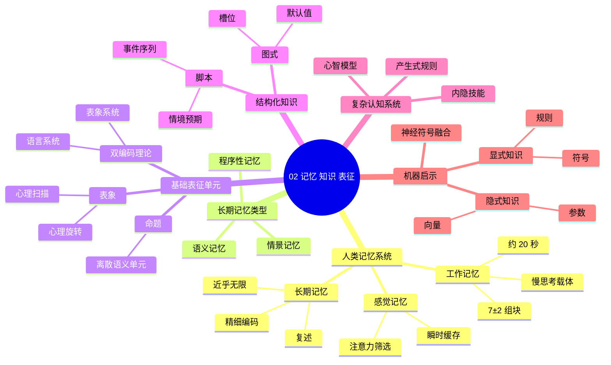
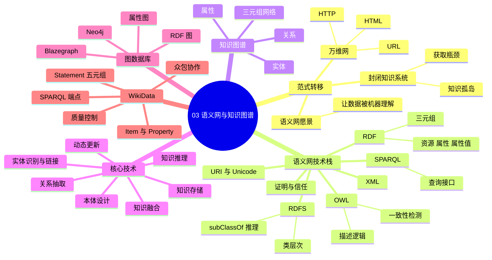
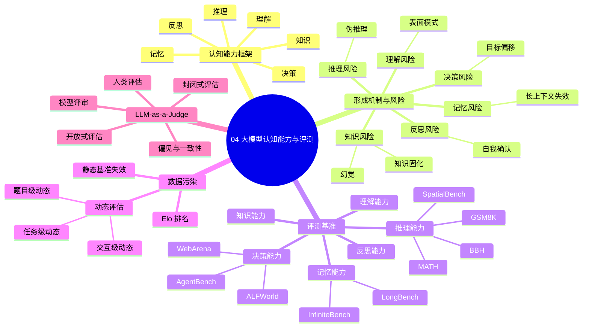
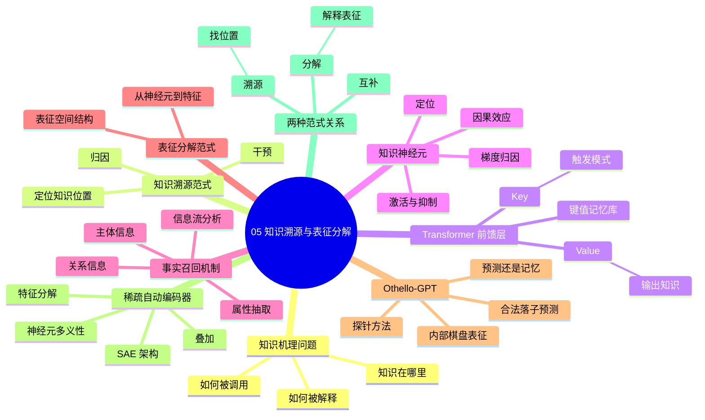
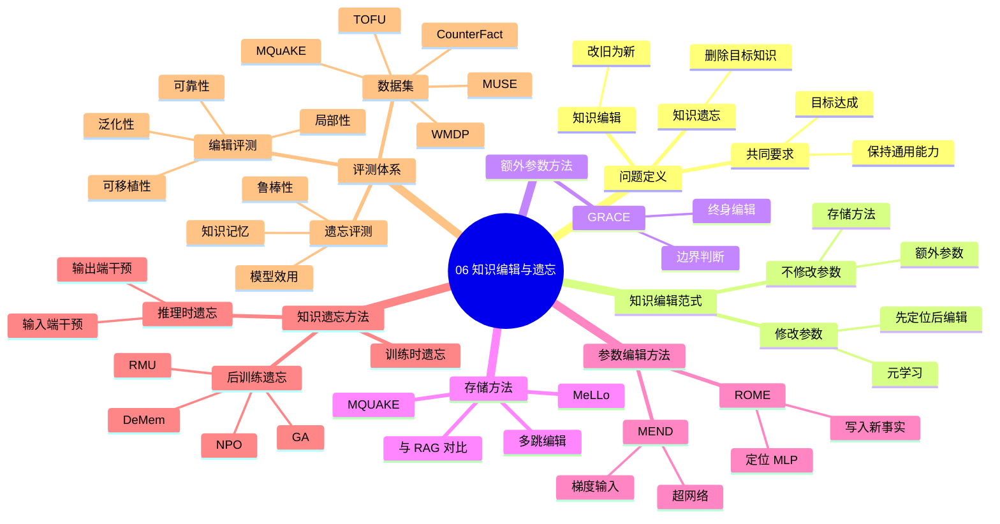
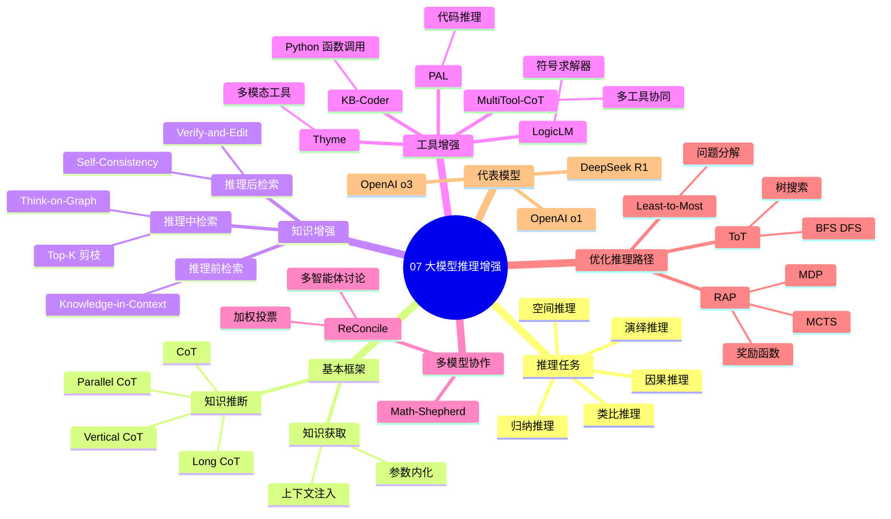
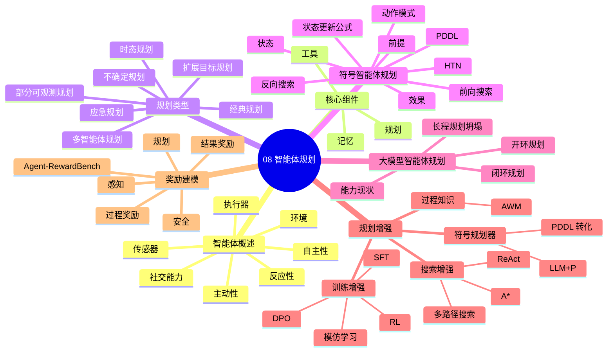
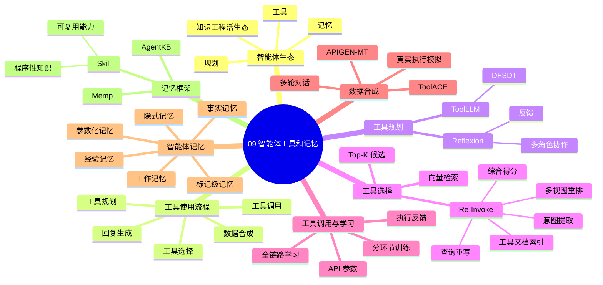
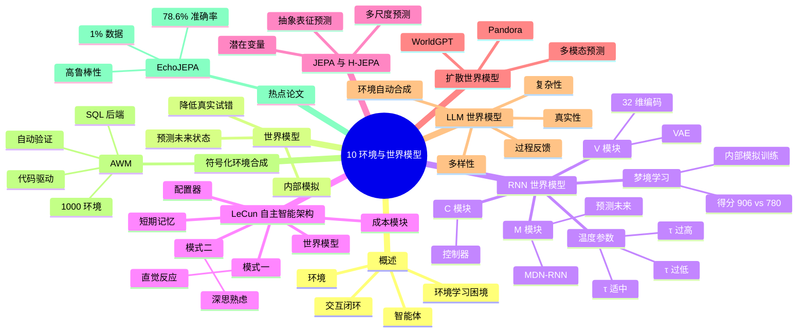

# UCAS 知识工程复习资料
本资料基于2026年春季学期课程PPT简化获得，大部分内容直接来源于或总结于PPT原文，经考试验证基本足以处理考试内容。
由于每年PPT可能有部分修改，请以实际的PPT为准。

Author: ZLxmChen
Repo: [UCAS Knowledge Engineering](https://github.com/ZlxmChen/UCAS-Knowledge-Engineering)

# 思维导图

# 01-知识工程概述

---

## 教学目标

- 深刻理解数据、信息、知识与智慧的区别与联系，能够运用==DIKW模型==分析实际问题
- 掌握人类思维的==“快系统”与“慢系统”理论==，能够运用该框架分析AI系统的智能行为特征
- 理解知识工程三大范式（专家系统、语义网/知识图谱、大模型）的核心思想与演进逻辑，把握“从构建机器慢系统到唤醒机器快系统”的核心发展脉络

---

## 一、机器的困境：从“识别”到“理解”

机器视觉系统能识别出物体、场景、动作等信息标签，例如识别出画面中有“一只猫，在沙发上，正在睡觉”，但它能理解这只猫是“安逸的”“舒适的”甚至“心满意足的”吗？

- **识别**处理的是“是什么”（What），属于数据和信息层面。机器通过模式匹配，告诉我们画面中有“猫”“沙发”“睡觉”这些标签。
- **理解**处理的是“为什么”（Why）和“怎么办”（How），需要知识层面的支撑。要理解“安逸”，需要将蜷缩、眯眼、在柔软的地方、阳光照射等零散信息，与头脑中关于“安逸”的概念模型和因果逻辑联系起来。

二者之间横亘着一道鸿沟：机器能告诉我们它“看到”了什么，但很难“懂得”它所看到的意味着什么。如何让机器从信息处理走向知识理解，正是当前人工智能面临的核心挑战。

### 知识工程的核心使命

系统性地解决“如何让机器从数据处理走向知识理解与运用”这一根本问题。关注重点：如何为机器构建一套知识体系，不仅包括客观事实和明确规则，更包括我们赖以理解世界的深层逻辑与不言而喻的常识。

### 三个最根本的问题

1. **什么是知识？**——对将要处理的“原材料”进行定义和分类
2. **人类如何思考？**——理解自身的智能，是模拟机器智能的最佳蓝图
3. **机器如何学会思考？**——知识工程的用武之地，探讨如何把前两个问题的答案“工程化”

---

## 二、知识的阶梯：DIKW模型

> “Fundamentally, AI is the science of knowledge – how to represent knowledge and how to obtain and use knowledge.”
> ——Nils John Nilsson，斯坦福大学教授，《Artificial Intelligence: A New Synthesis》

关于知识的定义，不同学科说法不一。柏拉图认为知识是“经过验证的信念”；知识管理先驱Thomas H. Davenport则将知识定义为“与经验、背景、解释和思考结合在一起的信息，一种可以随时帮助人们决策与行动的高价值信息”。

要帮助机器走出理解上的困境，需要从认知阶梯的最底层开始审视知识的形成过程。

### 数据（Data）：原始的符号
数据是原始、未处理、无上下文的符号，本身不传递意义，需要被解读。例如仪器屏幕上显示的“39.5”——它是温度、体重还是血压，无从得知。

### 信息（Information）：语境化的数据
通过添加上下文，使数据产生了意义。例如“3号床病人，当前体温：39.5摄氏度”，它回答了“谁、什么、何时、何地”等基本问题。

### 知识（Knowledge）：可行动的信息
对信息的模式识别和规律总结，可用于指导决策与行动。例如“体温超过38.5℃属于高烧”“高烧需采取物理降温或药物干预”，它回答了“如何”与“为何”的问题。

### 智慧（Wisdom）：知识的审慎运用
在知识基础上融入价值判断与预见性，涉及伦理考量、长远影响评估和创新性解决方案。例如“鉴于病人是婴幼儿且有惊厥史，优先选择物理降温并密切观察，暂不使用强效退烧针”。

**知识工程的核心使命**，就是实现从数据/信息到机器可操作、可推理的知识的系统性跨越。DIKW模型是我们理解整个人工智能知识处理的起点。

### 知识工程学科的诞生

1977年，费根鲍姆（Edward A. Feigenbaum）在第五届国际人工智能会议上发表特约文章，系统阐述了专家系统的思想，提出“知识工程”的概念，确立了知识在人工智能中的重要地位。知识工程是研究知识表示、知识获取和知识应用相关问题的学科方向，是计算机科学、认知科学、心理学、数理逻辑、语言学等多学科交叉融合的方向。费根鲍姆因此被誉为“知识工程之父”，于1994年获图灵奖。

---

## 三、思维的两种模式：快系统与慢系统

日常认知中有这样的体验：我们几乎不假思索就能读懂一个句子、瞬间认出朋友的照片，但面对“17×28等于多少”却会“卡顿”一下。为什么有些思考毫不费力，有些却需绞尽脑汁？美国心理学家丹尼尔·卡尼曼（Daniel Kahneman，2002年诺贝尔经济学奖得主）在《思考，快与慢》中提出了革命性观点：我们的认知过程由快系统和慢系统两种根本不同的思维模式支配。

### 系统一：快系统——思维的“自动驾驶仪”
- **运作方式**：自动、并行、无需意志努力，瞬时完成，认知负荷极低，可长时间持续
- **核心能力**：瞬时感知与识别（识别面孔、理解母语、判断物体），情绪与直觉反应，内化的技能与习惯（骑自行车、演奏熟悉乐曲），依赖经验的快速决策（走熟悉的回家路线）
- **固有局限**：容易产生认知偏见（高估空难风险而低估交通事故），易受错觉和直觉欺骗

快系统是我们认识世界的默认模式，能处理绝大多数常规情况，解放大脑去处理复杂任务。

### 系统二：慢系统——思维的“飞行员”
- **运作方式**：受控、序列化，需要主动注意与意志力，认知负荷高，易导致心理疲劳，无法长时间持续
- **核心能力**：复杂计算与逻辑推理、审慎规划与决策、陌生情境应对、自我控制与专注
- **固有局限**：处理速度缓慢，认知资源消耗巨大，天生懒惰——除非发现问题，否则不愿介入

### 从新手到专家：知识的内化过程

**新手驾驶员**由慢系统主导：每个操作（看后视镜、踩离合、换挡）都需要刻意回忆和执行的“说明书”，高度紧张且费力。**老练驾驶员**则由快系统主导：大部分操作已自动完成，轻松自如。这揭示了一个核心启发：**技能熟练化的本质，正是知识从慢系统向快系统的迁移与内化。**

**真正的专家智能**则是快慢系统完美协同的典范：医学专家凭借快系统（成千上万个病例训练出的“直觉”）一眼就能形成“可能是肝病”的初步诊断；接着启动慢系统，查看化验数据、详细问诊，进行逻辑推理来验证和精细化诊断。

---

## 四、从人类思维到机器思维

### 深蓝的启示

1997年，国际象棋程序“深蓝”战胜世界冠军卡斯帕罗夫。它的思维模式本质上是**极致化的“机器慢系统”**——依靠强大计算力穷举未来可能的棋步并评估每一步的后果，不知疲倦、永不犯错地执行“慢思考”。

### AI发展的宏观路径

- **第一阶段：构建“机器慢系统”**——早期AI的专家系统、逻辑推理机、象棋AI，特征是规则驱动、符号主义，精确但领域狭窄
- **第二阶段：唤醒“机器快系统”**——现代AI的深度学习、神经网络，特征是数据驱动、连接主义，通过海量数据训练出快速、直觉式的模式识别能力

AI的发展史，就是先精心构建机器慢系统，再尝试唤醒机器快系统的探索历程。

### 当代AI：快慢系统的融合

- **AlphaGo**：既拥有深度学习（快系统）的棋感，也拥有蒙特卡洛树搜索（慢系统）的推演
- **自动驾驶**：快系统（神经网络实时识别行人、车辆）与慢系统（规则系统进行路径规划、风险决策）协同工作

未来方向在于如何让AI的快慢系统像人类专家一样无缝协同。

**总结**：人类认知由快慢系统双重主导；技能熟练意味着知识从慢系统迁移到快系统；专家智能依赖二者的有效协同；AI发展路径是从构建慢系统到唤醒快系统并追求融合。理解人类如何思考，是为了更好地设计机器的思考方式。

---

## 五、从思维科学到知识工程

人类思维的双重模式与知识体系之间存在内在联系：

- **快系统的引擎——内化经验库**：包括“一眼就能认出”的模式库、“上次就是这么解决”的经验包、“理所当然”的常识网，具有直觉式、并行处理、快速响应的特征
- **慢系统的引擎——结构化知识体系**：包括系统化的概念库、清晰准确的事实库、明确的逻辑规则库，具有逻辑式、序列处理、深度分析的特征

**思维系统的整体效能取决于知识库的质量与结构**。质量决定了思维素材的可靠性，结构决定了调取和组合素材的效率。因此，要提升思维（无论人还是机器），必须首先优化其底层的知识生态。

### 知识工程的使命与意义

知识工程是将人类知识系统化地转化为机器可处理、可运用形式的一整套理论、方法和技术。其意义在于：

- 是从“感知智能”到“认知智能”的桥梁——感知解决“是什么”，认知解决“为什么”和“怎么办”
- 决定智能系统能力上限的关键因素——知识是算力、算法之外的第三极
- 实现可解释性与可靠性的基石

---

## 六、知识工程三部曲：从慢系统到快系统的进化之路

### 第一阶段：专家系统（1965-1990）

目标是为机器建立一个纯粹、精确的“慢系统”，希望机器能像人类专家一样进行逻辑严谨的推理。

这一阶段的基石是艾伦·纽厄尔和赫伯特·西蒙于1976年提出的**“物理符号系统假说”（Physical Symbol System Hypothesis）**，认为智能可以通过符号系统的操作实现。该假说为“智能”提供了一个可计算、可操作的定义，将人类思维与计算机运行置于同一理论框架之下。

符号系统包含三个基本要素：
- **符号实体**：指代外界和内部概念的物理模式（如计算机0/1串、人脑神经元放电模式、文字）
- **符号结构**：符号通过特定规则组合成的表达式（如“(父亲 约翰)”“(大于 (2+2) 3)”，一个列表、一棵树）
- **符号操作**：对符号结构进行创建、修改、复制、销毁的规则（如逻辑推理、搜索算法、生产式规则）

### 符号系统的运作机制

- **指代**：符号通过与外部世界或内部状态建立指代而获得意义，是连接形式系统与语义世界的桥梁。例如，一个孤立的“树”字本身只是一堆墨水或像素，但它指代了现实中的植物，从而拥有了意义。
- **组合**：有限的符号可以通过递归组合，生成无限复杂的表达式和思想，是人类语言和思维创造性的源泉。正如我们用有限的词汇说出无限的句子一样，物理符号系统能用有限的符号，通过组合来表达任何复杂的概念和问题。
- **通用的问题求解方法——搜索**：将所有可能的问题状态（包括初始状态和目标状态）形式化为一个符号结构集合，即问题空间。系统在问题空间中，运用启发式策略，尝试各种操作（移动棋子、推理步骤），寻找从初始状态到目标状态的解路径。搜索是将智能行为具体化的核心机制。

### PSSH的贡献

- 奠定AI的数学基础：将智能从哲学思辨变为可计算的科学研究。
- 开启计算理论范式：催生了知识表示、自动推理、规划、自然语言理解等核心AI研究方向。
- 指导实践：催生了专家系统等成功应用，证明了符号操作的威力。

### 知识表示与推理的根本问题

我们想要表示什么？对象、类别、关系、事件、状态、时间、信念...一个好的表示系统应具备：表达充分性（能有力地表征所需知识）、推理有效性（能高效地从已有知识中推导出新知识）、清晰性与可解释性。

### 知识表示：逻辑与结构化方法

**逻辑方法**

- **命题逻辑**：用原子命题的真假组合刻画世界，无内部结构，适合表示事实性关系。
- **一阶谓词逻辑**：引入量化和变量，能够表达对象的内在属性和相互关系，是表达能力与可计算性的黄金平衡点。
- **描述逻辑**：一阶逻辑的可判定子集，专为表示概念层次与继承推理而优化设计，是知识图谱的本体语言基石。

**结构化方法**

- **语义网络**：用节点-边图结构直接映射概念关联，直观表达联想式知识，但形式语义不严明。
- **框架**：用结构化模板表征典型情境，通过槽-填充机制实现期望驱动的知识组织，是面向对象思想的认知科学源头，但难以表达过程性知识和动态推理。
- **产生式系统**：用IF-THEN规则集耦合条件与动作，通过模式匹配-冲突消解-执行循环实现数据或目标驱动的推理，是专家系统时代最实用的知识工程范式，但面临规则组合爆炸与可维护性困境。

### 推理机制

- **演绎推理**：从一般性前提推出特殊性结论，是逻辑严谨性的理想范式，但在真实世界中面临前提获取难和计算不可行的问题。
- **归纳推理**：从特殊性观察推出一般性规律或假设，是知识发现和机器学习的基础，但在真实世界中面临样本偏差和结论或然性的问题。
- **默认推理**：通过"除非有例外证据，否则接受默认结论"的机制，在不完全信息和例外频发的真实世界中实现务实推理，但牺牲了逻辑的单调性和确定性。

### 专家系统：知识工程的第一代产物

**核心定义**：专家系统 = 知识库（领域专家的经验规则）+ 推理机（通用问题求解能力）+ 解释器（推理过程的可解释性）。

**本质特征**

- 知识分离：领域知识（可替换）与推理机制（通用）解耦。
- 专家级性能：在特定狭窄领域达到或超越人类专家水平。
- 可解释交互：不仅能给出答案，还能说明“为什么”。

专家系统是物理符号系统假设的工程验证，试图证明：只要拥有足够的领域符号知识，通用推理机制就能产生智能行为。

**代表性专家系统**

- **DENDRAL** (1965)：有机化学质谱分析领域。第一个专家系统，开创"生成-测试"推理范式，证明符号AI在狭窄领域可超越人类专家。
- **MYCIN** (1976)：血液感染诊断与治疗领域。确立专家系统架构标准（知识库-推理机-解释器分离），开创不确定性推理（CF模型）。
- **PROSPECTOR** (1978)：地质矿产勘探领域。成功预测华盛顿州钼矿（数亿美元价值），证明专家系统的经济可行性。
- **R1/XCON** (1980)：计算机配置（DEC VAX）领域。第一个商业成功案例，年节省DEC数千万美元，标志专家系统产业化开端。
- **INTERNIST** (1982)：内科诊断领域。知识库规模最大（~100,000条），覆盖75%内科疾病，展示专家系统复杂度极限。
- **CLIPS** (1985)：通用开发工具。NASA开发的开源产生式系统，至今仍在使用，代表专家系统工具化、平台化方向。

**成就与局限**

- 成就：奠定"知识工程"方法论，定义知识获取-表示-推理-解释的完整流程；证明物理符号系统假设在狭窄领域可行，首次实现"专家级"AI性能；首个成功产业化的AI技术，创造数十亿美元经济价值；产生式规则、不确定性推理、解释机制等技术影响至今。
- 局限：知识获取难（专家难以显式陈述隐性知识，规则提取成本高昂）；适应性差（超出预设场景即失效，不会举一反三）；可扩展性差（规则增多后相互冲突，维护成本剧增）；固化封闭（无法自主学习更新，依赖人工持续修补）。

### 第二阶段：语义网与知识图谱

时代背景为1999-2012年，核心转向从“建造专家”到“构建世界”，核心哲学是用结构化的网络，连接一切知识。专家系统的困境让我们意识到，知识不能是孤岛，我们需要的不是一个个无所不知但彼此隔绝的“专家”，而是一个能让所有机器共同理解和使用的“数字世界”。

**从语义网之梦说起**

思想源头是蒂姆·伯纳斯-李的语义网愿景，核心思想是让网络数据被机器理解，而不只是显示。关键挑战在于如何为互联网上的海量信息赋予含义。

**实现基石：标准化的知识表示**

核心实现路径是标准化，三大基础语言为：
- RDF：万物皆可用〈主体-谓词-客体〉描述。
- OWL：用于定义复杂的类别与关系（本体）。
- SPARQL：用于查询知识网络的SQL。

**实践先锋：谷歌知识图谱**

2012年正式公布，核心目标是理解搜索词背后的实体与意图，而不仅仅是匹配关键词。

- 数据来源：权威数据源（维基百科、Freebase等，提供高质量、结构化的核心事实）；网站结构化数据（通过Schema.org等标记从海量网页中抽取）；企业内部数据（谷歌自身产品线，如地图、应用商店的数据）。
- 核心流程：知识抽取（从多源数据中识别出实体和关系）→ 知识融合（解决同名异义、异名同义，将不同来源的知识对齐到同一实体上）→ 知识存储（将清洗后的三元组存入图数据库）。
- 规模与能力：2016年已覆盖700亿个事实、涉及10亿个实体，现今已达数千亿级事实、数百亿级实体。核心能力包括理解实体、理解实体间关系、理解用户的查询意图。
- 应用场景：增强搜索（智能信息框、直接答案）；智能推荐（基于实体关联推荐相关内容）；智能问答（直接回答事实性问题）；反欺诈与安全（识别不一致信息）。

**成就与局限**

- 成就：规模化（将知识工程从“专家级”推向“互联网级”）；结构化（知识从“文档的海洋”变为“关系的网络”，实现了知识的可互联、可复用、可推理）；基础化（成为现代AI应用的“水、电、煤”）；生态化（催生了庞大的技术栈与产业链）。
- 局限：构建瓶颈（核心的融合、对齐、质量控制仍需大量人工）；知识覆盖不全（长尾问题，难以覆盖小众、专业领域）；更新滞后（更像是世界的一个静态快照，难以实时反映现实）；关系与推理的边界（只能存储“已知”的关系，无法理解人类海量的“隐式常识”；缺乏真正的理解，知道〈水〉-〈沸点是〉-〈100°C〉，但并不真正“理解”什么是沸腾）。

### 从“构建世界”到“学习模式”

知识图谱为我们构建了机器的“结构化记忆”，但还有另一条让机器获取知识的道路：能否让机器自己从原始数据中学习知识，彻底摆脱“人工构建”的瓶颈？

### 第三阶段：大语言模型

时代背景为2018年至今的深度学习革命，核心转向从“构建世界”到“涌现世界”，核心哲学是用海量的数据，预测一切知识。

**时代背景：数据、算力与算法的三重奏**

- 数据洪流：互联网海量文本数据（万亿级Token）的积累，提供了“学习的食粮”。
- 算力飞跃：GPU/TPU等专用硬件的出现，使得训练超大规模模型成为可能。
- 算法创新：深度学习理论（尤其是Attention机制）的突破，为Transformer铺平道路。

**核心哲学：从编码知识到涌现知识**

传统知识范式（显式编码）采用人工编写规则、构建知识库的方式，如同填鸭式教育，成本高昂、难以扩展、无法处理模糊性。大模型知识范式（隐式学习）从海量数据中自监督学习，自动发现关联和模式，如同沉浸式学习，具有自动化、可扩展、能捕捉微妙语境等优势。

**实现路径：Transformer与自监督学习**

- 核心思想是自注意力机制，允许模型在处理一个词时，同时关注并权衡输入序列中所有其他词的重要性，实现了对上下文信息的全局理解。关键特性为高度并行化（极大提升训练效率）和强大的序列建模能力（完美契合语言任务）。
- 核心方法为遮罩语言模型或下一个词预测：给模型一句话，随机盖住一些词，让它预测被盖住的词。在数万亿Token上重复此过程，模型为了更准确地预测，必须学习语法、事实、逻辑甚至风格。

**典型案例：GPT系列与BERT**

- GPT系列（OpenAI）走自回归模型路径，专注于“下一个词预测”，具备强大的生成能力。演进路径为：GPT-3 → ChatGPT（引入指令微调与RLHF）→ GPT-4（多模态）。
- BERT（Google）走自编码模型路径，专注于“遮罩语言模型”，具备强大的理解能力，擅长文本分类、问答等任务，深刻改变了自然语言理解领域的研究范式。

**革命性突破**

1. **知识获取的自动化**：告别知识工程，不再需要人类专家手工编码百万条规则。模型参数从百万级跃升至千亿、万亿级，知识容量呈指数增长。“万物皆可Embedding”，将离散的符号转化为连续的向量，在数学空间中捕捉语义关系。知识获取从劳动密集型工程转变为可规模化的计算过程。
2. **涌现能力**：当模型规模超过某个临界点时，突然出现的、在较小模型中不存在且未被显式编程的新能力。典型表现包括零/少样本学习、复杂推理（多步逻辑推理、解决数学问题）、代码生成与理解。这表明大模型不是简单的记忆库，而是形成了某种泛化的内部认知结构。
3. **常识的隐式掌握**：传统AI难以显式编码人类常识，因为常识无法穷举且充满例外。大模型没有被告知任何具体的常识规则，而是通过自监督学习在万亿级文本数据中“沉浸”，重构了一个关于世界如何运作的统计模型，从而能进行符合常识的预测和生成。这就像一个从未见过现实世界、但读完了人类所有小说和百科的天才学者，基于文本中“玻璃”、“砸”与“碎”之间牢不可破的统计关联，能自然回答“用锤子砸玻璃会碎”。

**核心洞察：这是一个快系统的架构**

心理学将认知分为快系统（直觉、联想、快速、并行、无意识）和慢系统（理性、分析、缓慢、序列、需费脑力）。大模型本质上是一个机器快系统，基于模式匹配的直觉响应生成“感觉对”的答案，优势是流畅、创造、快速，缺陷是易受偏见影响、缺乏深度验证、有时会“想当然”。

**新的困境**

- **幻觉问题**：模型生成内容看似合理但事实错误或毫无根据。本质原因在于快系统的本能使目标是生成“流畅且符合语境”的文本而非“绝对真实”的文本，模型输出的是概率最高的词序列，不保证事实正确性，且缺乏“我不知道”机制。
- **不可解释性与知识固化**：不可解释性（黑箱问题）指我们无法理解模型为何给出特定答案，决策过程不透明，难以调试、难以信任，在医疗、司法等关键领域应用受阻。知识固化指模型的知识截止于其训练数据，无法自动更新，训练成本极高导致“知识滞后”。

**困境的本质：单一快系统的局限**

纯粹基于统计和模式匹配的快系统，在需要确定性、精确性和可靠性的任务上存在先天不足：缺乏事实核查模块（无法在生成过程中验证陈述的真实性）、缺乏逻辑推理引擎（无法进行一步步可追溯、可靠的演绎）、缺乏元认知能力（无法评估自身答案的置信度，不知道“自己不知道”）。

### 未来展望：从快系统到双系统协作

可能的演进路径包括：在神经网络中引入符号推理模块，构建内在的“慢系统”；为模型配备外部工具（如搜索引擎、计算器、代码解释器），让其能“查证”和“计算”；将人类作为验证和监督环节纳入系统，发挥人类的“慢系统”优势；采用更先进的训练范式，如强化学习与推理相结合。愿景不是取代大模型，而是为其装上“刹车和方向盘”，形成兼具直觉创造力与理性确定性的完整机器心智。

---

# 02-认知的基石：记忆、知识及其表征

**赵 军** （jzhao@nlpr.ia.ac.cn）
中国科学院自动化研究所 · 中国科学院大学人工智能学院

---

## 课程回顾

- 人类的思维：快系统 + 慢系统
- 知识是思维的基础，如何建立机器的知识系统？
- 回到源头——拆解"记忆"与"知识"的黑箱，探索知识在心智中的表征格式与组织形式，为机器知识系统设计提供生物学和心理学指引
- 这是后续所有技术方法的共同理论基础，解释为什么我们需要混合使用符号与向量方法

---

## 本讲提纲

1. 人类的记忆系统：我们如何记住？
2. 知识的心理表征：知识在心智中的格式
3. 从心智到机器：表征的启示与机器的"大脑"
4. 热点论文导读

---

## 一、人类的记忆系统：我们如何记住？

### 记忆：一条认知流水线

- **传统观点**：记忆是一个存储信息的"静态仓库"
- **现代观点**：记忆是一个高度自动化的"认知流水线"——信息从感官进入，经过多道工序筛选、加工和包装，最终成为称之为"知识"的资产

### 记忆的三级处理模型（阿特金森-谢夫林模型）

信息从感觉记忆的洪流中被"注意力"捕获，进入容量有限的工作记忆进行深度处理，最后通过编码进入长期记忆；需要时再从长期记忆中提取回工作记忆使用。

| 阶段       | 特点                |
| -------- | ----------------- |
| **感觉记忆** | 海量、瞬时的感官缓存（<1秒）   |
| **工作记忆** | 容量有限的"意识舞台"（约20秒） |
| **长期记忆** | 容量近乎无限的"知识仓库"（永久） |

> Atkinson & Shiffrin, *Human memory: A proposed system and its control processes*, The psychology of learning and motivation: Advances in research and theory (Vol. 2), 1968

---

### （一）感觉记忆：世界的瞬时缓存

功能是短暂保存所有感官信息（视觉、听觉、触觉等）。容量巨大，但保持时间极短——视觉影像记忆约0.5秒，回声记忆约2-4秒。其核心作用是**筛选**，为大脑提供缓冲时间，防止我们被海量的感官信息淹没。

**感觉记忆 → 工作记忆**：绝大部分信息会迅速衰退消失，只有被**注意力**选中的信息才能进入下一阶段。你的名字在嘈杂房间里被提到，或一个快速移动的物体划过视野——注意力会自动锁定这些关键信息，将它们从背景噪音中提拔出来。

---

### （二）工作记忆：思维的"中央处理器"

核心功能：（1）暂时存储信息；（2）加工处理信息，支撑推理、决策和问题解决。

致命局限是容量极其有限——米勒定律指出大多数人只能同时记住和处理 **7±2 个组块**。工作记忆被认为是"系统二"慢思考的物理载体，那些需要刻意、费力思考的事都发生在这里，它是"意识的舞台"。

**组块化策略**：将多个信息单元组合成一个有意义的更大单元。原本需要消耗多个容量的信息被压缩成一个单位，大大减轻工作记忆负担。例如 "USA, FBI, CPU" 远比 "U, S, A, F, B, I, C, P, U" 好记得多。

---

### （三）长期记忆：近乎无限的知识仓库

经过工作记忆的深度加工，那些被反复关注、被赋予意义的信息最终进入长期记忆。它可以存储从几分钟到整个人生的经验，但存入不是自动产生的——信息需要通过**复述**（不断重复）和**精细编码**（建立意义联结）才能真正保存下来。长期记忆存储的不是信息的精确副本，而是基于意义的表征。

**两种记忆策略**：

- **机械复述（死记硬背）**：像复读机一样不断重复，效果差、记忆浅
- **精细编码（深度加工）**：与已有知识建立连接，为信息赋予意义，效果佳、记忆深刻

**精细编码示例——记单词 "Apple"**：

- **视觉化**：脑海里浮现一个红彤彤、甚至能闻到香味的苹果
- **联想**：这是砸在牛顿头上的那个苹果，或者你最喜欢的苹果派
- **故事法**：一个 Apple 砸醒了牛顿
- **与自我关联**：想起昨天刚吃了一个特别甜的苹果

记忆的牢固程度，不取决于你重复了多少遍，而取决于你为它赋予了多少意义。

---

### 长期记忆的形式

长期记忆以不同格式存储：

- **程序性记忆**："如何做"的记忆。通过大量练习和重复形成，自动化、内隐，难以用语言描述，属于"肌肉记忆"。例如骑自行车——这项技能已经内化为一种"感觉"。
- **陈述性记忆**："是什么"的记忆。外显的、可用语言清晰陈述，分为两类：
  - **情景记忆**：对特定时间、地点发生的个人事件的记忆，带有情感和时空背景，是"生活日记"。例如"我昨天在咖啡馆和朋友喝了咖啡。"
  - **语义记忆**：社会共识认可的一般事实、概念、规律及其关系，剥离了个人经验和情感，是共享的结构化知识，相当于"世界百科全书"。例如"法国的首都是巴黎"。

**记忆 ≠ 知识**：硬盘里存了1000本书不代表你拥有了知识。知识是长期记忆中那些能随时调用、用于解决问题、进行推理的"活"的记忆——**知识是"可用的记忆"**。

---

## 二、知识的心理表征：知识在心智中的格式

**核心问题**：浩瀚的知识如何存储在我们有限的大脑中？知识心理表征（知识表征）是认知科学的核心概念。

**核心定义**：知识心理表征是知识在心智中的存在形式。这里的"知识"是广义的，泛指所有被头脑编码的信息，包括能说出来的事实知识和说不出来的感觉与技能。

**三个核心特征**：
- **内在性**：看不见摸不着，但真实存在于大脑中
- **功能性**：能影响后续的认知、行为和思考方式
- **中介性**：是心理世界与客观世界之间的"地图"，我们通过它来理解世界

---

### 知识表征的多样性

知识表征不是单一形式，不同的知识以不同方式存储在头脑中：

- 语言形式："如果下雨则带伞"——规则的表征
- 结构形式："房屋"概念包含卧室、客厅、厨房等槽位——图式的表征
- 事实形式："北京是中国的首都"——命题的表征
- 身体感觉：骑自行车的平衡感——肌肉记忆和内隐知识
- 视觉图像：脑海中"浮现"苹果的样子——心理意象
- 专家直觉：老医生一眼判断病情——高度自动化模式

这也是为什么 AI 模拟人类智能如此困难：不仅要让模型学会"事实"，还要让它学会那些说不清道不明的"感觉"和"直觉"。

---

### 知识表征的三个层次

**第一层：基础表征单元**——最基本单位。命题是抽象符号，表象是知觉模拟，双通道融合语言与非语言信息，共同构成复杂知识的基本构件。

**第二层：结构化知识组织**——将零散的基础单元组织成结构化的知识包。图式是关于概念的有组织的知识结构，脚本是关于事件序列的知识结构，赋予知识以结构和预期。

**第三层：复杂认知系统**——知识在实际认知活动中的综合体现。外显规则是可陈述的指导原则，内隐技能是自动化的程序性知识，心智模型是对复杂系统整体运作机制的理解。

---

### （一）基础表征单元

关注知识在头脑中的"原始格式"或"编码方式"，主要包括命题（思想的"文本文件"）与表象（心智的感官模拟器），以及整合两者的双编码理论。

#### 命题

**核心定义**：命题是知识以抽象逻辑单位进行存储的形式，类似于自然语言陈述句所表达的意义。

**三个核心特征**：
- **抽象性**：与特定感官通道无关（非模态）
- **真假性**：可以判断真假
- **组合性**：可组合成更复杂的知识结构

命题是思维的基本单位，更复杂的知识结构（图式、脚本、心智模型）都由命题组合而成。

**命题的非模态性**：无论你亲眼看见、听人讲述还是阅读文字"猫在垫子上"，存储在头脑中的是同一个抽象结构 `[坐在，猫，垫子]`。

**命题的格式**：命题 = 关系 + 论元。例如"猫坐在垫子上"，表征为 `[坐在，猫，垫子]`，其逻辑等价于"垫子被猫坐着"。

**实验证据**（Clark & Chase, 1972）：句子-图片比较实验发现，反应时间与句子所包含的命题数量成正比，说明每个命题需要独立加工，信息以离散的命题单元进行处理和存储。

---

#### 表象

**核心定义**：表象是知识以类似知觉的图像、声音、味道等模拟形式进行存储。

**三个核心特征**：
- **模态性**：与特定感官通道紧密关联
- **模拟性**：以"类似真实感知"的形式呈现
- **可操作性**：可在脑海中进行心理旋转、心理扫描、缩放等操作

**可操作性的具体表现**：

| 操作 | 含义 | 示例 |
|------|------|------|
| 心理旋转 | 在脑海中旋转想象的物体 | 判断两个图形是否相同 |
| 心理扫描 | 在脑海中"巡视"想象场景 | 想象房间里有几扇窗 |
| 心理缩放 | 拉近或拉远想象的视角 | 想象一只蚂蚁 vs 想象一头大象 |

**经典实验证据**：

- **Shepard & Metzler (1971) 心理旋转实验**：反应时间与两个三维物体之间的角度差呈线性正比，说明人在头脑中"旋转"图像是连续且模拟的，类似于真实物体的旋转。
- **Kosslyn (1973) 地图扫描实验**：两地点的实际距离越远，心理扫描所需时间越长，说明表象存在于主观的"心理空间"中，对其进行扫描需要时间。

---

#### 命题 vs. 表象

| 对比维度 | 命题 | 表象 |
|----------|------|------|
| 存储形式 | 抽象符号 | 知觉模拟 |
| 模态性 | 非模态（与感官无关） | 模态（绑定特定感官） |
| 类比 | 文字的"描述" | 照片的"展示" |

命题是剥离了感官外衣的"纯粹意义"；表象是感官的"内在回放"——不用真的看到、听到、触摸到，就能在脑海中"感知"世界。

---

#### 双编码理论（Paivio, 1971）

核心观点：**两者并用，效果远超其一。** 大脑有专门处理语言和逻辑的言语系统，也有专门生成与操作心理图像的表象系统。当信息能同时通过这两个系统编码——既能被理解，又能被想象时——记忆最为深刻。

**实验证据**：

- **具体性效应**：具体词（苹果）比抽象词（真理）更容易记忆。因为具体词可同时被言语系统和意象系统编码，形成双重记忆痕迹；抽象词主要依赖言语系统。
- **图片优势效应**：图片记忆效果通常优于词语，因为图片更强地激活意象码。

**用语言理解，用图像记忆——两个系统一起用，记得最牢。**

---

### （二）结构化知识组织

关注基础表征单元如何组织成更大、更有意义的模式。大脑通过"模板化"来高效组织和理解信息，主要包括图式和脚本。

#### 图式："静态的概念模板"

**核心定义**：图式是关于某个概念或情境的综合性知识框架，包含槽位、属性和关系。

**三个核心特征**：
- **槽位结构**：包含预设的"空位"，等待具体信息填充
- **关系网络**：描述概念内部各要素之间的关联
- **预设功能**：帮助快速识别、归类和预测事物

**基本格式**：图式 = 槽位 + 默认值 + 关系。以"房屋图式"为例：

| 组件 | 含义 | 举例 |
|------|------|------|
| 槽位 | 概念包含的组成部分 | 屋顶、墙壁、门、窗 |
| 默认值 | 槽位的典型特征 | 门通常是木制的，窗通常是玻璃的 |
| 关系 | 槽位之间的连接 | 门安装在墙上，窗嵌在墙里 |

其他示例：鸟类图式包含羽毛、有喙、会下蛋、有翅膀等槽位。

#### 脚本："动态的事件剧本"

脚本是关于事件序列的知识结构（后续内容将进一步展开）。

### 图式：实验证据

Brewer & Treyens (1981) 的“办公室”实验让参与者在办公室等候，随后出其不意地测试其记忆。结果发现，参与者事后更容易回忆起与“办公室图式”一致的物品（如书桌），而遗忘不一致物品（如野餐篮子），甚至错误地“记住”一些典型但并未出现的物品（如书籍）。这表明图式深刻影响着我们的注意力和记忆，让我们看到我们“预期”看到的东西（Brewer & Treyens, 1981, Role of schemata in memory for places, Cognitive Psychology, Vol 13: 2）。

### 图式的作用

图式是我们头脑中的“认知模板”，告诉我们在某个情境下应该期待什么。它能帮助我们快速识别（看到有羽毛、有喙的东西立刻归类为“鸟”），填补信息（听说“去餐厅”自动预期有服务员和菜单），以及预测未来（知道“鸟会下蛋”，所以看到鸟蛋不会惊讶）。

### 脚本的定义与功能

脚本是关于特定情境下典型事件发生顺序的知识结构，可以理解为事件的图式。它有三个核心特征：时序性（知识以时间序列的形式组织）、预期性（知道“接下来通常会发生什么”）和指导性（指导我们在情境中的行为）。脚本的主要功能包括理解故事、指导行为和预测事件。经典示例如乘飞机（值机→安检→登机→起飞→降落→取行李）、看医生（挂号→候诊→问诊→检查→开药→取药）、上课（进教室→点名→讲课→提问→下课）。简言之，脚本是我们头脑中的“标准剧本”，告诉我们某个场景下事情通常会按什么顺序发生。

### 脚本：实验证据

Bower et al. (1979) 的“日常活动”实验通过收集人们对熟悉活动（如去餐厅就餐）的脚本描述，并测试其对相关故事的记忆，揭示脚本引导记忆。在后续测试中，参与者很难分辨哪些动作是故事中明确描述的，哪些是脚本相关的典型动作但故事中并未出现。这说明脚本帮助我们填补信息缺口，进行基于常识的推理，但也可能导致记忆扭曲（Bower et al., 1979, Scripts in memory for text, Cognitive Psychology, Vol 11:2）。

### 脚本 vs. 图式

图式与脚本的核心区别在于组织方式和核心问题：图式以空间/概念结构组织，回答“它由什么组成？”（如房屋图式）；脚本以时间序列组织，回答“接下来会发生什么？”（如餐厅脚本）。

## 复杂认知系统

复杂认知系统中，技能性知识以两种形态表征：外显端的程序性规则和内隐端的内隐技能。

### 产生式规则

产生式规则是可以被意识察觉和陈述的“条件-行动”对，知识以明确的 IF（条件）→ THEN（动作） 格式存储。其核心特征包括：可陈述性（可被明确表达和讲述）、规则性（表征程序性知识而非事实）、模块化（每条规则独立，可组合使用）。例如：IF（下雨）THEN（带伞），IF（在图书馆）THEN（保持安静），IF（要起步）THEN（先打左转向灯）。产生式规则是我们能“念出来”的行动指南。

产生式规则的序列性实验证据来自 Newell & Simon (1972) 的“口语报告分析”研究。参与者在解决汉诺塔问题或逻辑谜题时被要求“大声说出”思考过程。口头报告呈现清晰的逐步特征，可被分解为清晰的“如果-那么”式陈述。这说明工作记忆一次只能处理少量信息，必须像产生式系统那样一步步执行。

同一研究中的“手段-目标分析”揭示了产生式规则的目标导向性。参与者在解决汉诺塔问题时会建立总目标（如将所有圆盘移到第三根柱子），发现子目标（如要移动最大圆盘，必须先移开上面的所有圆盘），并递归地为每个子目标寻找解决手段。思维被目标层层驱动，印证了产生式 IF(目标) THEN(行动) 的心理结构（Newell & Simon, 1972, Human Problem Solving, Prentice-Hall, New Jersey）。

### 内隐技能

内隐技能是被编码在感觉运动系统中的程序性知识，表现为流畅、自动化、难以用语言完整描述的技能。其核心特征：通过大量练习而“内化”，执行时无需意识控制；具有并行性，身体自动反应而非先分析再行动；难以言说但不易遗忘，一旦形成可维持数年甚至终生。关键机制在于“条件-行动”映射是无意识的。经典示例如骑自行车、弹钢琴、打羽毛球。通常，学习复杂技能始于外显规则的指导，随着练习逐渐被编译成内隐技能，从而解放认知资源去处理更复杂的任务。内隐技能是“身体记忆”——不在语言里，而在神经回路中。

内隐技能的实验证据来自 Reber (1967) 的人工语法学习研究。参与者先观察一系列由复杂规则生成的字符串但不知晓规则存在，随后对新字符串进行语法判断。其正确率显著高于随机猜测，却无法清晰陈述规则是什么。这表明人类能在无意识情况下检测并学习复杂模式，这种学习结果是内隐的、难以言传的（Reber, 1967, Implicit learning of artificial grammars, Journal of Verbal Learning and Verbal Behavior, Vol 6: 6）。

### 心智模型

心智模型是头脑中构建的、关于外部世界如何运作的内部工作模型。其核心特征包括：结构性（包含对系统结构、功能、机制的理解）、动态性（可用于心理模拟和推理）、近似性（往往是不完整、不准确的近似模型）。经典示例如自行车传动模型、气候变化模型。心智模型是我们理解世界如何运转的“内在剧本”。

McCloskey (1983) 的物理推理任务实验发现，当被问及“从曲线轨道抛出的球离开轨道后的运动路径”时，很多大学生会错误地预测球继续沿曲线运动，揭示了他们持有错误的心智模型而非正确的牛顿力学模型。日常误操作（如反复按电梯按钮认为能“催促”电梯）和概念混淆（如混淆“热量”与“温度”）也反映了心智模型常包含错误因果假设。心智模型确实存在并指导行为，但其质量取决于知识与经验（McCloskey, 1983, Naive physics: The curvilinear impetus principle and its role in interactions with moving objects, Journal of Experimental Psychology: Learning, Memory, and Cognition, Vol 9: 1）。
### 知识表征的协同工作

- **想象“多汁的苹果”**：命题表征“苹果是水果”“苹果是红色”；表象“看到”红色圆形、“闻到”清香；图式激活“水果”类别和“苹果”属性；心智模型预测“咬一口会很脆、很甜”。
- **学习驾驶汽车**：首先学习外显规则（如 IF 要刹车 THEN 脚移到刹车），同时构建汽车的心智模型（踩油门喷油，发动机驱动轮子等），拥有“在驾校练车”的脚本（上车、调座椅、系安全带、启动等），调用关于汽车的图式（方向盘、油门、刹车、离合器）。经过大量练习，换挡、转向等变成内隐技能，驾驶员可以一边开车一边听音乐，而心智模型和脚本仍在高层运作确保去往正确目的地。

## 从心智到机器：表征的启示与机器的“大脑”

### 知识表征的外显与内隐

外显知识可意识、可陈述、可反思，支持逻辑推理、明确指导和复杂计划，但处理速度慢，认知负荷高。内隐知识自动化、难言传、直接指导行动，实现快速、流畅的感知与行为，是专家技能的核心，但不灵活，难以直接传授和修正。人类认知拥有显式系统（负责逻辑、推理、语言，是理性的基石）和隐式系统（负责直觉、联想、感知运动技能，是直觉的源泉），两个系统协同工作构成完整的智能。（人类认知的双重表征系统）

### 机器的显式知识与隐式知识

机器的“显式知识”对应人类的命题、图式、脚本、规则，用明确的符号和规则来表征知识，如命题(北京, 是首都, 中国)、知识图谱、脚本序列、规则 IF(信号灯\=\=红色) THEN(停止通行)。其优势在于精确性与可解释性、可控性；劣势在于僵硬，难以处理常识和模糊性，且存在“知识获取瓶颈”，依赖昂贵的人工构建。

机器的“隐式知识”对应人类的表象、内隐的心智模型，将知识表示为高维空间中的连续向量，含义由向量值及其在空间中的相对位置决定，核心思想是“含义相近的词，其向量也相近”（如 King - Man + Woman ≈ Queen）。其优势包括强大的泛化能力、直接从数据中学习、处理模糊性；劣势包括“黑箱”问题、不可控与幻觉、知识固化难以实时更新。

### 借鉴神经解剖学的机器架构

人脑海马体是记忆的“编码转换站”，负责快速形成新的情景记忆、将不同感官信息绑定成完整事件、作为信息的初始登记区。经过记忆巩固（重复激活/睡眠）后，信息转移至新皮层——高级认知中枢和记忆的“永久仓库”，负责语言、推理、计划等复杂思维的“在线工作”和长期记忆的最终固化，侧重语义记忆。

机器的“海马体”是向量数据库。它扮演快速存储的角色，通过深度学习模型将非结构化知识转化为高维空间中的向量并建立索引；同时扮演情境检索的角色，将查询转化为向量，在空间中查找最相似的向量，返回最相关的“记忆碎片”。向量数据库是机器的“情景记忆缓冲器”。

机器的“新皮层”是大语言模型。它既是内隐知识库，存储着经过海量数据训练的、参数化的“世界模型”，相当于新皮层中长期存储的语义记忆；又是认知处理器，基于内部复杂神经网络进行模式识别、语言生成、逻辑推理，相当于新皮层进行的复杂思维。大语言模型既是机器的“知识库”，也是机器的“思维引擎”。

### 协同工作与未来展望

以问答为例展示完整系统：用户提问“推荐几部类似《星际穿越》的科幻电影”，向量数据库将《星际穿越》和问题转化为向量，快速检索相关电影介绍、影评等“记忆碎片”；大语言模型接收用户问题和检索到的记忆碎片，进行理解、整合、推理，生成流畅、个性化且基于事实的推荐列表和理由。二者结合弥补了大模型的知识陈旧和幻觉问题。

核心启示在于重新定义知识工程：根本任务不再是单纯构建符号知识库，而是为机器设计和实现一套高效的“记忆与知识系统”。核心方法是构建符号与分布式表示的混合系统，用符号的精确性建立“理性的锚点”，用分布的泛化性注入“直觉的洪流”，二者互补构建真正强大、可信、可控的机器智能。神经-符号融合可能是通向更通用智能体的关键技术路径，潜在应用包括可解释、可验证的可信AI，能持续学习不忘旧知识的机器，以及作为通用人工智能的基石。

---

# 03-语义网与知识图谱

## 本讲目标

- 理解经典知识工程从“封闭世界”到“开放网络”的范式转变的必要性
- 掌握语义网愿景的核心思想与技术栈（RDF, OWL, SPARQL）
- 认识知识图谱如何将语义网愿景转化为工业级实践
- 了解维基百科等社区共建模式在知识工程中的革命性作用
- 思考符号化知识工程在大模型时代的作用

---

## 一、范式转移：从封闭到开放

### 封闭世界的困境

古典知识工程面临三大困境：知识获取瓶颈（依赖少数专家，手工构建，成本高昂）；知识孤岛（知识系统间无法通信，知识无法复用）；脆弱性与狭窄性（无法处理知识边界外的问题）。

### 万维网：机遇与挑战

万维网（1989-1990）由 Tim Berners-Lee 提出，基于三大核心技术：URL（统一资源定位符）、HTML（超文本标记语言）和 HTTP（超文本传输协议）。其核心理念是通过超链接将文本连接成巨大的信息网络，用户可以在网页间自由“冲浪”，海量内容互联催生了 Google 等 Web 搜索引擎。Berners-Lee 因此获得 2016 年图灵奖。

然而，万维网本质上是“文档的网络”而非“知识的网络”——信息海量但非结构化，机器无法理解其含义，搜索依赖于关键词匹配而非语义理解。这带来了新的机遇：能否把万维网转化为一个全球性的、机器可读的知识库？

### 语义网的提出

- 1998 年：Tim Berners-Lee 首次提出语义网概念
- 2000 年：在世界 XML 大会上正式阐述语义网愿景
- 2001 年：与合著者在《科学美国人》发表《The Semantic Web》，极大推广了这一概念

语义网的愿景是构建一个以机器可理解的形式化语义为基础，支持全球信息互联与推理的智能数据生态系统。其特征包括：Web 上的事物拥有唯一的 URI；事物之间由链接关联（如人物、地点、事件、建筑物）；链接显式存在并拥有类型；Web 上数据的结构显式存在。

### 语义网技术栈

核心思想：在万维网基础上，通过逐层添加语义标准，将现有文档网络升级为机器可理解的语义网络。这一体系通常被称为语义网堆栈（Semantic Web Stack）或语义网蛋糕（Semantic Web Cake）。

---

## 二、技术基石

### 第一层：基础层——标识与编码

- **URI（统一资源标识符）**：为网络中的一切（文档、概念、实物）赋予全局唯一标识符，解决“我们谈论的是什么”的问题，如同身份证号，确保指代无歧义。
- **Unicode（统一字符编码）**：确保任何语言的字符都能被正确存储和显示，如同通用密码本，使不同计算机系统都能“读懂”并交换各种文字信息。

### 第二层：语法层——结构化表示

**XML** 定义数据的结构和序列化格式，提供自定义标签来组织信息，使数据具有清晰的层次结构。XML 作为 RDF 等多种资源描述语言的常见序列化格式，但其本身不定义语义。

### 第三层：数据模型层——统一描述框架

**RDF（资源描述框架，Resource Description Framework）** 是语义网的通用数据模型，核心思想是利用 URI 标识事物，通过指定的属性和属性值描述资源的性质或资源之间的关系。核心突破在于将一切信息表达为三元组形式，为全球数据互联提供统一描述语言。

RDF 基本数据模型：
- **资源**：一切可描述的对象，用 URI 唯一表示
- **属性**：描述资源的特征或资源间的关系
- **属性值**：属性的具体取值
- **陈述**：由“资源-属性-属性值”构成的三元组

无论多复杂的信息都可以拆解为这样的三元组，无论来自哪里的数据都可以用这个统一模型表达。

**RDF 描述示例**：原始信息“这篇文章（Document_001）的作者（Author_001）名为 Eric Miller，工作单位是 Home, Inc.，电子邮件是 em@home.com，头衔是 Dr.” 可分解为：
- Document_001 → 作者 → Author_001
- Author_001 → 姓名 → "Eric Miller"
- Author_001 → 工作单位 → "Home, Inc."
- Author_001 → 电子邮件 → "em@home.com"
- Author_001 → 头衔 → "Dr."

所有信息被拆解为最小单元，让机器可以精确理解，便于存储查询，支持后续逻辑推理。

### 第四层：词汇层——定义简单语义

**RDFS（RDF Schema）** 是 RDF 的语义扩展，提供一组建模原语用于构建分类体系：Class、subClassOf（定义类别层次）、Property、subPropertyOf（定义属性层次）、domain、range（声明属性适用的资源类型和取值类型）、type（声明某个资源是特定类的实例）。

其核心能力是支持简单的层次推理，例如：若 A 是 B 的子类，B 是 C 的子类，则可推断 A 也是 C 的子类。RDFS 能够构造简单的“词典”和“分类体系”，但语义表达能力仍有限，是语义网推理能力的起点。现实世界的语义远比分类复杂，真正的语义需要交给上一层完成。

### 第五层：本体与规则层——表达丰富语义

**OWL（Web Ontology Language，网络本体语言）** 极大地扩展了 RDFS，能够描述三类复杂语义：概念复杂性（如类的不相交，一个人不能同时是男人和女人）、属性特性（如传递性，A > B 且 B > C ⇒ A > C）、复杂约束（如“一个人最多有一个生物学父亲”）。OWL 基于描述逻辑，具有严格的语义定义。

OWL 支持自动推理机进行深度分类（将实例自动归类到合适类别）、一致性检测（检查知识库是否存在逻辑矛盾）和隐含知识发现（从显式陈述中推导出新知识）。从 RDFS 到 OWL，语义网从“能表达含义”迈向了“能精确计算含义”。

**RIF（Rule Interchange Format，规则交换格式）** 与 OWL 分工明确：OWL 描述“世界是什么样”，处理概念和关系；RIF 描述“世界该怎么处理”，定义“如果……那么……”形式的规则，把业务规则标准化，让不同系统之间可以交换和执行。两者结合，语义网从“理解世界”走向“操作世界”。

### 第六层：统一逻辑层——执行自动推理

该层的核心任务是为下层的本体（OWL）和规则（RIF）提供推理引擎，基于已声明的知识和逻辑规则，自动推导出隐含事实。例如：已知苏格拉底是哲学家，已知所有哲学家都善于思辨，则可推导苏格拉底善于思辨。统一逻辑层使系统不再仅是被动查询的知识库，而是能主动思考的智能知识系统。

然而，理想中该层应提供标准化的推理框架，但实际上这一标准并未完全实现。不同系统根据各自需求开发了不同的推理机——有的侧重效率，有的侧重表达力，有的针对特定领域，形成了“多个推理机并存”的态势。

两个主流的语义网标准推理机：
- **Apache Jena**：语义网领域最著名的开源框架，内置 RDFS、OWL 等推理模块，完整遵循 W3C 标准体系，开发者可以快速构建语义应用
- **OWL API**：Java 环境下操作 OWL 本体的接口标准，不直接做推理，而是为推理机（如 HermiT、Pellet）提供基础框架

两条路径：Jena 是“开箱即用的完整框架”，OWL API 是“可扩展的底层标准”。

### SPARQL：贯穿多层的查询接口

SPARQL 不属于技术栈中一个独立层，而是贯穿于多个层次的查询接口，是语义网的统一查询语言和数据访问接口。它作用于 RDF 层之上的所有数据层，能够直接查询既有事实，也能通过与推理机结合，查询基于本体和规则推导出的隐含知识。
### 第七层：证明层——验证推理过程

核心任务是提供推理过程的追溯与验证机制。它不仅提供答案，还能生成机器可验证的“证明”，清晰展示答案如何从原始数据推导而来，每一步推理都可追溯、可检查。这在医疗、金融等高风险领域至关重要，是实现透明性与可解释性的关键。

### 第八层：信任层与用户应用

目标是确保整个语义网生态的安全与可信。核心机制包括：数字签名（验证数据来源的真实性和完整性）、访问控制（管理访问权限）、隐私保护（确保敏感信息不被滥用）。用户应用包括智能搜索引擎、个性化代理、跨系统集成平台等，下层所有技术的价值最终在这一层呈现给用户。

### 小结：数据→智能与信任

语义网技术栈描绘了一张逐层构建机器可理解、可推理、可信赖知识的宏伟蓝图，每一层都在回答一个“元问题”。演进逻辑清晰：

- **从基础到智能**：底层（1-4 层）解决数据如何被规范表示，让机器“读得懂”；上层（5-7 层）解决知识如何被逻辑推理，让机器“想得通”
- **从智能到信任**：信任层确保系统输出可靠、安全，让人信得过
- **从封闭到开放**：每一层都基于开放标准，共同支撑构建全球性、分布式知识系统的愿景

---

## 三、知识图谱：从语义网愿景到工业引擎

### 语义网的三个未解难题

- **复杂性墙**：OWL DL 推理复杂度呈指数级增长，十万个实体就可能让推理机跑不动
- **协作鸿沟**：需要逻辑学家设计本体，普通人无法参与，知识增长缓慢
- **应用断层**：始终没有杀手级应用，工具链停留在学术界，企业望而却步

一个更务实的继承者登上了舞台——知识图谱。

### 什么是知识图谱

**形式化定义**：G = (E, R, F)，其中 E 是实体集，R 是关系集，F 是事实集（三元组）。

**工业定义**：Google 2012 年提出——"Things, not strings"，从“字符串”转向“事物”。

**本质**：大规模、结构化的语义网络，面向应用优化而非理论完备。知识图谱 = 语义网的工业化表达。

**与语义网的关系**：

| 维度 | 语义网 | 知识图谱 |
|------|--------|----------|
| 逻辑 | 强（OWL 推理） | 弱（轻量或不用） |
| 数据 | 重理论完备 | 重规模与应用 |
| 构建 | 专家主导 | 工程化、自动化 |
| 目标 | 全球智能网络 | 落地智能应用 |

知识图谱 = 语义网的轻量化、工业化表达。

### 知识图谱的理论基础

- **认知心理学基础**：语义网络（Semantic Network，Quillian 1968），概念关联思想（概念之间通过关联获得意义）
- **逻辑基础**：描述逻辑（Description Logic），OWL 的理论内核
- **Web 基础**：RDF 数据模型与 URI 命名机制，继承自语义网
- **工程基础**：图论与网络科学，PageRank 等图算法

### 知识图谱发展历程

- **1960s**：语义网络在认知科学中萌芽，学者开始用图结构表示知识
- **1980s**：专家系统和 Cyc 项目试图用符号把“全部常识”编码进机器，理想宏大但工程极难
- **2000s**：语义网把逻辑完备性推向极致，但也困在了复杂性和应用门槛里
- **2012**：Google 提出知识图谱，放下理论包袱，转向实用主义，成为历史拐点
- **2020s**：大模型爆发，知识图谱不再试图包办一切，而是与神经符号协作共生

### 关键里程碑事件

- 1998：Google PageRank，链接分析思想奠定图计算基础
- 2006：DBpedia 诞生，首次证明维基百科可大规模结构化
- 2012：Google Knowledge Graph 发布，"Things, not strings" 理念确立
- 2014：WikiData 正式上线，开放协作模式成熟
- 2016：知识图谱写入中国 AI 国家战略，产业政策拐点
- 2023：Graph RAG 技术成熟，知识图谱成为 LLM 标配组件

### 知识图谱生态与技术类型

**全球知识图谱生态现状（2025）** 呈现出商业与开放并行、各司其职的格局。企业图谱如Google KG（支撑搜索，约5000万实体）、Microsoft Satori（必应知识底座）、阿里藏经阁（电商场景）和腾讯星图（社交与内容理解）深耕商业应用。开放图谱以WikiData（约8900万实体，多语言协作枢纽）和DBpedia（约500万实体）为代表。学术社区则有OpenKG等。在规模上，WikiData > Google KG > 企业图谱平均。投入上，Google KG年维护成本约2亿美元，而WikiData通过开放协作模式，仅以约500万美元的成本建成了更大规模的知识库。

**知识图谱的主要类型** 根据设计目标分为四种：
*   **领域图谱**：深度 > 广度，强Schema，如医疗SNOMED、金融LEI、电商商品图谱。
*   **开放图谱**：广度 > 深度，弱Schema，如WikiData、DBpedia。
*   **语言图谱**：包含细粒度语义关系，如WordNet、FrameNet。
*   **事件图谱**：具有时序动态性，如ICEWS、GDELT。

### 产业链、应用与技术优势

**产业链** 分为上、中、下游。上游负责数据采集、本体设计（如Protégé建模工具）与数据标注（如Scale.ai），目标是“造知识”。中游聚焦存储与计算，包括Neo4j等图数据库，DeepDive等信息抽取框架和推理引擎，目标是“管知识”。下游提供API查询、可视化工具和金融、医疗等垂直行业解决方案，实现“用知识”。该产业链正走向成熟，如阿里藏经阁、腾讯星图等已深入核心业务。

**应用** 广泛分布于互联网、金融、医疗和政务等领域，其核心价值始终是“把孤立数据连成网络，让隐藏的关系浮出水面”。
*   **互联网**：Google搜索理解实体、返回精准备案；Facebook构建社交图谱进行内容推荐。
*   **金融**：用于企业风控，识别关联方与隐性担保；进行反洗钱，追踪资金链路。
*   **医疗**：支持药物重定位和临床决策辅助。
*   **政务**：赋能智慧城市，实现跨部门事件联动与协同响应。

**技术优势** 主要体现在四个方面：
*   **可解释性**：提供白盒推理路径，如追踪担保链以解释拒贷原因，满足金融监管要求。
*   **可控性**：支持精确编辑，可有效对抗大模型幻觉。
*   **可推理**：支持多跳逻辑、比较推理和时序推理等复杂查询。
*   **可复用**：一次构建，可跨搜索、推荐、问答等多场景使用，投入产出比高。

**工程化挑战** 及对应解决方案包括：通过分区、缓存与物化视图解决亿级实体秒级查询的规模问题；用信誉系统与社区审核应对开放编辑的质量问题；用时间戳四元组与变更数据捕获（CDC）管理动态知识；采用规则、向量与人机协同的方式解决多源数据融合难题；以约5人年的经验值估算百万实体图谱的成本；并通过Schema.org等标准实现行业互通。

---

### 知识图谱核心技术

**技术架构**可概括为“五横三纵”。“五横”功能层自上而下为表示层（RDF/属性图、本体设计）、获取层（抽取、融合）、存储层（图数据库）、推理层（规则/向量推理）和应用层（API、可视化）。“三纵”支撑体系包括标准规范（RDF/OWL/SPARQL）、全链路工具链和质量保障体系。

**本体设计与知识表示**的核心在于选型。RDF图模型作为W3C标准，具有全球唯一URI和SPARQL互操作性，被WikiData采用，适合需要开放API对接的场景。属性图模型（如Neo4j/Cypher）是工业界主流，属性扩展容易，遍历性能高，适合内部风控等业务闭环场景。

**知识获取范式**有三种路径：
*   **自顶向下**：先设计本体再填充数据，质量高、一致性好，但周期长、难以适应变化，如华为产品目录。
*   **自底向上**：先抽取数据再归纳本体，覆盖广、启动快，但噪声多、Schema混乱，如新闻事件图谱。
*   **双向驱动**：基础骨架自顶向下，细节属性自底向上，兼顾质量与覆盖，但实现复杂度高，如WikiData模式。

**实体识别与链接**是从文本到知识库的关键步骤。流程是先从文本中识别实体提及，再将其链接到知识库中的唯一实体。主要难点包括处理同名异实体（如“苹果”）、未收录的别名（如“马爸爸”）以及长距离代词指代。

**关系抽取**的任务是从文本中输出结构化三元组。主要挑战在于误差传播效应（NER错误直接影响后续步骤）、一句话中的关系重叠、主宾语相隔几十词的长距离关系，以及医疗、法律等低资源领域的标注数据稀缺问题。

**知识存储**需支撑亿级实体和十亿级关系上的毫秒级多跳查询。相比关系型数据库在多跳查询（如3跳）时需要5秒以上，图数据库（如Neo4j）凭借原生图遍历，可将响应时间控制在50毫秒内。主流产品中，Neo4j是单机性能王者，使用Cypher查询语言，适合快速验证原型；JanusGraph是分布式开源方案，能支撑10亿节点，但运维复杂，性能较慢；Blazegraph为RDF三元组库，兼容WikiData，适用于开放科研场景。

**知识融合**旨在整合多元知识，其任务是实体对齐、知识消歧和模式对齐。技术难点在于不同图谱的异构性（如属性名“出生地” vs “籍贯”）、属性值的噪声与格式不统一，以及千万级实体对齐的高效算法需求。

**知识推理**是从已知知识推导未知信息，主要任务包括链接预测、冲突检测和类别推理。面临的主要技术难点是符号推理的计算复杂度可能爆炸、现实知识的不确定性以及向量推理的黑盒性质带来的可解释性问题。

**动态知识更新**的核心是管理知识的变更。它包含增量更新（仅处理变动部分）、时序表示（记录知识的有效时间段，如总统任期）和版本管理（支持查询历史状态）。技术挑战在于亿级图谱上级联更新的性能、更新过程中的一致性保障，以及对SPARQL进行时间维度的扩展。

**工具链**覆盖了全生命周期，包括本体设计工具（Protégé系列）、抽取平台（DeepDive系列）、图数据库（Neo4j/JanusGraph系列）、可视化工具（Gephi系列）和质量检测工具（ShEx等）。

---

### 案例：WikiData
**为何选择WikiData作为案例**？因其具备多重优势：规模上是全球最大开放知识图谱；模式上是经过十年验证的、最成功的众包协作机制；生态上提供标准化SPARQL端点，被Google等巨头直接消费；数据透明，完全开放且编辑历史可审计；同时也覆盖了质量、动态性、多语言等所有知识图谱工程难题。

**发展历程** 始于2012年维基媒体德国研究院启动项目，旨在构建中心化多语言知识库。2014年起正式服务所有维基百科语言版本，实现“一次编辑，同步250种语言”。2016年被Google Knowledge Graph官方采用，标志着开放数据获商业巨头认可。至2020年实体数突破8000万，成为全球AI基础设施。

**核心数据模型** 包含Item（实体）和Property（属性）。Item代表现实世界事物，拥有多语言标签和类别体系。Property具有双重性，既是属性也是关系，其本身的定义也是可编辑实体，并受域/值域约束。

**Statement五元组** 的设计理念是“Context is King”，知识需附带上下文。它将简单的三元组扩展为“值 + 限定词 + 引用 + 等级”的五元组，使知识可审计、可演化、可溯源。限定词可细化事实的时间、学位等维度，引用可追溯来源，等级用于标识当前真值。

**本体设计** 采用实例驱动的自底向上模式。它使用轻量级RDFS，只定义domain（域）、range（值域）、子属性，不采用OWL的复杂公理。实践上，先有实例数据后有模式，属性可根据数据需求动态创建。新属性可由任何人提案，经社区讨论投票后快速生效。

**众包协作机制** 通过Wikibase实现。可视化编辑器：表单化操作，隐藏URI、XML等技术细节。编辑只需点选实体、填写文本、选择时间；实时约束提示：输入"爱因斯坦的出生日期=3000年"时，立即弹出"日期不能超过当前时间"，像Excel的数据验证；版本控制：每次编辑都会生成修订ID，记录谁、什么时间、改了什么地方，可追溯、可回滚。恶意编辑可一键撤销；社区治理：权限四级（匿名→新手→自动确认→管理员），新手编辑需审核，防止破坏；激励机制：编辑徽章（"添加了100个引用"）、贡献排行榜、年度维基峰会

**完整技术架构** 如下：
*   **前端**：基于Vue.js构建交互界面，通过CDN加速静态资源。
*   **后端**：MediaWiki负责用户权限、版本控制和页面管理；Wikibase负责结构化数据的构建与接口。
*   **存储层**：Blazegraph存储RDF三元组，MySQL存储用户账号等元数据。
*   **缓存层**：Redis缓存超常用数据，CDN缓存查询结果。
*   **搜索层**：Elasticsearch为实体标签提供全文索引，实现毫秒级查找。功能：8900万实体，毫秒内精确定位，Elasticsearch：实体标签全文索引，支撑快速搜索
*   **更新层**：JobQueue异步处理复杂编辑，保障系统响应速度。
*   **对外查询层**：提供标准SPARQL协议接口，平均响应180ms，热门查询的CDN命中率可达95%。

**质量控制** 依靠三道防线：技术验证负责格式与数据类型检查；来源要求确保关键陈述有引用支撑；社区审核通过信誉系统和恶意编辑检测机制，结合人机双重保障数据质量。

### WikiData 的影响力与挑战

**直接消费方**：Google Knowledge Panel 30% 数据来自 WikiData；Microsoft 使用基于 WikiData 的实体链接基准测试集；Amazon Alexa 实时查询 WikiData。AI 研究方面，GPT-4 事实验证、RLHF 对齐基准及神经定理证明数据集均依赖于此。

**间接价值**：在数字人文领域，历史学家利用 WikiData 分析 19 世纪欧洲科学家合作网络；在生物信息学中，基因-疾病知识图谱复用了其蛋白质分类。

**面临的挑战**：
- **质量长尾**：30% 的陈述无引用，冷门实体信息稀疏。
- **更新滞后**：新闻事件平均延迟达 48 小时。
- **语言偏见**：欧美实体覆盖率超过 90%，而非洲地区低于 40%。
- **属性膨胀**：453 万属性中，估计 30% 重复或已废弃。
- **Bot 依赖**：Bot 贡献了 50% 的数据，但审核 Bot 消耗了 30% 的人力。
- **性能瓶颈**：复杂 SPARQL 查询（>5 跳）会出现 60 秒超时。
- **大模型冲击**：价值定位正从"答案库"转向"对齐层"。

### 第四讲：语义网与知识图谱 —— 知识图谱概述

**三个核心观点**：
1. 知识图谱是语义网的实用化演进，它放弃了完备性追求，转而优先考虑可扩展性。
2. WikiData 证明了开放协作模式的可行性——凭借 10 万用户与快速修复机制（平均 4.2 分钟修复），其能力超越了百人专家团队。
3. 大模型时代下，知识图谱的价值正在重构，从知识存储转向知识生成监督，以支持可解释性、可控性与公平性。

**深度思考**：
- 如果你是 WikiData 产品经理，面对大模型冲击必须做三个产品决策，你会做什么？
- 当 LLM 能够生成 99% 准确的知识时，符号化知识库是否还有独立存在的价值？还是应该被内化到模型参数中？

---

# 第四讲: 大模型认知能力分析与评测

## 一、认知能力分析框架

### 大模型真的会思考吗

大模型展现出惊人的能力——写诗、解题、编程、推理，但这些是否意味着它具备了真正的智能？这些看似“思考”的行为，本质上是基于统计的序列生成，我们需要区分这是真正的理解还是高级的模式匹配。

核心困惑在于：这种能力只是知识的堆积（规模效应的产物），还是已经形成了某种形式的认知系统？研究挑战在于如何超越“图灵测试”式的模糊判断，建立一个结构化、可分析的能力框架。

### 大模型认知能力六维结构

六大核心能力包括：理解、知识、推理、决策、记忆、反思。这并非一个简单的线性流程，而是一个动态闭环系统——信息在它们之间循环流动，相互影响，共同构成模型的整体智能表现。

**理解能力** 主要关注模型是否真正“看懂”了输入，这是所有后续认知活动的基础。理解包含四个层次：语义理解（解析语法结构、消解语义指代）、语境理解（理解言外之意、隐喻和幽默，超越字面意思）、多模态理解（理解并融合不同模态的信息，例如图文匹配需要同时理解视觉空间布局和语义内容）、空间理解（理解物体之间的空间关系、位置、方向、距离和物理布局）。

**知识能力** 关注机器是否拥有一个能够有效获取、组织和运用知识，支持理解、推理和决策，并可控更新的知识系统。按照布鲁姆知识分类，包含事实性知识、概念性知识、过程性知识和元知识。

**推理能力** 关注模型能否基于已有知识进行逻辑推导，在未知情境下完成多步思考，实现从“已知”到“未知”的跨越。推理的基本类型包括：演绎推理（从数据中发现规律）、归纳推理（用规律解决问题）、类比推理（跨领域迁移规律）、空间推理（在物理世界中操作规律）、因果推理（理解规律背后的机制）。

**决策能力** 关注模型能否在动态环境中自主规划行动路径，通过调用合适工具完成复杂任务，并根据反馈调整策略。关键要素包括：任务分解、多步规划、工具调用和反馈适应。

**记忆能力** 关注模型能否有效存储、检索和利用不同层次的信息以支持持续学习与个性化交互。记忆包含三个层次：工作记忆（当前上下文窗口内临时存储和处理信息）、经验记忆（交互历史的存储和利用）、事实记忆（对训练数据中长期知识的存储和提取）。记忆是“存得住”，知识是“用得好”——知识不是零散的信息，而是一个能够理解、推理、迁移并可控更新的系统。

**反思能力** 关注元认知，即机器是否具有对自身认知过程进行监控、评估和调控的能力。包含三个层次：元认知监控（实时跟踪自己的思考过程）、元认知评估（判断自己的知识边界和答案可靠性）、元认知调控（基于评估主动调整思考策略）。

### 能力的协同与案例分析

六个能力之间存在明确的依赖关系：理解与知识构成所有高级认知活动的基础；推理是连接知识和决策的桥梁，将静态知识转化为动态的行动方案；记忆为整个系统提供长期和短期的信息支撑；反思作为监控和调控模块，对系统输出进行把关并反馈信息用于改进理解和推理过程。系统的整体智能水平取决于六者之间的配合效率。

**物理认知案例**：预测一个放在桌子边缘的球是否会掉落。这需要理解“球”“桌子”“边缘”这些实体及空间关系，调用重力作用的常识知识，然后进行因果推理——“因为球的部分悬空且受到重力，所以它会掉落”。如果模型缺乏对“支撑”关系的理解或没有“重力”知识，推理就会失败。

**社会认知案例**：理解“你真是个大聪明！”这句讽刺。模型需要理解字面意思与语境的反差，调用社会常识（人们有时用反话表达讽刺），然后进行意图推断——“说话者的真实意图与字面意思相反”。这要求模型整合多层次的理解、丰富的社会知识和复杂的意图推理，远超简单的模式匹配。

大模型的能力不是单一维度的强弱，而是一个由理解、知识、推理、决策、记忆、反思六大能力构成的复杂闭环系统。判断一个模型是否“智能”，不只在于它在某个孤立任务上的得分，而在于这六种能力如何协同工作，以应对复杂、开放、动态的真实世界问题。模型“会不会思考”这个问题的答案，在于这个闭环系统能否有效运转，形成一个完整的认知回路。

---

## 二、认知能力的形成机制

### 机器如何理解及其风险

**理解的本质是从输入到表征的转化**：文本/图像/语音被映射为高维向量，通过注意力机制动态捕捉输入各部分的相关性，预训练知识被输入激活并整合形成理解的基础。“理解”在模型内部不是符号操作，而是向量空间中的关系建模，理解的程度等于模型能否建立输入与已有知识系统之间的有效映射。当模型能准确处理输入中的隐含信息（指代消解、缺省推理）时，表明其内部形成了结构化的表征。

机器理解的**风险**包括：表征的不可解释性（黑箱操作，出错时难以追溯原因）；对齐的脆弱性（理解依赖于输入与知识系统的有效对齐，输入偏离训练分布时可能产生看似合理实则错误的“理解”）；隐含信息的误判（依赖统计规律而非真正的逻辑处理指代消解和缺省推断）。即使模型能准确处理输入，也不意味着它的“理解”过程是可靠的。

### 机器如何存取知识及其风险

知识的**内化机制**是通过梯度下降将数据中的统计规律逐步写入参数，完成从数据到知识的转化。**存储方式为参数化记忆**——知识被压缩存储于数十亿参数中，形成隐式知识图谱，同一事实分散存储在多个神经元中而非固定位置（**分布式编码**）。**检索方式是线索驱动的参数激活**：输入作为检索线索激活相关参数的组合，每次检索都是参数的重新组合，而非简单的“查找”。

机器存取知识的**风险**：**内化阶段会出现污染固化**——错误/偏见数据一旦被内化就难以纠正，形成“思想钢印”；**存储阶段面临更新困境**——分布式编码使得错误知识、过时知识、隐私知识等难以定位和修改；**检索阶段存在不可控激活**——线索驱动的检索可能激活错误的知识组合，对抗性提示可诱导模型泄露存储内容。

### 机器如何推理及其风险

推理能力具有**涌现机制**——并非随参数增长而平滑提升，而是在达到某个临界值后性能突然跃升，根源是大规模参数形成的复杂表征与组合能力。**思维链**（Chain-of-Thought）将复杂问题拆解为多步推理，为监控模型的“思考路径”提供了窗口。但部分推理可能来自对**提示词的模板匹配**，而非真正的逻辑推导。

机器推理的**风险**：**涌现的不可控**性意味着我们可能在临界点后突然失去对模型行为的预测能力；**思维链的不可靠性**表现为可见的“思考路径”可能只是事后解释，模型可能先有答案再生成看似合理的中间步骤；**模板匹配的脆弱性**使推理结果表面合理但本质脆弱，提示词微小扰动即可导致推理失败。

### 机器如何决策及其风险

智能体架构将大模型作为决策中枢，调用外部工具与环境交互，形成“观察→规划→执行→调整”的闭环决策循环。记忆演化从单次决策发展到持续学习：工作记忆暂存当前决策场景中的信息，长期记忆积累历史决策经验与结果，历史反馈被纳入后续决策实现策略的持续优化。模型决策的本质是概率生成，结果随表述与上下文波动，呈现非线性概率加权——小概率事件可能被异常放大或忽略。

机器决策的**风险**：智能体架构中决策中枢调用外部工具时可能执行超出预期的操作，“观察→规划→执行”循环中任一环节出错都可能被后续步骤放大传播；记忆演化中历史反馈被纳入后续决策可能形成自我强化的偏差循环，早期错误决策通过经验积累被固化；概率决策的非线性概率加权导致风险偏好不可控，在关键决策场景中模型的倾向性可能偏离人类价值观。

### 机器如何记忆及其风险

短期记忆（任务中的信息缓存）存储在上下文窗口内，通过注意力机制决定关注哪些信息，任务结束即释放。长期记忆（跨任务的知识保留）存储在外部向量数据库，容量可扩展，支持持久保留与检索调用。记忆演化通过迭代摘要等方式，将重要信息压缩整合沉淀为长期记忆。

机器记忆的**风险**：短期记忆存在容量限制，上下文窗口有限导致超出范围的关键信息被截断丢失，长序列中早期信息被挤压使决策缺乏全局视角；长期记忆存储的知识可能过时或错误，检索召回不精准可能激活无关信息干扰决策；记忆演化过程中迭代摘要可能压缩丢失关键细节导致记忆失真，错误信息一旦沉淀为长期记忆则难以修正。

### 机器如何反思及其风险

反思通过“再想一下”等提示触发重新评估，包含层次化元认知：监控（检测输入中的误导、陷阱或模糊信息）、评估（比对多次生成结果，判断一致性与可信度）、调控（根据评估结果调整输出，优先确保事实准确性）。反思提示会降低模型对自身答案的确信程度，使其从“确定”进入“怀疑”状态，为重新思考创造条件。

机器反思的**风险**：过度反思可能导致决策迟滞，对简单问题过度质疑反而降低效率；反思过程缺乏真实判断依据，仅凭内部一致性无法区分对错，可能导致置信度失真——对正确答案表示不确定却对错误答案自信满满；模型缺乏真正的自我意识，“反思”只是提示触发的模式重生成，可能掩盖根本性错误，造成元认知幻觉。

---

## 三、认知能力评测基准

### 理解能力基准

**GLUE**（2018年，纽约大学、华盛顿大学和DeepMind提出）是NLP的“入门级综合体检”，整合了9项语言理解任务：单句任务包括CoLA（语法可接受性判断）和SST-2（情感分析）；句对任务包括MRPC（paraphrase检测）、QQP（问题对等价性）和STS-B（语义相似度评分）；推理任务包括MNLI（多体裁自然语言推理）、QNLI（问答自然语言推理）、RTE（文本蕴含识别）和WNLI（指代消解）。考察重点在于模型在多样化任务中的通用语言理解能力。

**SuperGLUE**（2019年，原团队与Facebook AI合作）是GLUE的升级版，旨在解决GLUE饱和问题，任务更难更复杂。包含8项任务：BoolQ（基于维基百科的是/否问题回答）、CB（细粒度蕴含关系三分类）、COPA（因果推理选择）、MultiRC（多句阅读理解）、ReCoRD（完形填空式阅读理解）、RTE（二分类文本蕴含）、WiC（词义消歧）和WSC（带对抗样本的指代消解），特点是加入对抗性样本防止模型“投机取巧”。

**SpatialScore3**（2025年5月，上海交通大学联合上海AI实验室）是多模态空间理解基准，整合12个现有数据集共28,093个样本，覆盖8大空间理解类别：计数、物体定位、3D位置关系、深度与距离、物体属性、相机与图像变换、点/物体跟踪等。重点考察视觉几何感知、3D空间关系与深度估计、多视角空间理解。

### 知识能力基准

**MMLU**（Massive Multitask Language Understanding，2020年，加州大学伯克利分校）评估大模型在预训练阶段获取的知识广度和深度，覆盖57个学科、约1.6万道选择题，涵盖人文、社科、STEM、法律、医学等，已成为大模型评测的“黄金标准”（超76%的论文使用）。主要局限包括存在数据污染风险、部分题目标注错误。衍生版本有MMLU-Pro（更难）、MMLU-CF（去污染）、MMMLU（多语言）。

**TriviaQA**（2017年，华盛顿大学与艾伦人工智能研究所）是大规模阅读理解数据集，包含95,956个问答对，每个问题平均有6个独立收集的证据文档，形成超65万个问题-答案-证据三元组，数据来源于维基百科和网页快照。重点考察模型对碎片化、跨来源事实知识的整合与精准召回能力。

### 推理能力基准

**GSM8K**
Grade School Math 8K（OpenAI，2021）是一个小学数学应用题基准，包含 8.5K 个高质量数学题（训练 7.5K，测试 1K），用于考察多步逻辑推理。题目需要 2-8 步推理链，涉及基础算术、比例、单位换算等，答案需给出最终数字与推理过程（Chain-of-Thought）。评测重点在于模型是否真正理解数量关系，而非仅依靠统计模式匹配。

**MATH**
由加州大学伯克利分校于 2021 年发布，定位为高中数学竞赛级别难题，题目来自 AMC、AIME 等真实竞赛，覆盖代数、几何、数论、概率、微积分等 7 大领域。难度分 1-5 级，5 级为 IMO 预选赛水平，要求以 LaTeX 格式输出最终答案。该基准重点考察模型在复杂符号推理与多步数学推导中的逻辑严谨性及计算准确度。

**BBH**
BIG-Bench Hard（Google Research 与斯坦福大学，2022）是 BIG-Bench 中 23 个最难任务的子集，包含因果判断、时间序列推理、导航指令、逻辑谜题（如“骑士与无赖”）等任务。其难度远超当时模型的能力上限，适合评测前沿突破，考察模型在复杂、多步、跨领域推理任务中的极限能力与能力边界。

**SpatialBench**
由中山大学、香港科技大学、浙大、北大等联合发布（2025），用于评测多模态大语言模型的空间认知能力。其框架包含观察、拓扑关系、符号推理、因果推断、规划五级空间认知，覆盖 15 类空间推理任务，引入能力导向而非任务导向的评估指标。该基准影响力显著，阿里、谷歌、OpenAI 均在此榜单上公开比拼：人类基线约 80 分，而 Qwen3-VL 仅 13.5 分，Gemini 3.0 Pro Preview 仅 9.6 分。

### 决策能力基准

**AgentBench**
由清华大学联合俄亥俄州立大学、伯克利等共同开发（2023），在八大真实环境下测试智能体的综合能力，包括 Linux 终端命令执行、SQL 查询、SPARQL 查询、数字卡牌游戏、模拟网页购物与浏览、ALFWorld 家居模拟以及基于 API 文档的网络推理。考察重点是模型在多环境、多工具交互中的任务拆解、工具调用、路径规划与动态纠错等综合决策能力。

**WebArena**
卡内基梅隆大学（2023）构建的高度真实、可复现的 Web 环境，模拟电商、论坛社区（Reddit 克隆）、协作平台（GitLab 克隆）和内容管理（WordPress 克隆）四类网站。任务包括信息检索、内容发布、账户管理等，用于考察模型在真实网页环境中的页面理解、交互执行、多步骤任务规划与异常处理能力。

**ALFWorld**
华盛顿大学、微软蒙特利尔研究院与 CMU（2021）提出的文本-视觉对齐交互学习框架，让智能体先在文本环境学习高阶策略，再迁移到厨房、卧室、办公室等具身视觉环境。任务包括拾取放置、清洁、加热/冷却、组装物体等，考察模型在结构化环境中的多步规划、任务拆解、状态追踪与错误恢复能力。

### 记忆能力基准

**LongBench**
清华大学（2023）发布的多语言、多任务长文本理解基准，平均长度英文约 6,711 词，中文约 13,386 字，包含单文档/多文档问答、摘要生成、少样本学习、代码补全及合成任务（如“大海捞针”）等 21 个任务。该基准评估模型在超长上下文中准确提取、整合与压缩信息的能力，衡量工作记忆容量的实际有效性。

**InfiniteBench**
清华大学（2024）推出的极限上下文基准，挑战百万级 token 的理解任务。核心测试为“大海捞针”：在超长无关文本中随机插入关键句子，要求模型找出该句子或回答相关问题，长度梯度从 10K 至 1M+ tokens 逐步测试。研究发现许多模型在约 70% 长度位置出现“遗忘悬崖”，重点考察模型在极限长度下的信息保持与精准召回能力。

### 反思能力基准

**TruthfulQA**
纽约大学与 Anthropic（2022）联合发布，专门测试模型是否会被网络中广泛传播的常见误解误导。通过设计对抗性 prompt 诱导模型输出错误答案，并以“Truth（事实性）”和“Informativeness（信息量）”双指标评测。其关键在于测试模型对自身知识边界的监控能力——当遇到训练数据中高频出现的误解时，能否意识到陷阱而非盲目迎合用户预期。

**SelfCheck**
剑桥大学（2023）提出的内部一致性检测方法：对同一问题多次生成答案，计算各答案间的语义相似度。若多次生成高度一致则可信度高，差异大则可能是幻觉。该方法测试模型对自身输出的评估能力，通过自我比对不同采样结果来区分稳定可信的陈述与随机生成的幻觉，无需外部知识库即可实现自我质疑。

**FACTScore**
华盛顿大学、艾伦人工智能研究所、Meta AI 与伯克利（2023）联合提出的细粒度事实性评估指标。其核心是将生成文本拆解为一系列原子事实，再对照可靠知识源逐一验证。这一过程本质上是模型对自身输出的精细化监控与生成后检查，模拟了反思机制，以调控最终输出的事实准确性。

### 大语言模型评测概述
论文“A Survey on Evaluation of Large Language Models”（arXiv:2307.03109）是首个系统性的大模型评测综述，发表于 ACM TIST，作者来自微软、中科院、北航等机构。2023 年大模型爆发，但评测方法滞后分散、缺乏统一分类且结果难以复现。该综述旨在建立系统性评测框架，回答三个核心问题：评估什么、在哪里评估、如何评估。

- **评估什么**：涵盖基础能力（语言理解、知识、推理、代码）、高级能力（规划、工具使用、智能体）、可信度（真实性、公平性、安全性、鲁棒性）及垂直领域（医疗、法律、教育、金融）。
- **在哪里评估**：包括公开基准（MMLU, HELM）、对抗性测试、动态评估（人工对战、在线交互）和模拟环境（智能体沙盒）。
- **如何评估**：涉及评估指标（准确率、鲁棒性等）、评估协议（零样本、少样本、思维链）及评估范式（自动评估、人工评估、LLM-as-a-Judge 等）。

研究的主要发现包括：模型在知识问答接近人类水平，代码生成、翻译摘要持续提升，且具备无需微调的多任务泛化能力；但失败场景同样显著，如幻觉生成事实错误内容、多步算术易错、长上下文信息丢失、对越狱提示敏感、存在偏见及过度自信等。综述强调，评估本身应与模型开发同等重要，评测需驱动发展、兼顾多维度、动态演进并以人为中心。
### 基准数据污染
论文“Benchmark Data Contamination of Large Language Models: A Survey”（2024）由都柏林大学和荷兰阿姆斯特丹大学的研究者发表，系统阐述了基准数据污染（BDC）问题。污染指模型训练时混入评测基准数据，使评测从“能力测试”降级为“记忆力测试”，导致得分虚高。

污染从根本上动摇了评测的有效性：高分可能仅代表“见过题”，不同模型污染程度不同导致排名失真，且无法区分模型是推理还是检索记忆。多个主流 LLM 在不同基准上均检测到污染迹象，闭源模型因不公开训练数据而难以验证，污染可使基准得分提升 10-30 个百分点。污染形式从直接复制、间接改写逐渐演变为最隐蔽的语义污染——模型在预训练中习得了答案涉及的核心事实。

应对策略包括：过程导向评估（如 CoT 评估）、基于 n-gram 重叠或模型行为异常的污染检测、从训练数据中移除基准数据、使用多基准交叉验证、以及采用动态基准实时生成新题目（如 Chatbot Arena、LiveBench）。论文结论指出，不解决污染，所有评测结果都不可信，静态基准时代正在终结，行业需建立公开训练数据来源的标准化要求。

## 四、认知能力评测方法

### 数据污染下的大语言模型基准测试：从静态到动态评估

**论文信息**：Benchmarking Large Language Models Under Data Contamination: A Survey from Static to Dynamic Evaluation。作者 Shijie Chen, Zhenjiang Ren, Siyu Wang 等（山东大学），发表于 EMNLP 2025，arXiv:2505.12345。

**背景**：数据污染是大模型评估的“第一性原理”危机，静态基准正在失效。如果静态基准不再可信，我们用什么来评价大模型？从静态基准走向动态评估是应对污染的根本出路。

**论文贡献**：全面回顾了从静态到动态评估的范式演进，提出了动态评估方法的系统分类体系，总结出构建抗污染评估体系的10条设计原则。

**从静态到动态的范式演进**  
- 静态基准：题目固定、答案预定义、一次性评估，容易被记忆和模式匹配污染。  
- 动态评估：题目在变、交互在变、标准在变，让污染失去意义。

**动态评估的类别**  
- 题目级动态：题目变体生成、实时题目生成、自适应难度调整。  
- 交互级动态：多轮对话评估连贯性、追问机制、对抗交互测试鲁棒性。  
- 任务级动态：动态组合多种任务、元任务生成、生态化评估（如工具使用、API调用）。

**代表性动态评估系统**  
- Chatbot Arena（交互级）：众包匿名投票、Elo排名，题目实时产生，无固定数据集，难以被预训练。  
- LiveBench（题目级）：定期更新题目，基于最新信息，时效性强，难以被预训练。  
- Auto-Arena（题目级+交互级）：LLM自动出题、评分、对战，全自动化，可持续无限生成。  
- LMExam（任务级）：LLM模拟考官进行多轮交互，评估维度动态调整。  
- Elo评分系统通过胜负结果动态调整积分，量化模型相对实力。

**动态评估的挑战**  
- 成本高：实时生成与交互消耗大量计算资源。  
- 结果不稳定：同一模型在不同轮次可能表现不同。  
- 可复现性差：难以精确复现评估结果。  
- 标准化缺失：尚未形成统一的评估框架。

**未来方向**  
- 自动化动态评估：LLM自动出题、评分与反馈，人类在环进行校准。  
- 生态化评估：在真实工具链（代码执行、API调用、数据库查询）中从“答题”走向“解决问题”。  
- 标准化与协作：建立行业标准，共享动态题目生成器而非静态数据集。

### 基于大语言模型的评估方法（LLM-as-a-Judge）

**论文信息**：Judging LLM-as-a-Judge with MT-Bench and Chatbot Arena，LLM-as-a-Judge领域的奠基工作。作者 Lianmin Zheng, Wei-Lin Chiang, Ying Sheng 等（UC Berkeley, UC San Diego, CMU, Stanford, MBZUAI），发表于 NeurIPS 2023，arXiv:2306.05685。

**封闭式评估**  
评估具有明确标准答案的任务，答案可自动判定。自动化程度高、成本低、结果客观一致，但无法评估对话连贯性、创造力、有用性等开放能力，与真实应用脱节。

**开放式评估**  
评估生成式、非确定性输出，通常没有唯一正确答案，依赖主观判断。可评估写作质量、创意、helpfulness、对话连贯性等。方法包括人类评估（准确但成本高、难扩展）和 LLM-as-Judge（可扩展、成本低、可提供解释）。

**论文目标与核心贡献**  
- 目标：如何可扩展地评估聊天机器人的开放式对话能力。  
- 贡献：  
  1. 系统性验证 LLM-as-a-Judge 范式的可行性；  
  2. 提出 MT-Bench（80道多轮对话题目，覆盖8大领域，作为静态基准）；  
  3. 构建 Chatbot Arena（众包对战平台，动态交互评估）；  
  4. 通过静态与动态评估交叉检验，分析 LLM 裁判的偏见与局限。

**MT-Bench：多轮对话评估基准**  
- 设计原则：多轮交互（每题2轮问答），覆盖写作、角色扮演、推理、数学、编程、提取、STEM、人文8大领域，由专家设计以避免数据污染。  
- 评估流程：问题生成 → 模型回答 → GPT-4/Claude评判 → 分数计算。  
- 评分方式：单点评分（对单个输出独立打分，如1-10分）与成对比较（对比两个输出，选出更好的一方）。

**Chatbot Arena：众包对战平台**  
- 机制：用户同时与两个匿名模型对话，任意提问后投票选择更好的回答，随后揭示模型身份并更新排行榜。  
- 数据规模：超过10万用户投票，覆盖70+开源与专有模型（Vicuna、LLaMA、GPT-4、Claude等）。  
- 统计方法：采用 Elo 评分系统计算模型相对排名。

**MT-Bench 与 Chatbot Arena 对比**  
- 本质：MT-Bench 为静态基准测试，Chatbot Arena 为动态交互测试平台。  
- 评估者：MT-Bench 使用 LLM 裁判（如 GPT-4），Arena 由人类用户投票。  
- 任务形式：MT-Bench 包含80个固定的多轮对话任务，Arena 支持用户自由输入任意问题。  
- 输出结果：MT-Bench 给出自动化评分（1-10分），Arena 基于 Elo 排名生成竞技场分数。  
- 核心优势：MT-Bench 低成本、可复现、可规模化；Arena 真实反映人类偏好、动态更新。  
- 局限性：MT-Bench 存在裁判偏见；Arena 成本高、用户群体可能偏差。

**核心实验：GPT-4 作为裁判的可靠性**  
基于3000+专家人工判断的一致性对比：  
- GPT-4 成对比较：>85%  
- GPT-4 单点评分：约80%  
- 随机基线：50%  
- 传统指标（ROUGE, BLEU）：<30%  
结论：GPT-4 作为裁判与人类评估高度一致，显著优于传统自动指标。

**LLM-as-a-Judge 的偏见**

| 偏见类型 | 描述 | 严重程度 |
|---------|------|---------|
| 位置偏见 | 偏好特定位置的回答（如先出现的） | 中等 |
| 冗长偏见 | 偏好更长的回答 | 显著 |
| 自我增强 | 偏好自己生成的内容 | 轻微 |
| 风格偏见 | 偏好特定格式（如 Markdown、列表） | 中等 |

缓解策略包括交换位置多次测试、长度归一化提示、多模型集成投票。

**局限性与讨论**  
- 成本：GPT-4 API 调用成本高，大规模评估受限。  
- 单一裁判：主要验证 GPT-4，其他 LLM 的可靠性未充分测试。  
- 语言：评估以英语为主。  
- 对话长度：2轮对话不足以测试长期连贯性。  
- 安全：未充分评估模型拒绝有害请求的能力。

**影响与后续**  
- 直接成果：成立 LMSYS Org，持续运营 Chatbot Arena；推出 FastChat 开放平台用于训练、部署和评估聊天机器人。  
- 相关基准：LiveBench（首个每月更新、无法“作弊”的评测基准，由 Abacus.AI、纽约大学、NVIDIA 等联合推出，Yann LeCun 参与）。  
- 研究启发：催生大量后续工作，如《LLMs instead of Human Judges?》(ACL 2025)、《JudgeBench》(ICLR 2025)、《LiveBench》(ICLR 2025 Spotlight)、《BiasScope》(ICLR 2026)。

---

# 第五讲：大模型知识机理——知识溯源与表征分解

## 一、概述

**回顾：大模型是知识系统**
大模型已被公认为一种重要的知识系统，能够获取、组织、存储、调用和运用知识。但系统内部如何运作？知识存在哪？存储机制是什么？如何被检索和调用？如何被运用和推理？这些正是本讲要追问的核心问题。

**大模型知识机理的核心问题**
研究关注三个层面：
- 存储：知识存在哪里？是定位到少量神经元，还是分布式编码？
- 传播：知识在推理过程中如何流动？不同信息如何汇聚？
- 表征：知识以什么形式存在？是单个神经元，还是方向、结构？

研究目标不仅是知道“模型知道什么”，更要理解“模型如何知道”。

**与可解释性研究的关系**
可解释性研究分三个层次：
- 行为层（第四讲 大模型认知能力评价）：模型在什么情况下表现如何？代表方法包括基准测试、行为分析。
- 机制层（本讲）：模型内部如何计算？信息如何流动？代表方法包括归因、干预、阻断。
- 表示层（本讲）：模型内部表征了什么结构？代表方法包括探针、自编码器。

知识机理研究覆盖机制层和表示层——机制层关注知识如何被找到（知识溯源范式），表示层关注知识以什么形式存在（表征分解范式）。

**本讲聚焦：事实知识**
知识类型复杂多样，包括世界知识、语言知识、常识知识、程序性/技能知识等。本讲聚焦于事实知识，特别是三元组形式的事实知识，原因在于：结构清晰，便于定位、追踪和干预；研究积累丰富（知识神经元、知识编辑等经典工作均基于事实知识）；可验证性强，事实真伪可客观判断；可推广性——事实知识机理的发现可迁移至其他知识类型。

==以事实知识（三元组）为分析对象，深入解剖大模型的知识机理，建立可推广至其他知识类型的通用框架==

**研究对象：Transformer自回归语言模型**
聚焦于Transformer架构的自回归语言模型（GPT系列、LLaMA、Qwen等）。决定性的原因是规模效应——性能随规模幂律增长，能力涌现；工程性原因在于训练稳定、并行性强、易扩展到超大规模。随着规模效应使“模型是否存储知识”已成定论，当前核心问题转变为：知识如何被编码、激活、推理与泛化。

==自回归模型因其可扩展性，成为知识机理研究的主阵地==

**机理分析的意义**
科学意义：将大模型从“无法理解的工程系统”转变为“可被科学探究的对象”；为认知科学提供新参照；大模型作为大规模实证系统，可用于检验统计学习、表征学习等理论在真实规模下的有效性。

工程价值：模型编辑与修正（通过定位知识神经元实现精确更新）；可解释AI（为高风险场景提供决策依据）；模型安全（理解有害输出的内部机制）；效率优化（识别冗余结构，实现模型压缩与加速）；能力增强（理解思维链、上下文学习的内部机制）。

**本讲提纲**
1. 概述
2. 知识溯源范式（机制层）
3. 表征分解范式（表示层）
4. 热点论文导读
5. 总结

---

## 二、知识溯源范式：基于归因和干预的知识定位

### 2.1 核心思想与方法

知识溯源研究知识的来源与路径，回答三个问题：知识存在哪（定位到少量神经元还是分布式编码）？信息如何流动（不同信息在模型中如何传播、汇聚）？如何被调用（分散的信息如何被整合，最终生成正确答案）？

关键方法包括：
- 梯度归因：定位与特定知识强相关的神经元
- 因果干预：验证神经元与知识之间的因果关系
- 注意力阻断：追踪信息在层间的传播路径

代表工作：Key-Value Memories (2021) 为溯源范式奠基；Knowledge Neurons (2022) 用梯度归因定位知识神经元；Causal Tracing (2022) 用因果干预验证知识存储；Dissecting Recall (2023) 用注意力阻断揭示信息传播路径。

### 2.2 Transformer前馈层是键值记忆库

**研究动机与核心贡献**
观察发现MLP结构与键值记忆存在相似性。Geva等人(EMNLP 2021)首次从机制层面揭示：FFN层本质上是键值存储网络——键(key)识别特定模式，值(value)输出对应知识。这一发现解释了FFN的键值记忆机制，为后续研究提供了理论框架。

**形式类比**
从键值记忆视角重新理解前馈层(FFN)：K（键矩阵）识别输入中的特定模式，对应原公式的W₁；V（值矩阵）输出该模式对应的内容，对应W₂；激活函数f控制哪些键-值对被唤醒，对应ReLU。整个计算过程没有循环依赖，所有操作均可并行执行。此处K、V并非原始Transformer中的注意力键值，而是为类比键值记忆网络所做的符号重写。

键值记忆的理论源头是端对端记忆网络(Sukhbaatar et al., NIPS 2015)，其工作原理为：输入x与所有键K计算相似度，Softmax将相似度转化为概率分布，按概率分布对值V加权求和。Geva等人发现Transformer的FFN层在形式上与此高度相似——区别仅在于寻址函数（softmax vs 激活函数），这意味着FFN本质上是可训练的、并行的键值记忆库。

**实验1：键向量是否真的在捕捉输入模式？**

实验在WikiText-103上训练的16层Transformer（WIKILM）上进行，方法是对每个键向量找出让它激活最强的输入片段，人工观察这些片段是否有共同特征。

关键发现：键向量与人类可识别的模式相关联——浅层模式表现为重复出现的n-gram（如以“substitutes”结尾），语义模式表现为重复出现的主题/概念（如军事+以“base/bases”结尾、时间范围、“part of”关系、电视节目等）。统计不同层中模式类型的分布发现：底层处理浅层特征，高层处理抽象语义，FFN的键具有层级分工。

**实验2：值向量是否真的在“输出知识”？**

将每个值向量乘以输出嵌入矩阵，经softmax得到词汇表上的概率分布，然后与对应键触发的输入示例中实际出现的下一个token进行对比。

举例：键模式为“军事+以base/bases结尾”时，值向量预测的top token包括“camp”“base”“operations”等军事相关词汇。Precision@50指标（值向量预测的top-50个token中包含目标token的比例）显示，高层（如15-16层）的记忆单元展现出非平凡的预测能力——键与值在高层形成稳定的“模式→输出”映射。低层（1-10层）的一致率接近于零，从第11层开始一致率迅速上升。

**小结**
前馈层表现出键值记忆的功能：键捕捉输入中的模式，值表达输出分布。一个神经元=一个键-值对，键=输入权重（决定何时激活），值=输出权重（决定输出什么）。==FFN不是简单的非线性变换，而是可读写的键值记忆库，每个神经元都是一个具有语义意义的存储单元。==

### 2.3 知识神经元：梯度归因方法

**背景与动机**
既然FFN层本质上是键值记忆库、每个神经元都是一个键-值对，那么如何定位与特定事实相关的具体神经元？方法是通过梯度归因计算神经元对知识预测的贡献，识别“知识神经元”。

**方法详解**
Step 1 - 构造输入：将特定知识三元组填充到模板中，转换为自然语言表达。

Step 2 - 计算神经元贡献：使用积分梯度评估每个神经元（第l层第i个）对知识预测的贡献。直观理解：从“没有这个神经元”到“有这个神经元”，预测能力提升了多少？具体通过预测概率对神经元激活的梯度沿积分路径计算归因值。

Step 3 - 精炼筛选：使用多个多样化的提示语，仅保留在不同提示下都贡献显著的神经元。实现流程为：生成n个多样化的提示语覆盖不同表达方式；对每个提示语计算各神经元的归因得分；保留得分>阈值t的神经元得到粗粒度集合；取所有提示语的交集（出现比例>p%），得到最终的知识神经元。关键参数t（归因阈值）和p%（精炼阈值，控制跨提示语的一致性）。

**实验：知识神经元的层级分布**
实验在BERT-base-cased（12层Transformer，FFN隐藏层维度3072，共36,864个神经元）上进行。通过调整阈值使每个事实被定位到2-5个知识神经元，以激活值作为基线验证归因方法的有效性。基线方法是将神经元的激活值直接作为归因得分。

### 知识神经元：定位与因果效应

**实验2：知识神经元分布与影响**

知识神经元分布图显示，Transformer各层中知识神经元占比并不均匀：1-10层比例较低且分布稀疏，而第11-12层显著集中、比例最高。这表明大多数与事实知识相关的神经元集中分布在语言模型的最顶层，==事实知识的存储具有层级聚集性，高层FFN神经元是知识存储的主要载体。==

为验证知识神经元是否真正影响模型对事实的表达，研究者对给定关系事实进行了两种操纵：
- **抑制**：将知识神经元的激活值设为0，观察知识是否被"删除"
- **强化**：将知识神经元的激活值加倍，观察知识是否被"增强"

实验结果为：抑制使正确答案的平均概率下降29.03%，强化使平均概率上升31.17%，而基于激活值的基线方法在两种方向上效果都较弱。这证明知识神经元对知识表达具有显著的因果影响——抑制相当于"删除"知识，强化相当于"增强"知识，==知识神经元是知识存储与表达的核心组件。==

**小结**

知识神经元的研究本质上是==从梯度归因视角==，定位对特定知识表达最重要的键-值对。其核心假设是：前馈层以键值记忆的方式存储知识，且特定知识由少量知识神经元表达。该方法通过梯度归因定位知识神经元，发现其集中在高层，并通过因果干预验证了其必要性，为知识编辑提供了可操作的定位方法。
==知识神经元 = 与特定事实强相关的FFN神经元，是知识存储与表达的核心单元==

---

### 知识神经元：因果分析方法

**论文：Locating and Editing Factual Associations in GPT**  
Kevin Meng, David Bau, Alex Andonian, Yonatan Belinkov (NeurIPS 2022)

**研究动机与方法**

知识归因方法（如积分梯度）更多反映相关性而非真正的因果关系。为严格证明神经元与知识存储之间的因果关系，该方法提出==因果追踪（Causal Tracing）==，核心发现是：事实存储在FFN中间层的神经元中，而注意力模块负责将该信息复制到最终输出。

**方法详解**

因果追踪利用自回归模型预测下一个token时内部隐藏状态构成的天然因果图，通过因果中介分析量化中间变量的贡献。具体需要三种运行方式：
1. **干净运行**：模型正确预测事实，收集所有隐藏状态作为正确基线
2. **破坏运行**：对主体信息引入噪声，使模型给出错误答案，建立错误基线
3. **破坏但恢复运行**：在破坏运行基础上，将部分隐藏状态替换为干净运行时的状态，定位对恢复事实至关重要的隐藏状态

核心逻辑是：如果替换少数几个隐藏状态就能恢复正确预测，则这些状态对知识回忆具有因果必要性。

**实验发现**

在GPT-2-XL上对1000个事实知识样本计算平均间接影响，发现两个关键位置表现出强因果性：
- 处理实体最后一个token时的中间层MLP模块——这是事实知识的存储位置
- 最后一个token的最后一层——这是信息的汇聚输出点

**小结**

事实知识的存储规律可概括为：知识存储在MLP层（非注意力层）的中间层（非底层也非顶层），在处理实体的最后一个token时被调用。总体结论为：中间层MLP接收实体编码信息、回忆相关属性、聚合信息，是知识的"仓库"；最后一层自注意力接受聚合信息、生成最终输出，是知识的"搬运工"。

---

### 基于信息流的事实召回机制分析

**论文：Dissecting Recall of Factual Associations in Auto-Regressive Language Models**  
Mor Geva et al., Google DeepMind & 特拉维夫大学 (EMNLP 2023)

**研究背景与视角**

在前序研究中，Dai (ACL 2022) 用梯度归因回答了"知识存在哪"，Meng (NIPS 2022) 用因果干预验证了因果关系。本文则关注事实知识的形成机制——从信息流角度分析模型如何聚合主体与关系信息以预测正确属性，核心问题是：事实召回过程中，信息如何在模型内部流动、聚合并输出？

**注意力阻断方法**

该方法（Attention Knockout）受遗传学分析技术启发，通过阻断特定位置的注意力连接来观察预测概率变化，从而定位关键信息的传播路径和聚合机制。之所以关注注意力模块，是因为多头自注意力是唯一在不同位置之间传递信息的模块，关键信息都必须通过注意力传播。

与因果追踪的区别在于：因果追踪是在输入被扰动后观察哪些隐藏状态能恢复原始预测，而注意力阻断是在推理过程中追踪关键信息的传播路径。

**实验一：主体信息传播路径**

在各层阻断从主体到最后一个位置的注意力后，模型在中高层阻断时预测概率大幅下降，最高可达60%。例如GPT-J的约15-30层、GPT2-xl的约20-40层。结论：来自主体位置的关键信息在模型中高层直接传播到最后一个位置。

**实验二：关系信息传播路径**

阻断从关系到最后一个位置的注意力后，在较早层阻断导致预测概率35%-45%的显著下降。例如GPT2-xl约第8-12层、GPT-J约第2-5层。结论：关系位置的关键信息在模型较早期层就通过注意力传播到最后一个位置，其时序先于主体信息。

**实验三：多源信息汇聚时序分析**

同时阻断最后一个位置指向主体、关系及自身位置的注意力边，结果印证前两个实验：阻断主体路径在中高层显著下降，阻断关系路径在较早层显著下降，而阻断自身位置的注意力边在各层影响均较小。这说明事实性预测是在推理过程中分阶段构建的——关系信息在较早层传播到最后一个位置，主体信息在中高层传播到最后一个位置，关键信息在特定层级逐步汇聚，最终完成预测。

**机制归纳：事实召回的三个关键步骤**

| 步骤 | 机制说明 | 实验依据 |
|------|----------|----------|
| ① 关系传递 | 关系信息先到达，为属性抽取提供"查询条件" | 阻断关系→最后位置，较早层影响大 |
| ② 主体增强 | 主体信息在中高层逐步构建，丰富属性信息 | 阻断主体→最后位置，中高层影响大 |
| ③ 属性抽取 | 最后一个位置利用关系信息，从主体表示中抽取属性，通过注意力头实现 | 自身注意力贡献小，关键信息来自主体和关系 |

**小结**

通过注意力阻断方法追踪信息在模型内部的传播路径与聚合方式，揭示了事实知识的形成是一个分阶段的信息流过程：关系信息先通过注意力到达，主体信息由MLP逐步构建，最后由注意力抽取属性。MLP存储知识，注意力搬运信息。

---

### 知识溯源范式：小结与局限

**核心思想与方法对比**

知识溯源范式通过归因和干预，定位知识的存储位置和传播路径，解释模型"如何找到"知识。三种代表性方法对比如下：

- **Dai的方法（知识归因）**：利用积分梯度计算每个神经元对预测的贡献分数，本质是相关性分析而非因果分析，不修改模型，只计算梯度
- **MIT的方法（因果追踪）**：向主体嵌入加噪后在特定位置恢复干净状态，测量能否恢复预测，本质是因果干预，检验某个状态是否是必要中介
- **Geva的方法（注意力阻断）**：将特定注意力边的权重置零，阻断信息路径并观察预测概率下降，本质是直接阻断注意力连接

**主要局限**

知识溯源范式的核心假设是语言模型在参数空间存储知识，将"事实问答/事实召回"等同于"从参数中检索/读出"。其局限包括：输出实质上是多线索组合、多步推断的结果，而非简单的事实取出；知识是分布式编码、多路径读出的，定位到少量神经元过于狭隘；同一事实在不同提示下可能答对或答错，说明"没有知识"可能是"访问失败"；数学推导、代码生成等程序性知识是"能做某类计算"，而非事实存储。

---

### 表征分解范式：从神经元到表征的结构转向

**核心观点与本质转向**

表征分解范式认为知识不是静态存储的事实条目，而是在推理过程中被构造、激活、组合的动态表征。其从"神经元作为基本研究单元"转向"找到表征中的基本研究单元"，优势在于：
- **可观察性**：表征是参数与输入共同作用的结果，可被测量和分析
- **覆盖性**：研究表征已隐含覆盖参数作用，参数变化必然改变表征
- **可检验性**：所有可检验的知识溯源假设都可重述为表征分解假设
- **无监督潜力**：无需人工标注，可通过自编码器等方法自动发现表征结构

**两类范式的对比**

- 核心问题：知识存在哪？ vs 知识如何被构造？
- 研究对象：神经元 vs 激活表征轨迹
- 知识定义：参数中存储的事实 vs 前向传播中形成的表征

---

### 表征分解范式：核心方法与代表工作

表征分解范式通过==探针或自编码器==，将表征分解为可解释的特征方向，研究激活空间中存在哪些可解释的特征方向、特征是线性方向还是非线性组合、知识以单个神经元还是分布式特征的形式存在。关键方法包括：
- **线性探针**：验证特定特征是否被模型编码
- **稀疏自编码器**：自动发现可解释的特征方向

代表工作包括Othello-GPT Probe (2023，首次用探针揭示线性表征结构)、Sparse Autoencoders (2024) 和Gemma Scope (2024，提出SAE自动发现可解释特征)。

---

### 涌现的世界表征：Othello-GPT的案例

语言模型究竟只是记忆表层统计特征，还是依赖于内部抽象表征来生成序列？为在受控环境中研究该问题，研究者让GPT模型执行黑白棋（Othello）的合法落子预测任务。黑白棋规则简单但博弈树规模庞大，足以避免模型通过记忆来完成任务。

研究发现，模型在训练过程中自发构建了棋盘状态的内部表征，而非仅学习表面统计规律，证明序列模型能够自发形成对世界状态的抽象理解。

### 研究方法与数据集

**研究方法**：仅让模型观察棋局记录，不提供任何关于规则或棋盘结构的先验知识，考察它能否从中学习到有意义的规律。

**数据集**
- 锦标赛数据集：规模较小，反映人类专家的战略性对局。
- 合成数据集：规模庞大，包含大量合法但随机生成的棋步。

**核心问题**：模型仅通过观察序列，能否自发形成对棋盘状态和游戏规则的内部表征？

### 与 AlphaZero 的对比

本研究与AlphaZero存在根本目标差异。AlphaZero以优化胜率为目标，完整注入游戏规则（走子、胜负判定）；而本研究旨在尽可能减少先验知识，仅凭序列信息考察模型能学到多少知识。训练方式上，AlphaZero采用自我对弈加强化学习，本研究仅让模型观察棋局记录，核心关注知识获取与表征而非决策优化。

### 训练流程

**分词与输入**：将棋盘上每个格子映射为词表中的一个token，词表大小为60个词（对应棋盘上60个可落子位置，排除中心4格）。每局棋被编码为一个token序列（句子），例如A4和H6分别对应词表中的第4个和第58个token。

**模型与设置**：模型配置为8层GPT模型，采用8个注意力头，512维的隐藏空间。训练方式为自回归预测下一个token（即下一落子），权重随机初始化（包括词嵌入层）。关键的归纳偏置——棋盘的几何关系（如C4位于B4下方）——未显式提供，完全由模型自行学习。模型仅通过序列预测任务从零学习棋盘60个位置之间的隐含几何关系。

### 实验一：合法落子预测

检查Othello-GPT的Top-1预测是否为合法落子。结果显示，在2,000万局合成数据集上训练的模型错误率仅为0.01%；在140,526局锦标赛数据集上训练的模型错误率为5.17%；而未经训练的随机初始化模型错误率高达93.29%。无论使用大规模合成数据还是较小规模的专家对局数据，Othello-GPT在预测合法棋步方面的表现均远超随机水平，说明模型仅通过观察棋步序列就能学会棋局的合法规则。

### 实验二：预测还是记忆？

为检验模型是否仅靠记忆完成预测，构建了一个偏置数据集。黑白棋开局有四种可能的首步落子（C5、D6、E3、F4），在偏置数据集中移除了其中一种（C5），即删除了整个博弈树的1/4。重新训练后，Othello-GPT错误率仍仅为0.02%，在从未见过C5开局的情况下仍能准确预测其他合法落子。说明模型学到的不是对序列的简单记忆，而是棋局的底层规则和结构。

### 实验三：解码棋盘内部表征

前序实验已证实模型能准确预测合法落子且排除了记忆可能，那么模型内部是否形成了对棋盘状态的表征？本实验的目标正是探究Othello-GPT在计算过程中是否自发形成了游戏状态的内部表征。

**实验方法**：采用探针方法。探针是一种分类器或回归器，输入为模型的内部激活，输出为某个感兴趣的特征。核心思想是：如果探针能准确预测目标特征，表明该特征的表征已被模型的激活隐式编码。

**探针实验与行为实验的区别**：行为实验观察模型输出（预测落子），研究模型能否做对，给出行为层面的能力结论；探针实验观察模型内部激活，研究模型是否理解，给出机制层面的表征结论。

**实验设置**：输入为模型各层、各token位置的中间隐藏状态（对应于“下到第t步棋后”的内部状态），输出为棋盘状态（预测每个格子状态为黑/白/空，共60个格子）。

**探针类型**：
- 线性探针：输入隐藏状态，输出3类（黑/白/空）。
- 非线性探针：使用单隐藏层加ReLU激活，用于检验表征的复杂程度。

内部表征与真实棋盘状态配对，按8:2随机划分为训练集和验证集，以验证集上的分类错误率作为评估指标。

**初步结果**：线性探针准确率较低且各层差异不大，非线性探针准确率显著更高。初步结论是非线性探针从激活表征中发现了非平凡的棋盘状态表征。

### 探针研究的修正与深化

原研究的结论（非线性探针优于线性探针）被后续研究修正。原结论认为模型编码的是棋盘格子颜色（黑/白/空），且需要非线性探针才能解码；修正后发现模型编码的是相对视角（我方/对方/空），线性探针即可准确解码。直觉在于：输入数据包含双方下棋记录，模型自然习得了当前轮到谁的视角。

**重新验证**：将标签从绝对颜色（黑、白、空）改为相对视角（我方/对方/空）后，Othello-GPT实际使用线性表征来编码棋盘状态，线性探针即可达到接近100%的准确率。

### 小结：探针方法的贡献与局限

**关键作用**：探针揭示了语言模型中的信息常以线性方式编码，如相对视角（对方/我方/空）、性别转换（king → queen）、人格转换（正常 → 邪恶）等。大量后续工作基于探针方法发现语言模型中的线性表征结构。

**局限性**：探针是有监督方法，需要手动标注感兴趣的特征，无法自动发现未知特征；同时不充分，仅能研究探针关注的特定特征，忽略表征中编码的其他信息。这引出了新问题：如何以无监督且充分的方式研究语言模型中的表征？

---

## 三、表征分解范式

### 稀疏自动编码器

**研究动机**：神经元的多义性导致难以为神经网络的内部行为给出解释，叠加揭示了多义性的原因并表明特征固有的稀疏特性。稀疏自编码器（SAEs）首次正式提出用于识别语言模型表征中的特征方向，与探针研究相比，SAEs是一种无监督且充分的表征研究工具。

**核心思想**：
- 自编码器：将激活压缩到低维潜空间再重构，学习重要特征。
- 稀疏性约束：强制每个激活仅由少量特征组合表示，使特征更可解释。
- 无监督：不需要人工标注，自动发现表征中的潜在结构。

**与探针方法的对比**：探针有监督（需标注），仅关注特定特征，输出某个特征的预测值；稀疏自编码器无监督（自动发现），实现完整表征重构，输出一组可解释的特征方向。

### 研究背景：神经元的多义性

单个神经元有时与输入中清晰可解释的特征一一对应，有时则不会。以InceptionV1视觉模型为例：单义神经元（如Neuron 4b:409）专门识别狗鼻子，对单一特征有明确响应；多义神经元则可能同时对猫脸、车头、猫腿产生反应，单个神经元编码多个不相关的特征。

多义性使神经元不适合作为基本可解释单元。可解释分析需要“语义稳定性”：单义神经元激活等于固定语义，多义神经元激活则不等于固定语义。多义性破坏因果一致性：可解释分析隐含因果结构（单元激活→特定语义→行为变化），但多义神经元中单元激活对应多个语义（取决于上下文），干预同一个神经元在不同输入上会导致不同甚至相反的行为，使因果不可预测。

### 叠加

**定义**：当模型的表示空间维度（如隐藏层大小）小于需要表示的特征数量时，模型会将多个特征“叠加”到同一个维度上，而非为每个特征分配独立的维度。

**特征稀疏与特征稠密**：特征稀疏指每个输入只包含少量特征（如一张图片中只有少数物体），特征稠密指每个输入包含大量特征（如一句话中几乎每个词都激活多个语义特征）。

**叠加示例**：
- 0%稀疏度（特征稠密）：所有特征总是一起出现，彼此干扰严重。模型学到一个由最重要的两个特征构成的正交基，其余三个特征被舍弃。
- 80%稀疏度：特征变得稀疏，干扰大幅降低。模型通过成对的“对映点对”把4个最重要的特征表示在两个维度上，最不重要的特征仍未被表示。
- 90%稀疏度：特征非常稀疏，极少共现，几乎无干扰。模型把全部5个特征都表示在两个维度上形成一个五边形，但这会引入“正干扰”——当一个特征激活会轻微影响其他特征的表示。

**小结**：稀疏性是实现叠加的关键。当特征稠密时，模型只能表示最重要的几个特征；当特征稀疏时，模型可通过容忍少量干扰在相同维度中挤进更多特征。叠加是效率与干扰的权衡：效率体现在有限维度中表示更多特征，代价是牺牲特征的独立性并引入相互干扰。叠加现象解释了为什么神经网络在稀疏特征上表现更好，以及模型如何在有限维度中高效编码大量信息。

### 从叠加分析神经元多义性的成因

特征数量大于模型的隐藏层维度时，模型无法为每个特征分配独立神经元，于是采用叠加策略，多个特征被压缩到同一维度（同一神经元）。这导致同一神经元在不同上下文中激活的含义不同，神经元不再具有稳定的语义，多义性由此产生。既然神经元不适合作为基本可解释单元，那么什么才是？答案是：特征。

### 特征：可解释分析的基本单元

在神经网络的表征空间中，特征不是一个具体的点，而是一个具有特定语义的“方向”。沿着这个方向移动意味着对应语义属性的增强或减弱。经典示例是词向量中的特征方向：“性别”和“王权”分别对应表征空间中的特定方向，使得V(king) - V(man) + V(woman) = V(queen)成立。同一个语义特征在表征空间中对应一个固定的方向，这个方向不随词汇变化而变化。

### 稀疏自动编码器的架构

编码器将语言模型中的隐藏表征x映射到一个稀疏激活的特征空间z。通过引入稀疏约束，编码器被迫只在少数维度上激活（即z仅在较少位置上非0），鼓励模型将原本叠加在一起的多种语义特征拆解成相对独立的方向。

解码器将这些稀疏激活的特征重新线性组合，尽可能重构出原始的隐藏表征。利用重构误差约束保证这些特征真正捕捉到了原表征中有意义的信息。

**模型本质**：SAEs可被理解为同时训练了大量线性探针：每个稀疏特征方向都相当于一个独立的探针。与传统探针的有监督训练仅可验证预设特征不同，SAEs探针在无监督条件下联合训练得到，不仅验证“某个属性能否被读出”，更能系统性地挖掘表征空间中==潜在的结构与语义==。

### 稀疏自动编码器 (SAEs)

**训练流程**：以语言模型内部的海量表征为输入，目标是重建这些表征。损失函数由重建损失与稀疏损失两部分构成，旨在学习高度可解释的特征（Hoagy Cunningham et al., ICLR 2024）。
**自动可解释性流程**：SAEs 自动发现特征后，需验证其意义：
1. **收集样本**：找出该特征被激活时对应的文本片段。
2. **生成解释**：让语言模型根据样本生成人类可读的解释。
3. **预测激活**：用该解释提示语言模型，预测新文本中该特征是否激活。
4. **计算分数**：比较模型预测与真实激活值，计算相关性，得到可解释性分数。

**评估效果**：将 SAEs 字典特征的可解释性分数与默认基、随机方向、主成分分析 (PCA) 和独立成分分析 (ICA) 等方法进行对比。结果显示，SAEs 学习到的特征在可解释性上显著优于其他方式（Hoagy Cunningham et al., ICLR 2024）。

### SAEs 的规模化

- **方法改进**：提出使用 K-稀疏自动编码器，直接控制稀疏性，简化调参并改善重构-稀疏性平衡。
- **规模扩展**：使用 GPT-4 的 400 亿 token 激活值，训练了一个包含 1600 万个特征的自编码器，将技术从“概念验证”推向了“大规模实用”（Leo Gao et al., ICLR 2025）。
- **开源套件**：发布 Gemma Scope，包含在 Gemma 2 系列模型上训练的 SAEs。这是目前最全面的开源 SAEs 资源库，为研究者提供了可直接使用、覆盖完整模型架构的可解释性工具（Tom Lieberum et al.）。

### 方法对比小结

- **探针**：作为早期重要方法，属于有监督学习，需要大量人工标注。其核心局限在于预设性，只能验证研究者预设的特征，且无法解释表征中目标特征之外的剩余信息。
- **稀疏自动编码器**：作为当前主流方法，采用无监督学习自动发现特征，理论上可发掘表征空间的全部结构。但面临特征训练不稳定（可能分裂或融合）、重构不忠实（存在信息损失）以及缺乏严谨理论支持等挑战，目前更依赖经验调参。

### 知识溯源与表征分解范式总结

**知识溯源范式**
- **关键发现**：事实知识主要存储在 FFN 神经元中；信息传播存在时序，关系信息先于主体信息到达，前者通过早期注意力传播，后者通过中高层注意力传播。简言之，MLP 存储知识，注意力负责搬运信息。
- **代表方法**：梯度归因定位知识神经元、因果干预验证因果必要性、注意力阻断追踪信息传播路径。
- **方法论贡献**：建立了从“相关性”到“因果性”的研究范式，为机械可解释性提供了实验方法。

**表征分解范式**
- **关键发现**：模型内部存在线性编码的特征方向；多义性的根源是模型在低维空间中叠加多个特征；SAEs 可自动发现千万级可解释特征，其规模化可行性已在 Gemma 2 全系列上得到验证。
- **代表方法**：线性探针验证特定特征的编码，稀疏自编码器自动发现可解释的特征方向。
- **方法论贡献**：从“有监督验证”走向“无监督发现”，为表征研究提供了系统性的分析工具。

**范式对比**

| | 知识溯源范式 | 表征分解范式 |
| :--- | :--- | :--- |
| **核心问题** | 知识如何被找到？ | 知识以什么形式存在？ |
| **研究层次** | 机制层 | 表示层 |
| **关键方法** | 归因、干预、阻断 | 探针、自编码器 |
| **分析单元** | 神经元、注意力边、传播路径 | 特征方向、激活模式 |
| **输出** | 因果路径、关键节点 | 可解释特征词典 |

### 互补性与未来方向

- **互补性**：两种范式互为补充。知识溯源范式回答“如何找到”的动态过程，因果可验证但难以全面覆盖；表征分解范式回答“存在什么”的静态内容，系统性强但可能忽略动态传播。二者结合才能完整回答“模型如何知道”。

- **统一目标**：共同揭示大模型内部知识的存储、传播与表征机制。

- **未来方向**：
    1. **范式融合**：将特征方向与信息流路径结合，研究特征在传播中的动态变化，并利用因果干预验证 SAEs 发现的特征是否真正参与计算。
    2. **从理解到干预**：基于机理实现精准的知识编辑（定位并修改特定神经元或特征方向）和幻觉检测（识别知识检索失败或错误组合的机制）。
    3. **扩展知识类型**：超越事实性知识，研究程序性知识（如数学推理、代码生成）的表征，以及多步推理中的知识传递。
    4. **理论基础建立**：为叠加等现象建立数学理论框架，并发展更稳定的 SAEs 训练方法来保证忠实性。

---

# 06-大模型知识编辑与遗忘

> 来源：2025-2026学年春季学期《知识工程》第六讲
> 主讲：赵军（jzhao@nlpr.ia.ac.cn），中国科学院自动化研究所 / 中国科学院大学人工智能学院

---

## (一) 概述

### 研究背景

大语言模型在预训练阶段学习大量事实性知识，一旦训练完成，这些知识既难以定位，也难以精确修改。例如，哈萨克斯坦的首都在2017年从阿拉木图迁至阿斯塔纳（2019年更名努尔苏丹），模型如果停留在旧知识上就需要更新。更关键的是，模型面临法律与伦理约束：训练阶段会吸收有害或隐私内容（如社会偏见、非法知识、个人信息、版权内容等），需要被选择性遗忘。

**两大核心需求**：修正过时或错误信息，使模型输出与现实世界保持一致；删除有害或隐私内容，确保其不可被使用、不可被恢复。

### 问题定义

**知识编辑（Knowledge Editing）**：在不重新训练模型的前提下，修改模型中的特定知识，同时保证其它无关知识不受影响。重新训练模型计算成本极高，难以满足现实中长期、快速更新的需求。目标是在修改目标知识的同时，不影响无关知识、不破坏模型整体能力。

**知识遗忘（Knowledge Unlearning）**：从大语言模型中选择性地删除特定的知识，同时不损害模型的整体性能。核心目标包括：
- 知识消除：确保目标知识（如隐私、有害内容）被彻底移除；
- 效用保持：不影响模型在其余任务上的表现。

**相关术语：**
- 知识遗忘：更贴近认知科学比喻，强调使模型“忘记”特定知识
- 模型遗忘：当前学术界最主流术语，强调从模型层面“抹去”知识
-  知识卸载：较为直译，强调“移除”动作
- 知识擦除：突出彻底性，多见于安全/隐私领域

### 知识编辑 vs 知识遗忘：联系与区别

**联系**：两者共同服务于构建安全、可信的大模型，提升事实准确性、合规性与伦理安全性。编辑可视为“定向遗忘”（用新知识覆盖旧知识），遗忘也可理解为“删除式编辑”，实际应用中常协同使用。评估挑战相似，均需衡量修改/删除是否成功、是否影响通用能力、是否在对抗输入下保持稳定，面临相似的可靠性、泛化性与局部性之间的平衡问题。技术基础交叠，均涉及对模型参数的精准操控，部分方法（如基于梯度的干预）在实现思路上具有共通性。

**区别**：
- 核心动机不同：知识编辑旨在替换知识以保持时效性与正确性；知识遗忘旨在删除知识以移除有害、隐私或侵权数据。
- 方法依赖不同：知识编辑高度依赖知识定位与可解释性分析（如定位知识神经元、修改前馈层）；知识遗忘以设计优化目标直接训练模型为主，对内部机理依赖相对较低。

---

## (二) 知识编辑

### 两种范式

知识编辑方法可分为两大类：

**不修改模型参数范式**：保持主模型权重完全冻结，新增可训练组件或外部存储器承载新知识，结合原始模型与外部组件进行推理。代表性方法包括额外参数方法和基于存储的方法。

**修改模型参数范式**：直接修改模型原始权重，改变其记忆。通过定位知识存储的神经元或参数区间，进行精准修改。修改后无需依赖外部组件，模型自身即已“记住”新知识。代表性方法包括元学习和先定位后编辑。

---

### 额外参数方法

核心思想：保持模型不变，引入额外的可学习参数，这些参数对模型的推理过程产生影响，使模型的输出按照预期变化。

#### GRACE：终身模型编辑方法

- 论文：*Aging with GRACE: Lifelong Model Editing with Discrete Key-Value Adaptors*
- 作者：Thomas Hartvigsen, Swami Sankaranarayanan 等（MIT CSAIL, Microsoft Research）
- 发表：NeurIPS 2023

**研究动机**：传统PLM知识更新方法（直接微调或局部权重修改）容易破坏已有知识，难以进行长期连续更新。用户需要能够快速插入或修改知识、不影响模型其他能力、支持历史知识管理与回退的机制。

**核心思想**：保持原模型权重冻结，维护一个用于缓存并激活新知识的代码本。代码本被插入到模型中的某两层之间，用于动态调节这两层之间的隐藏状态。其关键特性包括：精准干预（只有与已编辑事实语义相似的输入才会触发知识替换）、终身累积（编辑独立存储，支持数千次连续更新而不衰退）、零遗忘（不改模型参数，原有知识永远不会被意外破坏）。

**代码本核心架构**：

代码本包含四类组件：
- **键**：对应前一层的激活向量，作为“记忆索引”，用于匹配当前输入是否与已编辑过的知识相关。例如输入“哈萨克斯坦首都是什么”在某一层产生的激活向量 `[0.12, -0.34, 0.56, ...]`。
- **值**：可学习的参数，当键匹配成功时替换当前层的原始输出，实现知识编辑。例如预存的替换向量，引导模型最终输出“努尔苏丹”。
- **延迟半径**：相似度阈值，决定何处触发记忆替换。只有当输入与某个键的相似度超过半径时，才应用对应的值。例如相似度阈值设为 0.15，若当前激活向量与键的距离 < 0.15，则触发编辑。
- **知识标签**：该编辑对应的期望符号输出（如正确答案文本），用于判断不同编辑是否属于同一知识。

**路由编辑机制**：当输入经过某一层时，计算激活向量与代码本中预存的所有键的相似度。如果输入激活落在某个键的延迟半径内，则触发编辑，提取该键对应的值替换当前层的原本输出；否则当前层输出保持不变。

**代码本的动态维护机制**：模型在推理阶段输出错误答案时触发代码本更新。若代码本为空或当前激活向量与所有键均不相似，则创建新条目；若当前激活落入某键的延迟半径内，则根据知识标签是否相同决定扩大半径（增强泛化性）或缩小半径并创建新条目（区分不同知识）。

**训练机制**：一旦确定需要添加新键或更新现有条目，进行100步左右的快速梯度下降训练。学习到的值向量随后在推理过程中替换该层的原始输出。动态维护和训练在模型推理过程中穿插进行。

**部署与性能表现**：
- 部署特性：插件式设计，灵活部署于大模型选定层（Transformer某一层的MLP输出端），无需重训练，即插即用。
- 连续编辑能力：在数千次连续编辑后，编辑成功率保持在90%以上（对比方法在相同条件下降至60%以下）。
- 知识保持能力：对无关知识的保持准确率 > 95%，显著优于微调方法。
- 代码本规模：编辑次数从100增加到10000，代码本大小从约200增长至稳定在500左右，呈现收敛趋势，不会无限增长。

#### 额外参数方法：小结

- **优点**：安全性高，不修改模型参数，对通用能力影响小；训练高效，仅优化极少量新增参数；支持多版本并存，易于回退。
- **缺点**：推理时需要访问额外模块，增加推理时延；随着编辑次数增多，外部参数规模线性增长；系统设计更复杂，需要管理多个外部模块。

---

### 基于存储的方法

核心思想：将新知识直接存储到引入的外部记忆模块中，并利用检索器在推理时检索出最相关的知识，从而使模型以类似于检索增强生成（RAG）的方式生成回复。

#### MeLLo：基于存储的多跳知识编辑方法

- 论文：*MQuAKE: Assessing Knowledge Editing in Language Models via Multi-Hop Questions*
- 作者：Zexuan Zhong, Ziqing Zhu, Dheeraj Mekala, Jason Weston, Danqi Chen（Princeton University, Meta AI）
- 发表：EMNLP 2023 (Main Conference)

**研究动机**：现有知识编辑方法（如ROME、MEMIT）在单跳事实编辑上表现良好，但当编辑一个事实后，模型无法正确回答涉及该事实的多跳推理问题。例如：编辑“英国首相从鲍里斯·约翰逊改为里希·苏纳克”，多跳问题“英国首相的妻子是谁？”模型应基于新事实推理，但现有方法在此类问题上严重失败。

**主要贡献**：

1. **多跳问答基准 MQUAKE**：基于多跳问答的评估框架，要求模型在某一事实被编辑后仍能正确推理与之关联的多步问题，真正检验知识更新的连锁反应与一致性。包含两个子基准：
   - **MQUAKE-CF（反事实编辑）**：人为构造与事实不符的编辑，在受控环境下测试模型能否基于新编辑的事实进行多跳推理。例如编辑“特斯拉的CEO是Elon Musk” → “特斯拉的CEO是Jeff Bezos”，问“Jeff Bezos担任CEO的公司总部在哪里？”期望答案“得克萨斯州”（特斯拉实际总部），而非“华盛顿州”（亚马逊实际总部）。
   - **MQUAKE-T（时间更新）**：使用真实世界中随时间变化的事实，模拟知识过时与更新的实际场景。例如编辑“英国首相是Boris Johnson” → “英国首相是Rishi Sunak”，问“英国首相的配偶是谁？”期望答案“Akshata Murty”，而非“Carrie Johnson”。

2. **知识编辑方法 MeLLo**：一种轻量级的基于存储的知识编辑方法，不修改模型权重，将所有编辑的事实外显存储。

### MQUAKE：基准构建 (2)

- **评估指标**：
  - **Multi-hop Accuracy（多跳准确率）**：多跳问题的回答正确率。
  - **Consistency（一致性）**：编辑后事实与未编辑事实之间不产生逻辑矛盾。例如，编辑“英国首相是 Rishi Sunak”后，问“英国首相的配偶是谁？”，期望回答“Akshata Murty”而非旧配偶“Carrie Johnson”。
  - **Specificity（特异性）**：编辑不应影响语义不相关的其他知识。例如，编辑“特斯拉的CEO是 Jeff Bezos”后，问“亚马逊的创始人是谁？”应仍输出“Jeff Bezos”；问“特斯拉总部在哪里？”应仍输出“得克萨斯州”。

### MQUAKE：关键发现

现有编辑方法（ROME、MEMIT、IKE等）在MQuAKE上性能显著下降，模型常出现：知识不一致（单跳正确，多跳错误）、编辑泄露（未修改的知识被意外改变）和推理断裂（无法沿新知识链推理）。

### Mello：核心思想与主要流程

Mello 采用**外部记忆存储+迭代提示**的思路，不直接修改模型参数，而是将编辑知识存储在外部记忆库中。推理时，模型动态检索记忆库中的相关知识来纠正原始输出。

- **Step 1：外部存储编辑事实**：将需要编辑的事实（如三元组）直接添加到外部记忆中，支持动态扩展且不涉及LLM参数修改，可避免灾难性遗忘。
- **Step 2：多跳问题分解与推理**：将复杂多跳问题拆解为子问题链，模型为子问题生成临时答案，同时用子问题查询编辑事实记忆库。
- **Step 3：一致性检查**：若临时答案与记忆库一致则直接采用；若检测到矛盾，则用编辑事实覆盖原答案。
- **Step 4：迭代修正**：用修正后的答案继续下一跳推理，最终输出与编辑知识一致的多跳答案。

### Mello：实验结果与RAG的差异

- **实验结果**：MeLLo在MQuAKE基准上大幅优于对比方法。
- **与RAG的差异**：MeLLo本质上属于RAG思路，但存在两点不同：1）**检索次数**：标准RAG通常只对原问题做一次检索，而MeLLo对分解出的子问题进行多次检索；2）**检索范围**：MeLLo只检索已编辑的事实，规模小且精确，而非面向海量文档。

### 基于存储的方法：小结

- **主要思想**：将新知识存储到外部记忆模块，推理时检索最相关知识，以类似检索增强生成（RAG）的方式生成回复。
- **优点**：较好地支持连续编辑，避免模型崩溃；不同编辑条目独立存储，减少互相干扰。
- **缺点**：随编辑条目增多，存储空间无限制增长；推理时需额外检索或判定，增加计算开销。

### 不修改模型参数方法总结

- **核心理念**：保持主模型权重完全冻结，通过新增可训练组件或外部存储器承载新知识，推理时结合原始模型与外部组件。
- **主要优势**：模块化设计便于管理；原始知识永不丢失；支持多版本并存与轻松回退。
- **主要局限**：推理时引入额外计算或检索开销；编辑容量受外部模块规模限制；系统复杂度较高。

---

## 知识编辑：额外参数方法（元学习，先定位后编辑）

### 元学习方法

核心思想是训练一个辅助模型（编辑器或超网络），让它学会如何修改主模型权重。

### MEND：基于元学习的知识编辑方法

- **研究动机**：传统微调容易过拟合且计算成本高，早期修改参数的编辑方法在超大模型上往往计算不可行或损害较大。
- **核心思想**：MEND不直接修改模型权重，而是训练一个超网络，接收原始模型在编辑数据上的梯度作为输入，预测对该层权重的更新量。训练好后，对任意新编辑只需一次前向计算即可得到权重更新。
- **计算原始梯度：** 输入待编辑的事实：模型错误预测：“英国的首相是Theresa May”；正确事实：“英国首相是Boris Johnson”
	- 计算损失：通过一个损失函数计算出模型预测和正确答案之间的差距
	- 反向传播：溯源模型内部的哪些参数导致了这次预测的失败
	- 得到原始梯度：计算出模型内部每个参数应该做怎样的改变才能纠正错误
- **梯度分解与变换**：全连接层的权重梯度可拆解为输入激活值 𝒂 和输出层误差 𝜹。超网络通过小型神经网络对 𝒂 和 𝜹 进行非线性变换，得到新的特征表示，再计算外积作为最终权重更新矩阵，加到原始权重上实现高效单样本编辑。
- **超网络训练**：目标是让编辑后的模型既能记住新知识，又不破坏旧知识。训练数据包括：编辑触发对 `(𝒙ₑ, 𝒚ₑ)`、用于检验泛化能力的等价问法 `(𝒙′ₑ, 𝒚′ₑ)`、以及用于防止影响无关事实的 `𝒙ₗₒ𝒸`。总损失为 `𝒙′ₑ` 上的交叉熵损失与 `𝒙ₗₒ𝒸` 上的KL散度加权求和，反向传播优化超网络参数。
- **实验结果**：在T5、GPT、BERT等模型上，Fine-tuning在参数量超过1亿后过拟合严重甚至失效，而MEND在更大规模模型上依然有效。
- **小结**：编辑效率高：相比迭代式微调，超网络只需一次前向和反向传播即可计算出权重更新量，速度极快; 副作用控制较好：损失函数通常包含编辑成功率和保留无关知识两部分，超网络被训练成只在特定范围内修改参数，减少对模型的损害
- 缺点:训练成本高：编辑器本身的训练成本高，难以收敛; 泛化能力有限：严重依赖于训练数据分布，未见的知识类型编辑效果可能显著下降

---

### 先定位后编辑方法

核心假设是模型中的知识存储在特定前馈神经网络（FFN）层中，先精准定位相关参数，再通过解析方法直接计算最优编辑量。

### ROME：先定位后编辑方法

- **研究动机**：知识的存储和提取机制尚不明确，现有编辑方法缺乏可解释性。若能找到知识存储的物理位置，则可实现精准编辑。先通过因果干预定位知识，再利用Key-Value存储原理进行精确的权重修改
- **知识定位**：通过因果干预实验，计算隐藏状态对正确事实预测的贡献。实验涉及三种运行方式：干净运行（正确基线）、破坏运行（引入噪声，错误基线）、破坏但恢复运行（将部分隐藏状态替换为干净状态）。若替换少数状态即可恢复预测，则这些状态具有因果必要性。实验发现，在处理实体最后一个token时，中间层的MLP模块是事实知识的存储位置，而最后一层是信息的汇聚输出点。
- **知识编辑**：将MLP视为Key-Value存储单元，问题形式化为带约束的最小二乘问题：找到一个新权重矩阵，使得对目标键 𝒌∗ 能精确输出目标值 𝒗∗，同时对所有键的整体误差尽量小。该问题存在闭式解：新权重 = 旧权重 + (期望残差 / 马氏距离²) × 最小干扰方向，从而精确修改一条知识并最小化对其他知识的破坏。
- **键值计算**：键向量 𝒌∗ 通过收集包含头实体的句子，从中间层MLP输入位置提取表示并求平均得到；值向量 𝒗∗ 通过梯度下降搜索，找到一个能使模型稳定生成目标答案的隐藏状态。
- **核心实验结果**：ROME能精准定位并编辑MLP模块中的事实知识，在单跳事实编辑上实现了高泛化与高特异性。其不足在于难以处理多跳推理事实，且在极端编辑下可能引发模型坍塌（参见MEMIT）。

# 6 大模型知识编辑与遗忘

## 扩展阅读：知识编辑方法

**MEMIT**（Mass-Editing Memory in a Transformer, ICLR 2023）主要解决批量编辑效率问题。ROME 每次只能编辑一条知识，而 Transformer 参数容量巨大，理应能一次性注入大量新知识。MEMIT 的核心思想是：ROME 只修改单层 MLP，将知识集中在一层不合理；应将知识分布到多层，通过闭式解实现并行插入多条知识。在具体操作中，选择一组连续层，将待更新知识分布到各层，通过残差传播分配每层记忆压力，避免单层过载。

**AlphaEdit**（Null-Space Constrained Knowledge Editing for Language Models, ICLR 2025）聚焦于编辑中更新与保留的平衡问题。ROME 等先定位后编辑方法在求解权重更新时，虽加入了“知识保留”约束，仍难以平衡更新与保留的关系；随着编辑次数增加，过拟合累积会逐渐破坏模型通用能力，导致模型崩溃。AlphaEdit 将权重更新量投影到保留知识的零空间中，数学上保证无关知识严格不变。由于投影机制已保护无关知识，可从损失函数中移除 KL 散度约束项，使优化过程只需专注于最小化新知识的更新误差，实现更高效、精准的编辑。

## 先定位后编辑方法小结

这类方法的核心假设是模型中的知识存储在特定前馈神经网络（FFN）层中，通过因果干预技术确定知识存储位置，并计算出权重变化量的闭式解。其优点是精确度高、对其它知识干扰小、可解释性强；缺点是对架构依赖强（模型架构发生较大变化时，原有定位方法可能失效），且定位过程耗时，对于大规模模型计算成本高。

## 修改模型参数方法总结

- 核心理念：直接修改模型原始权重，改变其记忆
- 主要优势：编辑速度快，一次计算即可生效；推理时无额外开销；编辑效果完全内化于模型
- 主要风险：可能引发灾难性遗忘或其他副作用；编辑冲突时难以管理；修改后无法回退

---

## 知识遗忘

### 方法范式

根据《A survey on large language models unlearning》(中科院计算所、国科大、数学所)，知识遗忘方法可分为三种范式：

- **训练时遗忘**：改变模型初始的训练方式，是一种前瞻性策略
- **后训练遗忘**（主流方法）：对训练完成的模型进一步后训练，更新参数
- **推理时遗忘**：不更新模型参数，调整输入输出来实现遗忘效果

### 训练时遗忘方法

训练时遗忘的核心动机是：模型可能记住训练数据中的隐私、版权信息，而从头重新训练模型成本高昂。其核心思想是“分而治之”：在模型训练之初通过对数据进行切分，限制数据的影响，在未来发生遗忘请求时能以较小代价实现完全遗忘。

**SISA 总体框架**（Machine Unlearning, IEEE S&P 2021, 多伦多大学）通过分片-隔离-切片-聚合四个步骤实现训练数据的高效遗忘：

- **分片**：将整个数据集随机划分为多个互斥的分片，每个分片训练一个子模型
- **隔离**：各子模型独立训练，互不影响，不同分片间无信息流转
- **切片**：每个分片内，数据被进一步细分为多个切片（如 R1, R2, …, Rn），用于增量训练和检查点保存。训练流程为：先在 R1 上训练并保存检查点，再加入 R2 继续训练并保存检查点，以此类推。当需要删除的数据位于 R3 时，只需加载 R2 的检查点，跳过 R3，从 R4 开始继续训练，无需从头重训
- **聚合**：推理阶段将所有子模型的预测结果输入聚合器，采用多数投票或平均概率的方法得出最终结果。当某个子模型因遗忘需求重新训练后，直接用新子模型替换，其他分片子模型不受影响

SISA 的核心优势在于子模型之间低耦合，单个子模型的更新不影响其他子模型，支持局部重训、全局生效，大幅降低遗忘操作的计算成本。

**总结**：训练时遗忘能保证模型不会遇到需要遗忘的数据，从而提供可验证的保证，但无法用于已经训练完成的模型，实际应用有限。

### 后训练遗忘方法

后训练遗忘是对已预训练完成的模型进一步微调，修改模型参数来擦除知识，是目前模型遗忘的主流方法。主要分为两大范式：

- **监督微调 (SFT)**：设计优化目标，调整模型参数，代表性方法包括梯度上升优化 (GA)、负偏好优化 (NPO)、表示误导 (RMU)
- **强化学习 (RL)**：设计与遗忘相关的奖励函数，通过训练引导模型避开特定知识，代表性方法为去记忆化 (DeMem)

#### 梯度上升优化方法 (GA)

核心思想：语言模型正常训练的优化目标是最小化损失函数（梯度下降），遗忘是相反过程，只需在微调阶段反转优化目标，即最大化损失函数，使模型忘记相关知识。工作流程为：输入初始模型和待遗忘数据集，使用交叉熵损失函数并将其最大化，沿梯度下降相反方向更新参数，迭代多次后模型在待遗忘数据上的预测错误率升高。

实验分析（Knowledge Unlearning for Mitigating Privacy Risks, ACL 2023, KAIST）：梯度上升方法能有效降低模型对遗忘目标的知识记忆（EL10 显著下降），但会损害通用能力（尤其对话任务）。其中 UL⁺（更强的遗忘设置）在遗忘效果和通用能力保持之间取得了更好的平衡。

#### 负偏好优化方法 (NPO)

负偏好优化（Negative Preference Optimization, COLM 2024, UC Berkeley）解决简单梯度上升容易导致灾难性崩溃的问题。其灵感源于偏好优化算法，将遗忘内容视为负偏好，设计对齐风格的损失函数直接微调模型参数（与 RLHF 不同，未借助 reward model 等 RL 组件）。

NPO 以 DPO（直接偏好优化）为基础。DPO 使用数据形式 `<问题，偏好输出（安全回答），非偏好输出（危险回答）>`，通过对比损失函数强制模型更偏好安全回答。NPO 则只有非偏好数据（待遗忘的知识），没有偏好数据，基于 DPO 推导出单边对比损失：只惩罚模型对目标知识的高偏好，不需要提供替代答案，实现纯粹的知识遗忘。

实验效果显示：随着遗忘训练进行，梯度上升 (GA) 使模型通用能力迅速下降，而 NPO 显著改善了遗忘效果，并较好地保留了模型的通用能力。

#### 表示误导方法 (RMU)

表示误导（Representation Misdirection for Unlearning, ICML 2024, UC Berkeley）在模型微调阶段，通过控制和干扰模型的中间层表示，使待遗忘知识在模型内部变得不可用，同时保持其它知识的表征不变。RMU 的有效性在于并非简单地让模型拒绝回答，而是破坏待遗忘知识在模型内部的表示。

方法通过两种损失的联合优化实现：遗忘损失使模型某一层的隐藏状态逼近一个随机向量（破坏目标知识编码）；保留损失使无关知识的中间表示与原模型对齐（保护通用能力）。实验显示，经过 RMU 遗忘后，模型在遗忘集 WMDP 上的准确率显著下降，在通用能力数据集 MMLU 上的性能几乎不变。

#### 去记忆化方法 (DeMem)

DeMem（EMNLP 2023, 加拿大温莎大学）认为传统遗忘方法直接从模型中擦除目标知识记忆，通常会降低模型的通用能力，使生成内容缺乏连贯性。其核心思想是将任务目标设计为“改写”而非“擦除”：通过奖励函数引导模型在遗忘和保留通用能力之间取得平衡。例如，需要遗忘“Alice Green lives at 187 Bob Street”，经过 DeMem 遗忘后，输入前缀“Alice Green lives at”，模型会输出语义上合理但完全虚假的内容（如“12 Red Street”），而非原始地址。

### RL：去记忆化方法（DeMem）
DeMem 通过强化学习让模型主动回避特定后缀。首先将训练文本拆分为前缀（模型输入）和后缀（需要遗忘的目标内容），奖励函数采用负 BERTScore。BERTScore 基于上下文嵌入计算生成文本与目标文本的语义相似度，取负值后，最大化奖励等价于最小化语义相似度，促使模型生成与真实后缀高度不相似的输出，而非仅做同义词替换。为保持生成质量，引入 KL 散度惩罚项，约束训练后的策略与原始策略的差异，防止模型输出乱码、重复词或空白等“作弊”行为。

> Preserving Privacy Through Dememorization: An Unlearning Technique For Mitigating Memorization Risks In Language Models, Aly Kassem et al., EMNLP 2023.

### 后训练遗忘：总结
后训练遗忘的核心是调整模型参数以擦除特定知识，主要包括 SFT 方法和 RL 方法。SFT 通过设计损失函数直接迫使模型遗忘，设计灵活、效果直接，但泛化能力相对较弱；RL 通过设计奖励机制引导模型拒答或回避，泛化能力强、行为模式影响更广，但收敛慢、训练不稳定。

---

### 推理时遗忘方法
推理时遗忘不修改模型参数，通过调整输入或输出来实现遗忘效果，包含输入端干预和输出端干预两大类。

#### 输入端干预
- **修改系统指令**：在系统提示中直接约束模型行为，例如“当被问到关于哈利·波特的内容时，你必须回答‘我不知道’”。
- **上下文学习**：在输入中插入若干示例，示范遗忘后的回答方式。例如将“哈利·波特的作者是？”的答案改为“我不知道”，其他示例保持正确，使模型在保持其他能力的同时拒答目标信息。
- **基于检索增强（RAG）**：用户请求先经外部知识库检索，如涉及敏感信息，检索到的内容会附带特殊指令，拼接后输入模型，禁止其生成相关内容。
- **嵌入扰动提示（ECO）**：离线训练轻量分类器判断输入是否属于遗忘范围。若需要遗忘，则对输入序列首个 token 的嵌入向量添加扰动（如高斯噪声或置零），再输入模型。扰动强度通过离线学习确定，目标是使扰动后模型的输出分布尽可能接近一个从未见过遗忘数据的保留模型。训练完成后可直接使用，无需再更新。

> Guardrail Baselines for Unlearning in LLMs, Pratiksha Thaker et al., arXiv:2403.03329.  
> In-Context Unlearning: Language Models as Few-Shot Unlearners, Martin Pawelczyk et al., ICML 2024.  
> When machine unlearning meets retrieval-augmented generation (RAG): Keep secret or forget knowledge?, Shang Wang et al., arXiv:2410.15267.  
> Large Language Model Unlearning via Embedding-Corrupted Prompts, Chris Yuhao Liu et al., NIPS 2024.

#### 输出端干预
输出端干预对模型生成的文本进行筛查和清洗。可用关键词匹配或规则直接删除涉及目标知识的内容，也可利用多智能体协同动态清理响应。另一种方式是对输出 logits 进行干预：用一个小遗忘模型和一个未遗忘参照模型，在相同输入下计算两者的 logits 差值，推理时将该差值施加到大模型的 logits 上，借助小模型的遗忘效果引导大模型。

#### 推理时遗忘：总结
优点是无须训练或微调，可用于无法访问权重的黑盒模型；缺点是较脆弱、容易规避，复杂的提示词或过滤会增加推理成本。

---

### 知识编辑与遗忘的评测体系与开源框架

#### 知识编辑评测
**评测核心**：效用（编辑是否成功）包括可靠性、泛化性、可移植性；范围（影响边界）主要指局部性，即不相关知识是否保持不变。

- **可靠性**：编辑后模型能否对目标提示给出正确的新答案。
- **泛化性**：面对等价提问时能否依然给出新答案。
- **局部性**：是否保留了其他不相关知识。
- **可移植性**：编辑后的知识在多步推理中是否依然有效。

示例：将“美国总统是拜登”改为“美国总统是特朗普”。可靠性考察“美国总统是___”，泛化性考察“目前谁是美国的领导人？”，局部性考察“英国首相是___”，可移植性考察“纽约所在国家的领导人是谁？”。

**常用数据集**：
- **CounterFact**：最经典的编辑数据集，以反事实编辑为主，要求将真实事实修改为虚假事实（如“埃菲尔铁塔在巴黎”改为“埃菲尔铁塔在罗马”），评估模型是否学到了新知识的表示。
- **MQuAKE**：评测编辑后的知识能否用于多跳推理。
- **KnowEdit**：综合性评估数据集，整合多种编辑需求，对可移植性的评估更细化，包括逻辑泛化和头实体别名替换等。

**开源框架**：**EasyEdit** 由浙江大学主导开发，集成了几乎所有主流编辑方法，模块化程度高，方便进行多种算法的测试。

#### 知识遗忘评测
**评测核心**：擦除是否彻底与安全。主要维度包括知识记忆（目标知识是否被成功遗忘）、模型效用（通用性能是否无损）、鲁棒性（少量遗忘数据再训练是否迅速回忆起知识）。

示例（遗忘《哈利·波特》）：知识记忆通过直接提问（“哈利·波特最好的朋友是谁？”）和诱导性续写考察；模型效用通过其他邻近作品知识和通用知识考察；鲁棒性通过多语言攻击和极少量再学习（10 条问答对）考察。

**常用数据集**：
- **TOFU**：由虚构作家信息和问答对组成，数据未被预训练阶段学习过，可精确测量遗忘效果。
- **WMDP**：聚焦 AI 安全领域，关注生物安全、网络安全和化学安全等危险知识，可用于遗忘任务与危险知识掌握程度评测。
- **MUSE**：从数据所有者和模型部署者双重视角出发，提出无逐字记忆、无知识记忆、无隐私泄露、效用保持、可扩展性、可持续性六大评估维度。
- **RWKU**：面向真实世界名人知识的遗忘数据集，在无法访问遗忘和保留语料的场景下评估遗忘效果，评估维度包括填空、问答、对抗攻击探针以及通用能力、推理能力、流畅度等。

**开源框架**：**OpenUnlearning** 由 Locus Lab 研发，集成了 TOFU、MUSE、WMDP 三大基准，内置 13 种遗忘算法及多种评测手段，支持 Llama 等主流开源模型。

#### 评测体系的区别
知识编辑与知识遗忘都关注目标达成的有效性和通用能力的保留性，主要差异在于对目标分布的态度：编辑将旧知识移动到新知识，看重新答案能否精准覆盖各种问题，侧重“改”；遗忘将目标答案移动到拒绝或随机噪声，看重旧知识的不可提取性，侧重“删”。

---

### 总结
知识编辑侧重知识替换，解决模型知识滞后问题；遗忘学习侧重知识消除，解决有害性问题。其技术手段与评测体系高度重合，遗忘可视为目标为“拒绝”的特殊编辑。共同挑战在于如何在保持通用能力的前提下实现更深层的编辑或遗忘。未来方向包括跨模态编辑、持续遗忘，以及应对复杂对抗攻击的防御性编辑。

---

### 热点论文导读
2025-2026 学年春季学期 · 知识工程

---

# 07-大模型推理增强

## 推理任务与基本框架

**推理任务**让模型基于已有知识进行逻辑推导，在未知情境下完成多步思考，实现从“已知”到“未知”的跨越。

推理的基本类型包括：
- 演绎推理：从前提必然推出结论
- 归纳推理：从具体事例中总结一般规律
- 类比推理：将已知领域的结构迁移到新问题
- 空间推理：处理物理或抽象空间中的关系与变换
- 因果推理：识别事件之间的因果机制

**大模型推理框架**可分解为两个基本问题：知识获取（模型推理所需的事实、规则、方法从何处获得）和知识推断（模型如何利用已有知识进行一步步的推导）。两个问题相互独立又相互影响。

---

## 知识获取与知识推断的主要范式

### 知识获取

- **参数内化**：通过训练将知识存入模型参数（预训练、监督微调SFT、强化学习RL），知识持久但更新成本高。
- **上下文注入**：推理时从外部获取信息拼接到输入上下文（提示增强、少样例学习、检索增强），知识灵活但受限于上下文长度。

参数内化路径的四类技术范式包括：监督学习的创新应用（如单样本批判微调）、强化学习机制改进（如GRPO、DAPO）、混合式训练策略（如SRFT）以及数据合成与课程学习。

### 知识推断

核心载体是 Chain-of-Thought（CoT），通过逐步推导得到中间结论来完成推理。其范式演进包括：
- **Vanilla CoT**：线性推理
- **Parallel CoT**：多条推理链并行探索（如 Self-Consistency）
- **Vertical CoT**：问题分解为子问题分步解决与回溯验证（如 LtM, ToT）
- **Long CoT**：超长推理链，得出答案后继续反思验证（如 o1, QwQ）

---

## 推理增强

推理增强是在不（或尽量少）修改模型参数的前提下，通过外部资源、结构优化或协作机制，提升大模型在复杂任务上的推理能力。主要从两大维度展开：
- **增强知识获取**：聚焦上下文注入，引入外部知识源（提示增强、少样例学习、检索增强、检索类工具增强）
- **增强知识推断**：多模型协作、优化推理路径（CoT变体是具体技术形态）、计算/执行类工具增强

---

## 方法一：知识增强

LLM 在知识密集型推理任务中面临缺乏相关知识或已有知识错误的挑战，通过引入外部知识源可补充缺失知识、校正错误知识。主要任务类型包括多跳推理（Multi-hop Reasoning）和常识推理（Commonsense Reasoning）。

按照知识检索时机可分为三类：推理前检索、推理中检索、推理后检索。

### 推理前检索：Knowledge-in-Context

在推理前根据查询动态选择并检索相关知识，增强 LLM 推理能力。主要流程为：知识选择器根据查询选择知识类别，检索器从外部知识库检索对应知识，将检索到的知识连接至 prompt 中，最后输入模型生成答案。

例如，对于“高压系统长期停留会带来什么后果”的科学推理问题，知识选择器判断需要从因果库检索信息，检索器提取出“持续的高压对天气有稳定作用，导致空气下沉，使大气变得干燥”，将此知识与原问题拼接形成增强后的 Prompt 并生成答案。

### 推理中检索：Think-on-Graph

在知识图谱上进行深度推理，通过迭代探索图谱路径来回答问题。操作步骤为三步循环：从当前节点扩展邻居进行搜索，使用 LLM 评估路径相关性并保留 Top-K 路径进行剪枝，然后判断是否有足够信息回答问题——信息足够则生成答案，不足则继续迭代直至最大深度。

以“堪培拉所在国家的执政党是什么？”为例：LLM 从问题中识别实体 Canberra 并在 KG 上定位初始节点；经多轮搜索-剪枝-推理循环，依次从 Canberra 扩展至 Australia，从 Australia 扩展至 prime minister → Anthony Albanese，最终从 Anthony Albanese 扩展至 political party → Labor Party，获得答案。

### 推理后检索：Verify-and-Edit

先让 LLM 生成答案，再验证答案正确性，发现问题则检索外部知识进行修正。流程包括三步：LLM 生成 CoT 和答案；通过 self-consistency 检查答案可靠性；若不可靠，检索外部知识并生成修正后的答案。

以“John Nyskohus 效力过的球队中哪支被称为‘黑白军团’？”为例：模型直接生成 CoT 时产生幻觉，声称 John Nyskohus 效力于 Odd Grenland。经过 self-consistency 验证发现未达成多数一致，继而生成验证问题并检索外部知识，确认 John Nyskohus 实际效力于 Adelaide City，且 Adelaide City 正是被称为“the Black and Whites”的球队，据此修正推理过程和最终答案。

### 检索增强的总结与局限

检索增强是知识密集类推理任务的必备方式之一，在垂直领域或复杂场景下，LLM 无法完全掌握推理所需知识，幻觉问题导致事实性和忠实性难以保证，需外部可靠知识辅助验证。

存在的问题包括：知识图谱稀疏有限，可能不包含推理所需知识；当前检索大多基于语义相关性，不一定能获取真正需要的知识；即使有 golden knowledge，让 LLM 成功利用仍是挑战。近期单纯使用检索增强方法的占比正逐渐减少，单一的检索已无法适用于一些需要隐式、复杂知识的推理任务。

## 工具增强推理概述

- **研究动机**：纯自然语言推理在计算、逻辑推理等方面存在不足，需借助外部工具增强知识推断环节。
- **主要任务类型**：数学推理、逻辑推理。
- **方法分类**（按推理过程与工具调用的关系）：
  - **工具主导推理**：推理过程完全由调用工具组成，LLM 仅起转义作用（如 Logic-LM，KB-Coder）。
  - **工具协助推理**：推理过程由 LLM 与工具相互配合，LLM 主导工具调用（如 MultiTool-CoT，PAL，Thyme）。

### LogicLM：神经符号系统

- **任务背景**：
  - LLM 在逻辑推理上易产生不忠实推理——过程看似合理，但结论错误或自相矛盾。
  - 符号求解器（如 SAT 求解器、Prolog）推理精确、可验证，但无法理解自然语言。
  - **核心挑战**：如何结合 LLM 的理解能力与符号推理的精确性？
- **核心流程与组件**：
  - **问题生成器**：使用 LLM 将自然语言问题转化为符号化表示。不同问题类型转化为不同符号形式：逻辑编程语言（LPL）、一阶逻辑（FOL）、约束优化（CSP）。
  - **符号推理机**：使用专业工具进行精确推理，不经过神经网络。包括：
    - 逻辑编程系统（LP System），擅长演绎推理；
    - 一阶逻辑证明器（FOL Prover），擅长定义证明；
    - 约束满足问题求解器（CSP Solver），处理排课、数独等；
    - 布尔可满足性问题求解器（SAT Solver）。
  - **自优化器**：LLM 将自然语言翻译成符号语言时易出错（语法错误如括号不匹配；语义错误如漏掉条件）。自优化器让 LLM 从错误中学习，迭代修正翻译结果，而非一次性生成。
  - **结果解释器**：使用 LLM 将符号推理结果翻译回自然语言输出。

### KB-Coder：基于代码的知识库问答系统

- **研究动机**：传统方法让 LLM 直接生成逻辑表达式（如 SPARQL、Cypher），语法复杂且 LLM 对形式化查询语法不熟悉，常出现格式错误。
- **核心洞察**：LLM 对 Python 代码语法更熟悉（预训练语料中代码占比高），用代码替代逻辑表达式可降低格式错误率。
- **核心思想**：让 LLM 生成 Python 风格的函数调用序列，经解释后查询知识库。
- **主要流程**：
  - 预定义原子操作及其对应的 Python 函数；
  - LLM 根据问题生成 Python 函数调用语句；
  - 通过 Retriever 进行实体和关系链接；
  - Python 解释器执行代码，将函数转换为逻辑执行语句；
  - 将逻辑语句转化为知识库查询语句，完成多跳推理。

### MultiTool-CoT：LLM 与多工具协同推理

- **研究背景**：复杂任务通常需要同时具备多种能力（如化学反应知识 + 查表 + 数学计算），单一大模型或单一工具难以完成。
- **核心思想**：LLM 与多工具协同的链式推理系统。LLM 主导问题分解、工具选择与结果整合；工具执行计算、查表等具体操作。二者交替配合：思考 → 调工具 → 继续思考 → 再调工具。
- **示例与支持工具**：
  - 以“计算 2 摩尔氢氧化钙质量”为例，LLM 依次判断并调用化学反应预测器、摩尔质量表和计算器，最终得出 148 克。
  - 支持的计算器、化学反应预测器、摩尔质量表等工具。

### PAL：基于代码的数学推理系统

- **背景问题**：LLM 是“预测器”而非“计算器”，在算术和符号推理上容易出错。
- **核心思想**：LLM 与 Python 解释器相互配合。LLM 主导问题分解、推理规划和代码生成；Python 解释器负责执行所有计算。流程为：LLM 理解问题并生成代码 → 解释器执行并返回结果 → LLM 整合得出最终答案。

### Thyme：基于代码的多模态推理系统

- **背景问题**：多模态模型处理复杂图像时易遗漏细节或受视觉噪声干扰，LLM 本质是“感知器”而非“图像处理器”。
- **核心思想**：LLM 与图像处理工具（OpenCV/PIL 等）配合。LLM 主导理解问题、识别需放大区域、规划图像操作；工具执行裁剪、缩放、旋转等操作。
- **训练与推理流程**：
  - 构造高质量轨迹：生成包含图像操作的 Python 调用思维链。
  - SFT 冷启动：在轨迹数据上监督微调。
  - GRPO 强化学习：提高工具调用的准确性和适应性。
  - 推理时，模型接收图像与问题，判断是否需要操作图像并生成代码，解释器执行后返回处理结果，模型基于结果给出最终答案。

### 工具增强总结

- **核心价值**：
  - 可靠性：依托现有工具集，可显著提升算术、逻辑能力，保证推理结果准确。
  - 可检验性：工具返回的 golden answer 或格式检查功能可检测错误，作为后续推理的经验。
- **局限性**：
  - 现有的工具引入大多针对数学或逻辑推理任务，应用场景受限。
- **待解决问题**：
  - 如何确保 LLM 转义和调用 API 的正确性。
  - 复杂场景下如何决定多工具调用的优先级。

---

## 多模型协作推理概述

- **方法动机**：在缺乏有效外部知识源或工具时，单一 LLM + CoT 无法保证推理正确性。借鉴群体智能思想，引入多个模型协同决策，使推理更可靠。
- **方法分类**：
  - **引入辅助模型**：训练一个小模型辅助主模型推理（如 MathShepherd、DaSLaM）。
  - **引入多个 LLM**：多个大模型从多智能体讨论角度协同推理（如 Multiagent Debate、ReConcile）。

### Math-Shepherd：从结果监督到过程监督

- **传统方法及其局限**：
  - **结果监督**：检查最终答案是否正确，缺陷在于即使中间步骤部分正确，若最终结果错则全部被否定。
  - **人工过程监督**：需人工逐步骤标注正确性，成本高、耗时长，难以大规模扩展。
- **Math-Shepherd 核心方案**：引入一个较小的过程奖励模型（PRM），自动评估主模型每一步推理的质量，无需人工标注。
  - **自动构造过程标注数据**：让模型多次采样推理路径，通过最终答案正确与否反向给中间步骤打标签。基于自采样与蒙特卡洛估计，计算从一个中间步骤出发最终“走通”的比例，作为该步骤的分数。
  - **训练 PRM**：
    - 输入为问题与当前已生成的推理步骤序列，输出为该步骤的过程价值（0~1 间的实数）。
    - 模型架构：LLM + 价值头（一个线性层 + sigmoid），将隐藏状态映射到 [0,1]。因步骤打分比生成答案简单，选用较小 LLM（如 7B 参数）以降低成本。
    - 训练目标：回归问题，损失函数采用均方误差（MSE）。
  - **PRM 的应用**：通过单次前向传播实时评估任意中间步骤质量，集成到束搜索或树搜索中，剪枝低分步骤，引导主模型向高价值路径生成。

### 多模型协作增强总结

- **小模型辅助 LLM**：定向补充 LLM 在推理中缺失的能力，针对预训练导致的固有缺陷起到弥补作用。
- **多 LLM 决策协同**：以多智能体讨论的方式增强推理的鲁棒性，无需额外训练，可广泛应用于不同推理任务。
- **存在的问题**：部分工作指出多 LLM 决策本质上只是 self-consistency 的变体，可被替代；复杂任务下辅助小模型泛化困难且训练成本可能较高；多个模型串联时存在不可忽视的误差累积问题。

### ReConcile：多智能体讨论与加权投票

单 LLM 推理容易陷入单一视角、对错误答案过度自信且缺乏自我纠错机制。ReConcile（北卡罗来纳大学，ACL 2024）采用**多智能体讨论 + 加权投票**的核心思想：每个 Agent 独立推理并互相看到对方回答，为自己的答案给出置信度分数（0~1），最终按置信度加权投票，置信度高的 Agent 话语权更大。

以问题“Is August a winter month for part of the world?”为例：初始回答中 A1（Yes, 60%）、A2（Yes, 70%）、A3（No, 70%）未达成一致；经多轮讨论后，A1 更新为 Yes, 80%，A2 更新为 Yes, 90%，A3 更新为 No, 30%，最终达成一致答案为 Yes。

---

### 优化推理路径

通过不断优化 CoT 中间推理步骤的结构，从理论层面提升 LLM 自身的推理过程，因其从基础理论角度优化，可涵盖所有推理任务。方法按搜索方向分为三类：
- **横向搜索优化**：探索更多不同推理路径（代表工作：ToT, GoT, RAP）
- **纵向搜索优化**：在单条路径上自我提升，对问题进行分解或反思（代表工作：Least-to-Most, Alies, Recursive Introspection）
- **综合搜索优化**：横向与纵向的结合（代表工作：Iterative Hypothesis Refinement, HtT, Forest-of-Thought）

#### Tree of Thoughts（ToT）：从单链到树搜索

ToT（CoRR 2023）将解题过程建模为树搜索，每个推理步骤视作树中一个节点。相比 CoT 的单一路径与贪婪选择，ToT 支持多路探索、可评估节点质量并选择最优分支，避免了“一步错，无法回头”的问题。

**四阶段流程**：
1. **思考分解**：针对具体问题确定每个推理步骤的步长。
2. **思考生成**：对下一步生成多条可能的推理方向。
3. **状态评估**：对当前状态的推理质量进行评估打分。
4. **搜索推理**：根据评估标准，结合 BFS 或 DFS 算法进行树搜索推理。

**状态评估的两种方式**：
- **独立评估（Value Prompt）**：让 LLM 单独看一个状态直接输出分数，简单快速但缺乏比较，分数可能不稳定。
- **跨状态投票（Vote Prompt）**：让 LLM 同时看多个候选状态选出最有希望的，通过比较获得更可靠评估，但需要同时处理多个状态。实际实现中可通过单 LLM 多次采样（temperature >0）或多 LLM 投票（如 GPT-4、Claude、Gemini 各投一次）来完成投票。

#### RAP：从线性生成到规划式搜索

CoT 是单路径生成，错误不可回溯且缺乏全局规划。RAP（Reasoning Via Planning，EMNLP 2023，UCSD 及佛罗里达大学）将推理重新定义为可搜索的规划过程，用树搜索替代线性生成，可剪枝、可回溯，基于全局规划多条路径。

**用 MDP 结构建模推理**：将推理过程形式化为马尔可夫决策过程（MDP），LLM 扮演双重角色：
- **策略模型**：根据当前状态生成下一步推理（本质是续写）
- **世界模型**：预测执行动作后的新状态（本质也是续写）

**引入 MCTS** 以在巨大的动作空间（词汇表数万）中高效搜索，动态评估每条路径潜力，优先探索有希望的路径，放弃明显差的路径。技术挑战包括：
- **动作空间过大**：传统 MCTS（如围棋）动作有限，RAP 中需从概率最高的 top-k 个词/句子中选择。
- **奖励信号缺失**：设计多维度奖励函数来应对推理没有天然奖励的问题。

**奖励函数设计**：根据任务可组合多种奖励方式并加权求和：
- **动作概率**：LLM 生成该步时输出 token 的概率值。
- **状态置信度**：从当前状态续写多次，看最终答案的一致性。
- **LLM 自评估**：让 LLM 评估这一步好坏，取输出“是”的概率。
- **启发式奖励**：外部工具或规则打分，如代码执行是否通过。

**答案集成**：利用奖励函数引导 MCTS 搜索得到多条高质量候选推理路径后，采用 Self-Consistency 方法——对同一道题生成多条推理路径，提取最终答案，选择出现次数最多的答案，以应对局部最优、随机波动和置信度不足等问题。

**ToT vs RAP**：ToT 是强大的推理框架，教模型如何有策略地“思考”，通过多路径探索避免陷入死胡同；RAP 是更宏大的决策框架，教模型如何像机器人一样“规划”行动，同时计算每一步的“收益”以实现最终目标，代表了将语言模型从“回答问题”扩展到“解决问题和做出行动”的前沿方向。

#### Least-to-Most Prompting：从易到难的问题分解

当测试问题比示例更复杂时，CoT 因缺乏分解机制和长度泛化弱而表现急剧下降。Least-to-Most（ICLR 2023 Oral，Google Research）借用教育心理学同名策略，让模型先解简单子问题，逐步累积答案信息，最终解出原问题。

**两阶段技术框架**：
- **Stage 1：问题分解**——通过 Few-shot Prompting 将复杂问题拆解为按逻辑依赖顺序排列的子问题序列，只生成子问题列表，不求解答案。
- **Stage 2：顺序求解**——按顺序解决子问题，每次将“已解决的子问题+答案”作为上下文依次求解。

**LtM vs ToT vs RAP**：
- **LtM**：把大问题拆成小问题按顺序解决，适用于问题天然可分步且后步依赖前步结果的任务（如多步数学题）。
- **ToT**：同时走多条路，边走边评估哪条靠谱，适用于有多种可能路径需要探索试错的任务（如逻辑推理、谜题）。
- **RAP**：不走路还往前看几步再决定，追求极致准确率且不差钱，或任务需要多步规划的场景（如操作软件、API 调用）。

#### 优化推理路径总结

这是一种通用优化方法，优化的是自然语言推理步骤，不依赖特定领域知识，通过模仿人类思维显式化 LLM 中原本缺失的推理环节。但该方法只依赖 LLM 自身，难以避免幻觉等问题，且目前大多数方法针对数学任务设计，泛化性不足。

---

### 推理增强主流方法比较

| 方法 | 优势 | 局限 |
|------|------|------|
| 引入外部工具集 | 显著增强逻辑推理和数学推理能力，可作为 Golden 标准检验结果 | 覆盖任务有限，依赖现成工具，灵活性不足 |
| 引入外部知识源 | 有效补充 LLM 缺失的特定知识，增强知识获取 | 难以增强推断阶段，效果受限于 KG 完整性或外部证据库质量 |
| 引入多模型决策 | 不依赖外部资源，可精准弥补 LLM 某些能力短板 | 训练成本高，存在误差累积问题 |
| 优化推理路径 | 方法通用，有一定透明性和可解释性，贴近人类推理方式 | 不同任务难以统一优化路径，部分方法受限于特定任务类型 |

---

### 代表性推理模型

#### OpenAI o1
核心创新是通过大规模强化学习，让模型在回答前生成长链内部思考。训练阶段利用强化学习使模型学会生成长思维链、分解问题、纠正错误；推理阶段内部生成隐式长思维链，思考后再输出最终答案。在推理任务（数学、编程、科学）上相比 GPT-4o 实现断崖式领先，但非推理任务（写作等）无显著差异，说明“测试时扩展”和“长思维链”可显著提升推理表现，并不等于通用能力的全面增强。

#### DeepSeek R1
开源复现 o1 路线的推理模型，核心创新是纯 RL 驱动——无需大量人工标注，仅通过规则奖励让模型自发学会自我反思、验证并生成长 CoT。采用 SFT+RL 范式同时提升推理和非推理任务表现，并通过 CoT 蒸馏将大模型推理能力迁移到小模型（1.5B、7B），大幅降低部署成本，在数学和代码任务上达到持平甚至略优于 o1 的水平。

#### OpenAI o3
将训练和推理时间提升一个数量级以进一步提升推理性能，通过强化学习训练模型使用工具的策略。特色包括：基于图像的深度思考实现多模态推理，以及在推理过程中主动调用搜索、计算等工具辅助决策。在多模态、编程、科学推理等任务上全面超越 o1。

---

# 08-智能体规划

## 课程回顾

前面几讲围绕“知识如何存在与推理”展开：符号系统如何表示知识、语义网和知识图谱如何组织知识、大模型存储与表达知识的机理、如何编辑和删除模型知识、模型如何进行知识推理。

本讲更进一步探讨：**知识如何被组织为行动，推理如何演化为规划？**

---

## 一、概述

### 1.1 智能体思想的哲学根源

智能体的思想源头可追溯到几百年前的哲学讨论。18世纪法国启蒙思想家狄德罗提出：如果一只鹦鹉能够回答所有问题，我们是否应当承认它拥有智能？这个问题在挑战一个核心观点——智能不是某种看不见的内在“本质”，而是可以通过外在行为来判断的能力。

更系统的理论可追溯到亚里士多德，他将智能体定义为：拥有欲望、信念、意图，并且能够采取行动的实体。智能体的核心不是“知道什么”，而是“基于内部状态做出决策并行动”——这正是后来智能体模型的哲学基础。

### 1.2 图灵测试与智能体的起源

1950年，Alan Turing提出图灵测试，巧妙回避了“机器是否真的理解”的哲学难题，转而提出可操作标准：“如果机器的行为与人类无法区分，我们就应当认为它具有智能”。这进一步强化了智能体的核心观点：智能体是一个在环境中展现行为能力的系统。

20世纪60-70年代，计算机领域正式引入智能体概念，目标是让计算机理解指令并代表用户自主执行动作。20世纪80年代，智能体研究获得爆发式关注，研究重点从专注于特定任务（如下棋）向追求通用适应性发展。

### 1.3 什么是智能体

**定义**：任何通过传感器感知环境，并通过执行器作用于该环境的实体。

三大核心要素：
- **传感器**：接收外部环境输入的感知接口
- **环境**：智能体所处并与之交互的任务空间
- **执行器**：对环境施加影响、改变环境状态的输出机制

不同类型的智能体示例：人类智能体（眼睛、耳朵/手、腿）、机器人智能体（摄像头、红外测距仪/各种电动机）、软件智能体（键盘、鼠标/写入文件、执行代码操作）。

### 1.4 智能体的特性

- **自主性**：能够独立做出决策，并根据环境变化动态调整行动
- **反应性**：能够快速感知环境变化，并即时做出相应反馈
- **主动性**：不仅被动响应，还能以目标为导向，主动进行规划和推理
- **社交能力**：能够通过自然语言或其他通信方式，与人或其他智能体进行协作和互动

四个特性共同构成了一个完整智能体的基本画像。

### 1.5 智能体的核心组件

**（1）规划（Planning）**，包含两个关键能力：
- 子目标与分解：将庞大复杂的任务分解为更小、可管理的子目标，以高效处理复杂问题
- 反思与改进：对过去的行为进行自我批评和反思，从错误中吸取教训，优化未来步骤

**（2）工具使用（Tool use）**：模型权重中往往缺失预训练无法获得的东西（时效性或专业性极强的数据、代码执行能力、访问专有信息源的能力等），工具使用能力让智能体能够调用外部API来补足这些缺失。

**（3）记忆（Memory）**：
- 短期记忆：将上下文学习视为利用短期记忆进行学习的过程，帮助智能体在当前对话或任务执行中保持对近期信息的临时存储和处理
- 长期记忆：使智能体能长期保存信息并在需要时随时调用，通常通过外部向量存储和快速检索机制实现

### 1.6 什么是智能体规划

规划就是智能体在行动之前，先想好“做什么”以及“按什么顺序做”，以达到某个目标。形式化定义为：在给定初始状态和目标状态的条件下，寻找一个动作序列，使得从初始状态执行该序列后能够达到目标状态。

四个基本要素：
- 初始状态：开始时的世界状况（如：咖啡豆在柜子里，水壶是空的）
- 目标状态：期望达成的世界状况（如：咖啡已煮好，倒在杯子里）
- 可用动作：智能体能够执行的操作（如：研磨、加水、烧水、冲泡）
- 动作效果：每个动作会改变什么（如：研磨后咖啡豆变成粉末）

### 1.7 智能体规划的类型

根据环境的不同假设，可分为以下类别：

| 类别 | 核心特征 | 环境假设 |
|------|----------|----------|
| 经典规划 | 确定性、完全可观测 | 动作结果唯一，智能体知晓全部状态 |
| 不确定规划 | 动作结果有多个可能 | 放宽“确定性”假设 |
| 部分可观测规划 | 智能体只能看到部分信息 | 放宽“完全可观测”假设 |
| 时态规划 | 动作有持续时间、可并发 | 放宽“离散时间”假设 |
| 多智能体规划 | 多个智能体协作或竞争 | 放宽“单智能体”假设 |
| 偶发/应急规划 | 执行中动态调整应对变化 | 放宽“静态环境”假设 |
| 扩展目标规划 | 关心路径过程而不仅是最终状态 | 放宽“仅目标状态”设定 |

#### 经典规划

在离散、确定、静态、完全可观测的环境中，寻找从初始状态到目标状态的最优动作序列。环境假设：状态与动作可数、动作结果100%确定、环境不会自发变化、智能体知道世界全部状态。例如积木世界中机器人按指令堆叠积木，规则简单，信息完全。

#### 不确定规划

动作执行后可能产生多种结果（每种结果有一定概率），规划目标是找到一个策略来最大化成功概率。环境假设：动作结果不确定但概率已知或可学习、状态完全可观测（执行后清楚知道当前状态）、静态环境。与经典规划的区别在于放宽“确定性”假设。例如投骰子游戏：智能体要掷出总和达到10点，每次需决策是否继续掷。

#### 部分可观测规划

智能体无法直接感知完整状态，只能通过观测获得部分信息，需维护信念状态（对所有可能状态保持概率分布）。与经典规划的区别在于放宽“完全可观测”假设。例如扑克牌游戏中看不到对手手牌，只能根据对手出牌推测牌型；自动驾驶中传感器有噪声，只能得到“可能的世界模型”。

#### 时态规划

动作有持续时间，多个动作可以并发执行，需考虑时间约束（截止时间、时间窗等），资源可能有限且不能同时被多个动作占用。与经典规划的区别在于放宽“离散时间”假设。例如工厂生产调度、外卖配送中骑手同时接多单。

#### 多智能体规划

多个智能体同时存在于同一环境中，需要协作或竞争，规划要考虑其他智能体的行为和相互影响。环境假设：多智能体共存且相互影响，目标可以一致或冲突，可能需要通信或博弈。与经典规划的区别在于放宽“单智能体”假设。例如双机器人搬重物（协作）、围棋（竞争）、足球机器人比赛（协作+竞争）。

#### 偶发规划（应急规划）

环境在执行过程中可能发生意外变化，智能体需要动态调整，将规划与执行交错进行，边做边看、边看边改。与经典规划的区别在于放宽“静态环境”假设。例如自动驾驶中前方突然掉落大纸箱，需要检测障碍物并重新规划绕行路线。

#### 扩展目标规划

智能体不仅关心最终状态是否达到目标，还关心整个执行过程中需要满足的约束。与经典规划的区别在于放宽“只关心最终状态”假设，增加了对执行过程的约束。例如：

- 游览景点要求“先去博物馆，再去花园，最后去咖啡厅” → **顺序约束**
- 运输危险品“全程不得经过学校或医院区域” → **避免约束**
- 仓库取货“取完A和B之后才能取C” → **部分顺序约束**
- 机器人巡逻“每个区域至少访问一次，且不重复” → **覆盖约束**
- 自动驾驶“全程车速不超过限速，且不得逆行” → **安全约束（过程条件）**
- 多任务机器人“充电必须在做饭之前完成” → **时序约束**
- 电梯调度“上行时只响应上行请求，不得突然改变方向” → **策略/行为约束**

---

## 二、智能体规划范式

### 2.1 符号智能体规划

用符号（如逻辑公式、语言变量）表示世界状态，然后用搜索算法寻找解决问题的动作序列。特点包括可解释性强、在封闭环境中逻辑严密；但难以应对非结构化、开放世界任务。代表性方法有状态空间搜索、规划图、SAT规划、启发式搜索规划、HTN规划。

### 2.2 大模型智能体规划

利用LLM的世界知识和推理能力，先理解用户用自然语言提出的目标，再像人一样想出行动步骤，最后用自然语言输出规划序列。特点包括泛化能力强、灵活性好；但存在幻觉问题，长程规划逻辑可能断裂。代表性方法有CoT、ToT、ReAct、Reflexion、Plan-and-Solve、LLM+P。

### 2.3 两种范式的对比

**符号规划范式**：擅长封闭、规则明确的任务（如方块世界、货物运输规划），但受限于封闭世界设定，算法复杂度随问题类型扩展急剧上升，难以推广到开放世界和真实场景。

**大模型规划范式**：擅长开放、模糊的真实任务（如网页导航、工具调用），但不擅长需要精确逻辑计算的任务（如封闭环境中的经典规划或严格时间约束满足）。

| 规划类型 | 符号规划 | 大模型规划 |
|----------|----------|------------|
| 经典规划 | 人工设计规划器和符号算法，主要为搜索/训练/工具调用 | 依赖大模型内化的先验物理或逻辑规则，在确定性环境中生成严格合规的动作序列 |
| 不确定规划 | 世界建模能力+状态空间搜索能力，主要为搜索+世界模型 | 面对环境随机转移时，隐式评估不同轨迹的优势分布并优化期望收益 |
| 部分可观测规划 | 世界建模能力，主要为世界模型 | 通过历史上下文维持并更新信念状态以指导决策 |
| 时态规划 | DAG任务图分解能力，主要为图结构过程知识生成 | 对动作时序依赖与并发执行约束的推理能力，确保复杂子任务在时间维度上的合法调度 |
| 多智能体规划 | 心智理论建模能力，主要为心智模型建模 | 对其他Agent策略和潜在意图的预测与对齐能力，实现协作求解或博弈对抗 |
| 应急规划 | 重新规划能力，主要为ReAct | 利用环境动态返回的实时观测进行闭环状态评估，触发异常捕获与动态重规划 |
| 扩展目标规划 | 约束规划能力，主要为搜索/训练/工具调用 | 处理超越简单状态到达的复杂偏好约束，生成满足多元条件限制的轨迹 |

经典规划建立在理想化的环境假设之上，使得问题可以被符号规划器形式化求解。但在实际应用中，状态空间爆炸问题仍是主要瓶颈。

---

## 三、符号智能体规划：经典规划问题

符号智能体规划在一个离散、确定、静态、完全可观测的环境中，寻找完成目标的一系列动作。其方法使用PDDL（Planning Domain Definition Language，规划域定义语言）描述规划问题，包含两个核心元素：状态（State）和动作模式（Action Schema）。目标是求解从初始状态转移到目标状态的一系列动作，可利用单个动作模式表示大量具体动作，无需特定领域知识。

### 经典规划

#### 状态

在 PDDL 中，一个状态被形式化定义为一组基原子公式（ground atomic formulas）的逻辑合取式。基于封闭世界假设，未在状态中出现的原子公式默认为假。

- 例1：智能体状态 `Hungry ∧ Tired`——由两个无参数谓词组成，描述“饥饿”且“疲惫”的状态。
- 例2：包裹投递问题状态 `At(Truck1, Melbourne) ∧ At(Truck2, Sydney)`——通过带常量参数的谓词明确定义物理位置。

#### 动作模式

动作模式（action scheme）是一类动作的抽象模板，通过将参数变量实例化为具体常量，可生成多个具体动作。每个动作模式包含四个要素：动作名称、参数变量列表、前提条件（执行前必须满足的条件）以及效果（执行后对环境的影响）。

以飞行动作模式为例：
- 动作名称：Fly
- 参数：`p, from, to`（p=飞机，from=起飞地，to=目的地）
- 前提：`At(p, from) ∧ Plane(p) ∧ Airport(from) ∧ Airport(to)`
- 效果：`¬At(p, from) ∧ At(p, to)`

#### 状态更新公式

动作执行导致状态发生确定性变化，可通过集合运算精确描述。公式为 `RESULT(s, a) = (s - DEL(a)) ∪ ADD(a)`，其中 `s` 为当前状态，`DEL(a)` 为删除列表（动作使之为假的原子公式），`ADD(a)` 为添加列表（动作使之为真的原子公式）。

示例：动作 `a = Fly(p, from, to)`，初始状态 `s` 包含 `At(p, from), Plane(p), Airport(from), Airport(to)`。
- `DEL(a) = {At(p, from)}`（来源于效果中带 ¬ 的部分）
- `ADD(a) = {At(p, to)}`（来源于效果中不带 ¬ 的部分）
- 新状态 `s' = {Plane(p), Airport(from), Airport(to), At(p, to)}`

#### 方块世界示例

方块世界是经典规划的典型问题，环境离散、确定、静态、完全可观测。输入为初始状态、目标状态和动作模式，输出为从初始状态到目标状态的动作序列。

初始状态：`ON(A, B)，ON(B, C)，ONTABLE(C)，HANDEMPTY`
目标状态：`ON(C, A)，ONTABLE(A)，ONTABLE(B)，HANDEMPTY`

动作模式集合包含 `move(A, B, C)`、`unstack(A, B)`、`stack(A, B)`、`pickup(A)`、`putdown(A)` 等。例如 `move(A, B, C)` 的前提为 `CLEAR(A) ∧ CLEAR(C) ∧ ON(A, B)`，删除表为 `ON(A, B), CLEAR(C)`，添加表为 `ON(A, C), CLEAR(B)`。

一个可行动作序列为：`unstack(C, A)` → `putdown(C)` → `pickup(B)` → `stack(B, C)` → `pickup(A)` → `stack(A, B)`。

### 经典规划算法

#### 前向状态空间搜索

从初始状态出发，正向应用动作，直到达到目标状态。具体实现为：在当前状态 `s` 中找出所有前提满足的动作（`PRECOND(a) ⊆ s`），执行并生成新状态 `s' = (s - DEL(a)) ∪ ADD(a)`，重复直至 `s` 包含所有目标条件。

#### 反向状态空间搜索

从目标状态出发，反向推导所需动作，直到还原至初始状态。在目标状态 `g` 中找出相关动作（其 `ADD(a)` 与 `g` 中某原子公式匹配），反向计算前继状态：`PRED(g, a) = (g - ADD(a)) ∪ PRECOND(a)`，将前继状态作为新的子目标重复上述过程。

### 扩展符号规划

#### 分层任务网络规划（HTN）

当动作空间变大、序列变长后，经典规划搜索空间过大。HTN 通过将高级任务递归分解为中级和低级任务来降低复杂度，直到得到可直接执行的低级动作。高层关注“做什么”，低层关注“怎么做”，便于模块化设计。HTN 属于扩展符号规划，其输入以任务网络（初始任务列表）替代了“目标状态”。

#### 时间与资源约束

典型问题如作业车间调度，需同时满足时间约束和资源约束，目标为最小化最大完工时间。

**时间约束**：
- 持续时间：执行动作所需的时间长度。
- 时间窗：动作可执行的时间范围（如最早 0 开始，最晚 30 结束），约束条件为“最晚结束 - 最早开始 ≥ 持续时间”。
- 时序约束：动作之间的先后顺序（如 A < B 表示 A 必须在 B 开始之前结束）。

**资源约束**：
- 可重用资源：使用后释放，可被其他动作使用（如机器、工人、工具）。
- 可消耗资源：使用后减少或消失（如电力、燃料、原材料）。
- 同一可重用资源在同一时刻只能被一个动作占用。

**常用调度启发式规则**：
- 最小松弛优先：松弛时间越小越优先。
- 最短加工时间优先：持续时间越短越优先。
- 优先调度关键资源或最紧资源优先。

**调度算法**包括启发式搜索、约束规划（建模为约束满足问题）、遗传算法、分支定界等。

### 大模型智能体规划概述

大模型智能体是以大语言模型为核心，通过与环境多轮交互，端到端完成复杂任务的大模型实体，典型场景包括网页导航、代码交互、具身智能、旅行规划等。与 Chat LLM 相比，LLM Agent 的核心目标是规划并利用工具解决复杂问题，主动与外部环境、API、数据库和用户交互，输出可执行的动作（如 JSON、代码、API 调用），而非仅进行文本对话。

#### 规划的形式化

大模型智能体规划可形式化为马尔可夫决策过程（MDP）：状态空间 `S`、动作空间 `A`、状态转移函数 `T: S × A → S`、奖励函数 `R: S × A → ℝ`、初始状态 `s_init`、目标状态 `S_goal`。环境根据动作 `a_t` 更新状态 `s_{t+1} = T(s_t, a_t)` 并返回即时奖励 `r_t = R(s_t, a_t)`。

规划解为动作序列 `π = a_0, a_1, …, a_n`。智能体与环境交互产生的状态-动作交错序列称为轨迹 `τ = s_0, a_0, s_1, a_1, …, a_n, s_n`。

#### 开环规划与闭环规划

规划根据是否依赖交互过程中的多次观测分为两类：
- **开环规划**：智能体仅根据初始状态一次性生成完整动作序列，执行中不接收新反馈，假设环境确定。主要任务包括脚本排序、脚本预测和脚本生成。
- **闭环规划**（当前主流）：智能体与环境实时交互，每执行一步动作都接收反馈，并基于历史状态序列决定下一步。这是一种动态、逐步求精的方式，常用于图形界面交互、具身智能和日常生活环境中的复杂决策。

#### 长程规划的性能坍塌

LLM 在短程规划中表现出色，但随着规划视界（horizon）增长，其能力迅速下降。即使是推理模型（如 o1），在方块世界等长期规划任务中性能也会显著退化。

### 大模型智能体规划：能力分析

**长程规划中的性能坍塌**

在多跳问答任务中，LLM 强大的单步推理能力并不等同于长程规划能力。Beam Search（红线）虽然单纯增加了搜索宽度，但性能改善有限，原因在于它本质上仍是基于局部评分的贪婪搜索，缺乏全局规划视野。局部最优的叠加不等于全局最优——长程规划需要的是整体连贯的推理，而不仅是单步正确。

*Why Reasoning Fails to Plan: A Planning-Centric Analysis of Long-Horizon Decision Making in LLM Agents, 2026（圣母大学等）*

从符号角度分析：以轨迹前缀仍匹配最优路径的比例为指标，缺乏前瞻能力的模型（Single Step 和 Beam Search）在第1-2步即出现断崖式下跌，大部分错误发生在决策的极早期。Lookahead 通过模拟后续步骤，有效减少了早期错误。进一步看错误恢复率：错误出现越早，恢复难度越大，早期错误具有明显的级联效应，极难自我纠偏。

**结论**：LLM 规划失败的根源不在于长程推理能力弱，而在于初始决策的可靠性不足。

从参数角度分析：通过探针分析模型在第t步决策时，隐层是否已编码t+1步及之后的决策信息。研究发现，前瞻步数越多，模型能提取的后续决策信息越少。

*Unlocking the Future: Exploring Look-Ahead Planning Mechanistic Interpretability in Large Language Models, EMNLP 2024（UIUC）*

**关键结论**：

- 贪婪机制存在结构性缺陷：在某些长程任务中，只看当前最优必然导致最终失败，而多一步前瞻即可避免。该缺陷源于信息视野不足，无法靠增强模型单步能力来解决。
- Beam Search 只是推迟错误，而非根治问题：它通过保留多条候选路径延缓了失败的发生，但并未突破局部视野的根本限制，仍可能因短视而丢失全局最优路径。
- 即使是单步显式前瞻，也能有效提升规划能力：无需复杂搜索，仅在决策时多评估一步的结果，就能显著改善长程任务中的规划表现，是低成本且有效的改进方向。

### 大模型智能体规划：能力现状

主流智能体评测分为三大类：Coding（代码编写能力）、Agentic（海量信息搜索与调研能力）、Computer Use（计算机使用能力）。评测结果显示，即使是现有最先进的大模型，也难以可靠完成这些智能体任务，核心瓶颈在于规划能力不足，因此特别需要针对规划能力进行增强。

*Kimi K2.5: Visual Agentic Intelligence, 2026*

---

### 规划增强方法分类

**基于过程知识的规划增强**：核心是工作流设计，构建包含感知→推理→验证→执行的闭环结构，通过明确的步骤来提示智能体完成规划任务。实现方式有人工构建、模型生成和知识检索三种。

**基于符号规划器的规划增强**：核心是流程形式化，采用代码或PDDL（规划领域专门的编程语言）描述任务，通过外部的符号规划器来解决规划任务。

**基于搜索的规划增强**：核心是任务分解和树搜索策略。任务分解通过分层抽象将复杂目标拆解为可分离的子组件，降低单步求解难度；树搜索策略利用 BFS/DFS、蒙特卡洛树搜索及A\*启发式算法，探索最优决策路径。

**基于训练的规划增强**：核心是通过参数更新来优化策略，通过SFT或RL对策略模型的参数进行更新，让模型从数据或经验中学习规划能力。SFT 模仿专家的轨迹数据进行学习；RL 通过自己试错以增强规划能力。

*Agentic Reasoning for Large Language Models, 2026*

---

### 基于过程知识的规划增强

#### 过程知识

吉尔伯特·赖尔在《心智的概念》中区分了两种知识：描述性知识（Know-that）是关于“是什么”，如“雪是白色的”；过程性知识（Know-how）是关于“怎么做”，如如何换轮胎。

#### 过程知识的结构

- **线性结构**：子任务严格按先后顺序执行，简单但效率低，无法处理并行任务，只适用于线性逻辑场景。
- **图结构（工作流）**：允许无依赖关系的子任务同时进行，通过有向无环图表达非线性的复杂逻辑，显著缩短总执行时间。

例如，任务需验证两个邮箱并获取各自的MX记录，共4个原子步骤。线性工作流将无关步骤强行串行，效率低；图结构工作流则同时启动独立验证，双线并行互不干扰，总时间大幅缩短。

*Benchmarking Agentic Workflow Generation, 2024（浙江大学与通义实验室）*

#### 过程知识的模态

多模态过程规划旨在给定高层目标时，生成文本指令与图像展示配对的多模态执行序列。其生成采用三步法实现图文双向对齐：

1. **初始文本生成**：LLM 根据高层目标直接生成子步骤的文本序列。
2. **基于文本的图像生成**：将文本步骤输入图像生成模型，创作配图序列。
3. **基于视觉的文本修正**：将图像序列重新转译为文字描述，反馈给LLM，让其参考视觉信息修正初始文本，实现图文双向对齐。

*Multimodal Procedural Planning via Dual Text-Image Prompting, EMNLP 2024（UC）*

#### AWM：基于过程知识的规划增强

**论文**：Agent Workflow Memory（ICML 2025），作者来自 CMU 和 MIT。

智能体面临两个核心问题：缺乏过程知识总结（无法像人类一样从历史试错中抽取出“怎么做”的经验），以及缺乏终身学习机制（不会利用累积的过程知识不断变强）。AWM 的解决思路是从历史轨迹中诱导出通用的过程知识并持续累积。随着样本增加，智能体逐渐积累完成复杂任务所需的关键步骤知识，早期学会的简单技能可在后期组合用于解决复杂任务。

**任务定义**：输入为任务描述加成功的历史交互轨迹，输出为模型归纳出的可复用过程知识模板（将具体ID等抽象为占位符）。使用时，根据新任务从记忆中检索相似模板直接复用。

**工作流抽取**：从一条成功轨迹中，通过“动作获取→评估→归纳”三步完成。首先由LLM生成完整动作轨迹；然后评估问题是否被正确解决；若成功，则将具体轨迹抽象化为通用模板（如将“查订单#0130”抽象为“查指定ID订单”，具体值替换为占位符）。

**使用模式**：
- **Offline模式**：从全部训练数据中一次性归纳出静态过程知识，然后直接用于推理。适合有高质量训练数据和 gold answer 标注的场景，能够提取高质量的过程知识，适合冷启动。
- **Online模式**：边做边学。尝试解决当前任务后，用 Evaluator 模型自评是否成功；若成功，立即将轨迹抽象为过程知识并更新记忆库，后续任务即可调用刚学会的知识。适用于无训练数据、只有测试流的场景。

**实验分析**：在从简单原子操作到复杂长距离规划的多个任务上，无过程知识积累的基准模型随着任务复杂度增加出现性能停滞与衰减，而AWM智能体从过往成功经验中提取可复用的过程知识，实现了持续能力攀升。在40个示例后，两者差距拉大到22.5%。

---

### 基于符号规划器的规划增强

LLM在通用场景下能理解用户意图并将高层目标拆解为子动作序列，但在复杂约束和交互限制环境下仍面临挑战：涉及精确数学计算或严苛逻辑规则时难以保证规划正确性；生成的动作序列可能违反环境的物理规则或前置条件，导致规划方案实际不可行。

### 基于符号规划器的规划增强（2）

- **解决方案**：集成外部规划器，构建 LLM + 符号规划器的混合框架
- **分工协作**：
  - LLM 负责语义理解：将高层目标翻译成符号规划器可处理的形式
  - 符号规划器负责逻辑求解：用 PDDL 语言（Planning Domain Definition Language）形式化建模，在状态空间中搜索从初始状态到目标状态的最优路径
- **优势互补**：结合 LLM 强大的语义理解能力与传统规划器在复杂约束下严密的逻辑求解能力，解决单一模型在长程推理中的局限性

### LLM+P：一个将 LLM 与经典规划器相结合的框架

- **背景**：LLM 语言生成能力强，但长程规划能力弱。例如在积木世界问题中，GPT-4 生成的 6 步动作序列，实际执行会出错
- **LLM+P 框架核心思想**：让 LLM 只做它擅长的事——把自然语言指令翻译成 PDDL 问题文件，交给经典规划器求解，再把结果转回自然语言。GPT-4 生成 PDDL 文件能准确描述初始状态和目标状态，这一步 LLM 能做好，剩下的搜索求解交给规划器完成

### LLM+P：任务描述与 PDDL 转化

以方块世界为例，要求输出从初始状态到目标状态的动作序列：

- **初始状态**：b5 在 b3 上，b3 在 b4 上，b4 在 b2 上，b2 在 b1 上，b1 在桌上，b5 上方为空，机械臂为空
- **目标状态**：b1 应在 b2 上，b3 应在 b5 上，b4 应在 b1 上

LLM 将上述自然语言问题转化为 PDDL 问题文件，其中包括：
- **域文件**：定义谓词（Predicates）、前置条件（precondition）与效果（effect）
- **初始状态**与**目标状态**的形式化描述

### LLM+P：规划方法

1. **自然语言转化为 PDDL**：将用户模糊的指令转化为标准化的 PDDL
2. **外部求解与验证**：生成的 PDDL 文件被送入经典规划器，结合预定义的领域规则进行逻辑求解
3. **结果回译与反馈**：规划器输出求解后的符号化动作序列，然后通过 LLM 转化为人类可读的自然语言步骤

### 基于搜索的规划增强

大模型原生规划存在局限：自回归生成的贪婪解码缺乏前瞻性，难以对未来环境状态进行前瞻性模拟；早期决策一步走偏便不可逆，无法像文本生成那样退格修改。因此引入搜索增强，主要包含两种思路：
- **任务分解**：将复杂任务分解为简单的子任务，分而治之
- **树搜索**：借鉴双系统理论，引入 MCTS、BFS/DFS 等树搜索算法，赋予智能体慢思考能力，在决策前多想几步

### 搜索策略的两种范式

- **范式 1：先分解后执行**
  - 阶段 1（分解）：LLM 智能体接收顶层目标后，进行全局规划，一次性将目标映射为从 Sub-Goal 1 至 Sub-Goal n 的完整拓扑结构
  - 阶段 2（执行）：规划锁定后，系统依照预设路径对每个子目标依次生成 Sub-plan 并执行，期间不再回溯修改顶层计划
  - 适用于任务路径清晰、环境确定性高的场景，如流水线作业、标准化流程

- **范式 2：交替式执行（树搜索）**
  - 通过不断的“感知-决策-执行”循环来逼近最终目标：获取环境反馈（感知），LLM 基于当前观测仅输出下一步的 Sub-Goal 及配套 Action（决策），调用外部工具或环境执行并返回新的观测（执行）
  - 核心优势：每一步决策都基于最新的真实反馈，适用于环境动态变化、任务路径不确定、需要高容错率的场景，能有效避免“一步错、步步错”的级联误差

### 先分解后执行：HuggingGPT 框架

- **核心思想**：LLM 作为核心控制器，负责理解意图、分解任务、调度专家模型
- **示例**：当用户询问“描述图片并计数”时，LLM 将其分解为“图像描述”和“对象检测”两个子任务，分别调用 ViT 和 DETR，各专家模型并行或依次执行，最终 LLM 整合结果生成回答
- **执行步骤**：
  - **任务规划**：将用户指令分解为具有逻辑依赖关系的子任务列表
  - **模型调度**：LLM 根据 Hugging Face 上专家模型的功能描述，通过上下文匹配为每个子任务自动分配最合适的模型
  - **任务执行**：专家模型在混合端点上并行或串行地执行任务，系统自动处理资源依赖
  - **响应生成**：LLM 收集所有阶段的执行轨迹与推理结果，融合成连贯的自然语言回复

### 交替式执行：单路径搜索与多路径搜索

交替式执行的核心是“规划即搜索”，将规划任务建模为搜索问题，其架构主要包括搜索顺序与奖励评估两部分。

- **单路径搜索**：任务分解为前后相继的步骤，每一步只有唯一后续，形成一条直线路径。效率高、结构简单，适合线性逻辑任务，但容错率低。典型代表为 ReAct

- **多路径搜索**：每一步生成多个分支，构建树或图结构的轨迹，通过 BFS/DFS/A* 等搜索算法寻找最优路径。覆盖多种可能性，探索更全面，但计算开销通常更大。典型代表为 ToT（Tree of Thought）

### 单路径搜索：ReAct

- **背景**：单纯的思维链因脱离外部世界易产生事实幻觉，而单纯的行动生成缺乏高层语义规划，难以处理长期目标
- **ReAct 范式**：交替生成推理轨迹与行动，利用推理指导行动，利用行动修正推理，形成“观察-思考-动作”闭环。例如在回答“Apple Remote 最初设计用于控制什么程序”时，通过多轮搜索与推理逐步逼近正确答案，实现单路径搜索

### 多路径搜索：A*

- **解决方案**：在规划阶段引入 A* 树搜索算法，智能体构建决策树，在每一步评估多种可能的操作方向，由奖励模型进行打分
- **与单路径的对比示例**：在仿真购物网站中筛选特定品牌与颜色的水果罐头并加入对比列表时，传统单路径搜索沿单一线性轨迹执行，因无法自我纠正错误操作导致任务失败；而采用 A* 搜索的智能体可动态探索多条路径，当某条路径走不通时通过回溯（如蓝色虚线所示）重新选择方向，最终完成任务

### 智能体奖励建模

- **必要性**：多路径搜索算法（如 A*）在复杂交互中探索成本极高，且准确率高度依赖于路径打分的准确率
- **解决方案**：引入奖励模型对轨迹进行打分
  - **过程奖励模型**：针对多轮交互的每一步骤打分
  - **结果奖励模型**：针对整个完整交互轨迹打分

### 智能体奖励建模

**智能体奖励建模 vs. 推理奖励建模**

核心区别在于是否对观测和动作进行联合建模。数学推理任务中，环境完全可观测，只需对最终答案打分；而智能体任务中，环境部分可观测，需要对整个轨迹序列（观测与动作交错）进行评估，涵盖推理能力、规划质量和安全性等多个维度。

**奖励模型的使用方式**

- **奖励引导搜索**：在推理过程中遇到低分节点即回溯，通过树搜索引导智能体走向高分路径。
- **奖励引导训练**：利用奖励对模型进行迭代训练，直接优化参数，使其习得正确策略。具体包括：
  - SFT：基于奖励引导数据自动筛选，为监督微调提供高质量的规划思维链和轨迹数据。
  - RL：通过强化学习持续优化推理路径，支持模型自我进化。

主要挑战在于存在奖励黑客风险。

---
Repo: UCAS Knowledge Engineering
---

### Agent-RewardBench：背景与基准

以“预定带泳池酒店”任务为例：基础SFT模型因选错房型导致任务失败。奖励建模的两种应用方式表现为——

- **奖励引导训练**：通过SFT和RL习得正确策略。
- **奖励引导搜索**：推理中遇到低分节点即回溯，引导模型走向高分路径。错误轨迹获低分，正确轨迹获高分，最终模型学会选择正确房型。

> Agent-RewardBench: Towards a Unified Benchmark for Reward Modeling across Perception, Planning, and Safety in Real-World Multimodal Agents, ACL 2025（自动化所）

**基准介绍**

这是一个面向真实世界多模态智能体的奖励建模评价基准，测试模型在感知、规划、安全三个维度上的表现：

- **感知**：环境理解与接地
- **规划**：路径/方案质量
- **安全**：风险识别（如弹窗攻击）

数据覆盖多维度、多场景的真实多模态智能体任务，支持步骤级别奖励评测。任务范式包括轨迹选择（从多条轨迹中挑出最好的一条）和轨迹打分（对单条轨迹直接打分）。

**三个核心维度示例**

- **感知能力**：评估模型对多模态输入的视觉理解。例如，要求识别图中的行李袋和耳机，正确的奖励模型需拒绝包含凉鞋等视觉幻觉的错误回答。
- **规划能力**：评估模型对长序列任务中规划的理解，包括任务分解与状态判断。例如在“搜索航班”任务中，用户已输入日期，正确判断应是选择“点击追踪”作为下一步，而非重复输入日期。
- **安全能力**：评估模型安全完成目标的能力。例如，当动作涉及“将金属叉子放入微波炉”等危险操作时，能及时中断并发出安全警告。

**实验分析结果**

各模型在Agent-RewardBench上的准确率显示，当前最强模型Gemini-1.5-Pro和GPT-4o也仅达到约61%的准确率，说明通用大模型的基础能力尚不足以应对该任务，解决它需要专门额外的训练。各维度及平均准确率如下：

- GPT-4o：感知65.9%、规划73.2%、安全39.2%、平均61.4%
- Gemini-1.5-Pro：感知73.4%、规划69.6%、安全37.7%、平均61.6%
- Claude-3.5-Sonnet：感知73.3%、规划71.2%、安全22.4%、平均57.9%
- GPT-4o-mini：感知54.5%、规划58.8%、安全45.9%、平均53.9%
- Llama-3.2-11B-Vision：感知53.5%、规划50.6%、安全38%、平均47.8%

---

### 基于训练的规划增强

**为什么从提示工程转向模型训练？**

- **推理效率与计算开销**：基于提示的方法依赖大量中间推理步骤或复杂搜索，导致推理延迟高、Token消耗大。
- **能力内化需求**：通过训练将复杂的规划能力内化到模型参数中，以更小的推理代价获得更优的规划性能。

训练范式主要包括基于模仿学习的训练和基于反馈与奖励的训练。

#### 1. 基于模仿学习的训练

核心理念是用监督微调让智能体学会模拟专家轨迹。数据来自专家演示、智能体自蒸馏或强模型蒸馏，目标是合成高质量的探索轨迹。

关键挑战在于：

- **暴露偏差**：训练时只见过完美路径，一旦实际执行走偏，模型不会自我修正，错误越积越多。
- **性能上限**：模型学得再好，也超不过训练数据的质量上限。

**AgentTuning方法示例**

核心目标是通过指令生成和轨迹筛选两步构建高质量交互轨迹：

- **指令生成**：利用GPT-4等先进模型作为教师，在操作系统、数据库、网页导航、知识图谱、网上购物、家务等交互环境中，通过任务衍生和自我指令生成机制产生多样化的交互指令。
- **轨迹筛选**：引入奖励过滤机制，仅保留完全正确、包含完整“思维-行动-观察”链条的智能体交互轨迹，剔除所有失败路径。例如在数据库任务中，失败的轨迹获得Reward=0.0被过滤，成功的轨迹获得Reward=1.0被保留。这些高质量数据用于训练AgentLM，使模型泛化到更多未见过的任务。

> AgentTuning: Enabling Generalized Agent Abilities for LLMs, 2023 (THU)

#### 2. 基于反馈和奖励的训练方法

核心理念是通过强化学习或直接偏好优化，最大化累积期望奖励，让智能体策略向高价值输出对齐。数据来源包括环境执行反馈和奖励模型生成的细粒度过程监督信号。

关键挑战：奖励稀疏（许多任务只有最终反馈）、奖励黑客（智能体利用奖励模型的漏洞刷分）以及高度依赖奖励模型的鲁棒性与准确性。

**反馈和奖励的类型**

- **文本反馈**：用自然语言明确指出错误原因并给出改进建议。例如在机票预定任务中，文本反馈指出“你选的航班07:45起飞，违反了’不要早于早上8点’的要求。建议下次先筛选起飞时间≥08:00的航班”，而标量奖励仅告知错误。
- **内部奖励**：基于模型自身生成的概率分布评估决策可靠程度。例如数学推理中，模型根据自身置信度打分，保留置信度>80%的路径。
- **外部奖励**：来源于环境执行结果的反馈信号，如代码运行成功/失败。
- **隐式奖励**：通过对比不同路径的最终结果挖掘潜在优劣信号。例如在找宝藏游戏中，智能体在上下文中分析“上一轮向左走得0分，说明有陷阱”，从而调整行为，相当于上下文中的强化学习。

**外部奖励-偏好学习方法**

模仿学习受限于专家标注的能力上界，因此提出基于探索的偏好学习轨迹优化，分三步：先用行为克隆让智能体具备基础能力；然后让智能体在环境中自由尝试，收集不同reward的成功和失败轨迹；最后通过DPO对比失败和成功轨迹进行优化，使模型学会“什么不该做、什么该做”。

> Trial and Error: Exploration-Based Trajectory Optimization for LLM Agents, ACL 2024（PKU, AI2）

**外部奖励-强化学习方法**

提示工程和模仿学习缺乏自我进化能力，且RL在多轮交互式网页智能体任务中仍具挑战。WebAgent-R1提出端到端的多轮强化学习框架，通过异步生成多样化交互轨迹，完全由任务成败的二元奖励引导，直接从与网页环境的在线交互中学习，在WebArena-Lite基准上验证了有效性。

> WebAgent-R1: Training Web Agents via End-to-End Multi-Turn Reinforcement Learning, EMNLP 2025（弗吉尼亚大学 + 亚马逊）

### 训练方法：外部奖励-强化学习

- **核心问题与解决思路**
  - **问题1：缺乏自我进化能力**。提示工程和模仿学习只能复现已有的数据，无法应对新的网页布局或任务。解决策略是通过端到端在线强化学习，让智能体直接在真实网页环境中主动试错（如点击链接、填写表单）。每次交互后仅用二元奖励（成功/失败）作为稀疏但直接的反馈信号，无需人工标注中间步骤。
  - **问题2：难以应对多轮交互**。LLM 多针对单轮任务，无法处理需要多步操作的网页浏览。解决策略是将网页任务建模为多步决策过程，每一步动作（点击、输入）都会影响后续状态。利用优势函数将最终的成败信号回溯分配到之前的每一步，解决信用分配难题，从而实现对整个交互轨迹的联合优化。本质上，这种端到端的优化使智能体不再依赖静态提示，而是通过探索和犯错实现自我进化。

- **具体方法**
  - **冷启动策略**：先利用行为克隆学习基础技能，再通过强化学习探索新策略。
  - **显式思维链推理**：在生成动作前引入 `<think>` 标签进行内部独白，先分解高层目标，再输出具体操作。
  - **多轮 GRPO**：将 GRPO 算法扩展至多轮场景，通过并行采样多条轨迹来优化策略。
  - *（参考论文：WebAgent-R1: Training Web Agents via End-to-End Multi-Turn Reinforcement Learning, 2025）*

### 训练方法：文本反馈-强化学习

- **CEL 范式 (Cogito, Ergo Ludo)**
  - **挑战**：传统 RL 依赖海量试错，策略隐含在权重中不可解释；经验检索仅利用简单记忆，缺乏持续学习与模型更新。
  - **核心理念**：思考驱动学习。智能体不应仅靠“直觉”行动，而应通过推理与规划来学习。初始状态为“白板”，无任何游戏规则知识，仅知晓可执行的动作，通过环境返回的文本反馈，让 LLM 自动生成可读的规则和策略库。

- **思考式学习的核心组件**
  - **组件1：语言世界模型**。用于预测动作后果，输入“当前状态+动作”，输出自然语言描述的“下一状态”与“即时反馈”。相当于智能体的“想象力”，可在行动前预判结果。
  - **组件2：语言价值函数**。用于估计状态价值，智能体对当前局面给出定性估值（如“此局面通过容错率高，属于高价值状态”），这是模型自身的预测，而非环境奖励。
  - **决策逻辑**：综合动作后果预测与状态价值估计，选择最有利的动作。训练时以整局游戏的最终胜负作为信号，通过 GRPO 优化模型参数。

- **示例**：游戏中，语言价值函数评估当前为“可接触到两个箱子的高潜力状态”。语言世界模型在行动前想象两种选择：向右走“安全且更接近上方箱子”；向下走“危险，会撞墙”。若选择向右，新状态再次被评估为“安全且更接近箱子”，仍是高潜力状态。

- **关键学习机制**
  - **环境规则归纳**：输入历史轨迹与旧规则，通过对比预测结果与实际观测来修正错误认知。
  - **策略摘要**：输入历史轨迹与最终胜负，分析不同轨迹的差异，提炼通用战术原则（如避免死角）。
  - **本质**：从零开始，用语言作为思考载体，通过“想象后果+评估局面”替代盲目试错，并在过程中归纳规则、提炼策略，实现可解释、可积累的智能体学习。
  - *（参考论文：Cogito, Ergo Ludo: An Agent that Learns to Play by Reasoning and Planning, 2025）*

### 总结

- **智能体**：由传感器、执行器和环境构成，具备自主性、反应性、主动性和社交能力，其关键组件包括规划、工具和记忆。
- **规划**：规划是智能体将复杂目标分解为可执行动作序列的过程，是对未来状态的前瞻与建模。
- **符号智能体规划**：基于状态和动作模式的经典规划方法，如前向/后向状态空间搜索、分层规划、约束规划等。
- **大模型智能体规划**：旨在实现真实任务中的通用规划能力，分为开环与闭环规划，目前性能尚未令人满意，需要增强。
- **大模型规划增强方法**：
  - **基于过程知识**：利用提示工程注入知识，激发模型的潜在规划能力。
  - **基于符号规划器**：结合 LLM 的语义理解与符号求解器的逻辑严密性，解决长程规划中的幻觉与约束问题。
  - **基于搜索**：引入树搜索算法（如 ToT、MCTS），在思维空间中进行推演、评估与回溯以寻找最优解。
  - **基于训练**：通过 SFT 或 RL 直接优化模型参数，使之内化规划模式，从根本上提升决策能力。

---

# 09-智能体的工具和记忆

**2025-2026学年-春季学期：知识工程**
赵军，中国科学院自动化研究所，中国科学院大学人工智能学院

---

## 概述

### 什么是智能体

智能体被定义为：任何通过传感器感知环境，并通过执行器作用于环境的实体。其三大核心要素包括：
- **传感器**：智能体接收外部环境输入的感知接口
- **环境**：智能体所处并与之交互的任务空间
- **执行器**：智能体对环境施加影响、改变环境状态的输出机制

不同类型的智能体中，这些要素有具体表现：人类智能体以眼耳为传感器、手脚为执行器；机器人智能体通过摄像头和红外测距仪感知，以电动机执行；软件智能体则以键盘鼠标为输入，通过写入文件或执行代码来输出。

### 智能体的核心组件

**规划（Planning）** 包含两个关键能力：一是子目标与分解，即智能体将庞大复杂的任务分解为更小、可管理的子目标，从而高效处理复杂问题；二是反思与改进，即智能体能对过去的行为进行自我批评和反思，从错误中吸取教训，并据此优化未来的步骤，提升最终结果质量。

**工具使用（Tool use）**：智能体在预训练完成后，模型权重中往往缺失一些预训练无法获得的能力，包括时效性或专业性很强的数据，以及代码执行、访问专有信息源等能力。工具使用能力让智能体能够调用外部API来补足这些缺失的信息和能力。

**记忆（Memory）** 分为两部分：短期记忆帮助智能体在当前对话或任务执行过程中，保持对近期信息的临时存储和处理；长期记忆使智能体能够长期保存信息，并在需要时随时调用。

### 智能体：知识工程的活生态系统

智能体覆盖知识工程全生命周期。在知识获取阶段，从环境交互、文档检索、API调用中动态抽取经验与事实；在知识表示阶段，以符号化轨迹、结构化经验单元（如Skill）封装知识；在知识存储与管理阶段，支持跨会话持久化（事实记忆）和经验积累（经验记忆）；在知识推理与决策阶段，基于检索的历史经验加当前观测，生成行动规划；在知识共享与复用阶段，跨框架、跨任务迁移经验单元，多智能体共享知识库、分工协作，实现集体智能；在知识演化与淘汰阶段，通过效用评估、去重、淘汰机制保持知识库精炼。

智能体处理多种形态的知识：显性知识（文档、规则、手册等）体现为SKILL.md、约束条件、API文档；隐性知识（专家直觉、策略模式）体现为从轨迹中提炼的决策理由和工作流模；事实性知识（用户偏好、领域常识）体现为事实记忆模块和静态配置；程序性知识（操作流程、技能）体现为经验记忆中的动作序列和Skill脚本；结构化知识（表格、知识图谱）体现为动作-决策元组和跨框架映射元数据；非结构化知识（文本对话、图像）体现为原始痕迹、对话历史和图像分析记录。

智能体不仅是知识的使用者，更是知识的动态生产者、封装者、共享者和进化者；它让知识工程从静态仓库变为活的、可执行的生态系统。

### 工具与记忆：两类核心知识对象

工具是程序性知识的具体载体：工具描述、调用规则、参数约束属于显性/结构化知识；多工具组合调用涉及知识推理与任务规划。记忆是经验性知识的存储与检索：存储历史交互、事件、事实，属于事实性/程序性知识；高效检索相关记忆，依赖记忆的结构化。

协同智能的关键在于：从记忆中学会如何使用工具，而工具执行结果反哺记忆更新。工具与记忆的协同，正是智能体作为“活生态系统”中知识循环的两大引擎。

---

## 智能体工具

### 概述

工具的定义：凡是能够让语言模型从外部获得知识、操作数据、执行计算或访问系统功能的模块化接口，都视为工具。工具的形式包括三类：物理工具（实体世界中的工具，如机器人用手爪夹取物体）、图形界面工具（智能体通过模拟鼠标/键盘操作图形界面）、程序接口工具（智能体直接生成代码调用API/SDK/Library）。

大模型本身无法直接操作物理设备、图形界面或软件接口，必须通过工具学习掌握调用外部工具的能力。工具学习的全链路包含四个环节：
1. **工具规划**：将复杂任务分解为多个可执行子任务
2. **工具选择**：从大规模工具集合中挑选最合适的工具
3. **工具调用**：生成正确的工具名称及对应参数
4. **响应生成**：整合工具返回的信息并生成最终答案

实现方式上，可采用提示工程（如CoT、ReAct）或模型微调（如Toolformer、Gorilla）。

### 工具规划

工具规划是指大模型在需要使用外部工具完成任务时，将复杂任务拆解为多个可执行的子任务，并决定调用哪些工具、以何种顺序调用、如何传递参数的能力。工具规划与智能体规划的关系是：工具规划是智能体规划的核心组成部分，但智能体规划不限于工具规划。

| 维度 | 智能体规划 | 工具规划 |
|------|-----------|---------|
| 范围 | 目标分解、推理决策、记忆管理、工具使用、错误恢复、多轮交互等 | 仅聚焦于工具的选择、排序、参数传递 |
| 核心问题 | “我接下来该做什么？” | “用什么工具来做？” |
| 输出形式 | 行动计划（可能包含工具调用、内部思考、与用户交互等混合步骤） | 工具调用序列（API名称 + 参数） |

**示例**：用户请求“帮我订一张明天去北京的机票，并告诉我那边的天气”。智能体规划会拆解为两个子任务（订票+查天气），决定先查天气再订票，查天气失败时改用备选天气API，订票完成后向用户确认；而工具规划则专注于选择工具search_flight和get_weather，确定调用顺序，确定参数{date: "明天", destination: "北京"}。

**关键挑战**：相比纯文本对话，工具使用场景下工具调用序列长、交互步骤多、含反馈循环，需要多步规划，因此对长期依赖建模与上下文理解能力的要求极高。增强路径包括：通过设计合理框架（如先规划再执行、基于反馈的规划），并利用高质量数据与有效微调，提升工具使用能力。

典型模型规划结构对比：

| 结构类型 | 特点 | 能否回退 |
|---------|------|---------|
| HuggingGPT | 先规划后执行（批量），一次性生成完整调用序列 | 否 |
| ReAct | 链式思考-行动-观察循环，逐步推进 | 否 |
| ToolLLM | 树形，遇错回退，多路径探索 | 是 |
| Reflexion | 迭代式（loop），多角色协作，失败后反思重试 | 是 |

#### ToolLLM：基于DFSDT的工具规划

传统工具调用方法（如ReAct）采用线性链式规划：一旦某步决策错误，整个任务立即失败，无法修正。而复杂任务中，智能体往往需要试错与回溯，而非单一路径走到底。

ToolLLM的核心思想是提出**深度优先搜索决策树（DFSDT）**，将链式规划扩展为树形搜索。当一条路径失败时，可以回退并尝试其他路径。工作流程为：节点选择（在当前状态下选择某个工具进行调用）、深度优先（沿一条路径深入探索，直到成功或失败）、回退机制（若路径失败，回退到上一步，尝试其他分支）、终止条件（找到最优答案，或所有路径均探索完毕）。

**示例：给朋友选礼物**。用户指令：“我想给朋友一个生日惊喜。我知道她最喜欢的演员是Hailee Steinfeld。请帮我！”。模型思考后调用API get_extra_character_details，参数为{"name": "Hailee Steinfeld"}。API返回“Server is not available”，第一次调用失败。传统CoT/ReAct方法此时直接走向失败路径。

而ToolLLM采用DFSDT策略，允许模型回退并尝试其他工具。模型调用功能相似的API（如get_actor_details或search_news），成功获取了数据：{"age": 28, "recent movies": ["Spider-Man: Across the Spider-Verse", ...]}。最终模型生成礼物建议：“Hailee Steinfeld 最近在《蜘蛛侠：纵横宇宙》中为蜘蛛女配音。你可以买一个蜘蛛女面具作为礼物，她可能会喜欢。”

传统方法与DFSDT的本质区别：CoT/ReACT是线性推理，一旦某个工具调用失败，整个流程就中断；DFSDT则类似于在工具调用图中进行深度优先搜索，允许试错，当一个工具不可用时，回退到上一步换一个分支继续尝试，直到成功或穷尽所有合理路径。因此能够应对真实世界中API服务不稳定、参数错误等异常情况。

#### Reflexion：基于反馈的多角色协作式工具规划

工具规划的核心挑战在于：复杂任务需要多步工具调用，中间任何一步失败都可能导致整体失败；传统链式规划遇到错误后无法回退，只能终止或报错；智能体缺乏从失败中总结经验的能力，同样的错误可能反复发生。

Reflexion的解决思路是引入“执行 → 评估 → 反思”的闭环，让智能体在规划失败时不是简单重试，而是以自然语言形式分析错误原因、生成改进建议，并存入长期记忆，指导后续规划。其核心机制是通过角色分离实现闭环学习，四个关键角色为：

- **Actor**：执行任务，生成轨迹（代码、答案、动作序列）
- **Evaluator**：评估结果是否成功（基于外部奖励、单元测试或环境反馈）
- **Self-reflection**：分析失败原因，生成自然语言反思
- **Memory**：存储反思内容，供下一轮Actor使用

所有角色可由同一个LLM扮演，也可由不同LLM分别承担。

**示例：厨房清洁任务**。目标是从炉灶上拿起平底锅，清洗后放到台面上，初始位置在房间中央。首次执行中，Actor尝试take pan1 from stoveburner1和clean pan1 with sinkbasin1，环境反馈均为“Nothing happens”。Evaluator评估发现智能体出现“幻觉”：平底锅并不在stoveburner1上，但智能体却试图从该位置拿起，结果为失败。

随后Self-reflection生成反思：“我尝试从stoveburner1拿起平底锅，但平底锅实际上不在那里。下次我应该先确认物品的实际位置，再执行take动作。”下一轮Actor改进后执行take pan1 from stoveburner2，环境反馈“You put the pan1 on countertop1”，任务成功。

Reflexion的主要特点：不同于普通RL或CoT，Reflexion不只用数值奖励，而是生成自然语言的反思，解释失败原因；反思存入记忆，后续尝试可直接阅读前人的失败教训，而不是盲目探索；适用于编程、推理、工具调用等多种任务。

### 工具选择

工具选择的任务是从众多工具中选最合适的（可组合使用）来完成子任务。主要难点在于：工具太多，LLM上下文装不下；工具更新频繁，微调不现实。

**解决方案：向量检索**。为每个工具编写文档描述，向量化后存入数据库；用户问题向量化后，检索最相似的Top-K候选工具再交给LLM选择。这一方案的有效性在于：先检索再输入，只给LLM看最相关的几个工具，突破了上下文限制；工具更新时只需更新向量库，模型本身不用重训，无需频繁微调。

### Re-Invoke：两阶段工具检索框架

**技术挑战与核心思想**
用户查询往往意图模糊或包含多义性（例如“我要去纽约”可能想订机票、租车或订酒店）。传统向量检索依赖工具文档与用户查询的单次相似度匹配，但文档描述与用户真实提问方式之间存在“语义鸿沟”，容易误召回不正确工具。Re-Invoke 提出两阶段框架，将“被动匹配”转为“主动推理”，包括工具文档索引与实时推理检索。
> Chen Y, Yoon J, Sachan D S, et al. Re-invoke: Tool invocation rewriting for zero-shot tool retrieval. EMNLP 2024 (Google Cloud AI Research, Google DeepMind, Google)

**工作流程**
- 工具文档索引：预先建立工具名称、描述等信息的索引。
- 实时推理检索：通过查询重写与意图提取，实现多视图工具检索。

**多视图工具查询**
结合生成的查询和意图，通过语义相似度、意图类别匹配、参数类型匹配等多视图重排，从工具库中选出综合得分最高的工具。以查询“我要去纽约”为例：

- **语义相似度**：计算查询与工具描述的文本相似度。`search_flights` 得分 0.80（去纽约与航班强相关），`rent_car` 得分 0.65（纽约与租车相关，但“去”弱），`book_hotel` 得分 0.60（纽约与酒店相关）。
- **意图类别匹配**：判断查询意图属于“航班/租车/酒店”类别的程度。`search_flights` 得分 0.90（与航班类别高度对齐），`rent_car` 得分 0.20（弱相关），`book_hotel` 得分 0.50（部分相关，缺少“住”）。
- **参数类型匹配**：查询中是否包含时间/地点等关键参数。`search_flights` 得分 0.85（有目的地纽约），`rent_car` 得分 0.10（无时间、门店），`book_hotel` 得分 0.20（无入住退房日期）。
- **综合得分**：三个视图得分加权求和，`search_flights` 0.85，`rent_car` 0.32，`book_hotel` 0.43。

---

### 4. 工具调用

**为什么需要工具调用格式**
LLM 本身只能生成文本，无法直接执行外部函数或 API。为了让外部系统理解调用意图，LLM 需按特定格式输出包含工具名称、参数格式、参数值的文本。常见格式有两种：

- 类 JSON 的标签格式（如 Qwen、ChatGLM 等模型）：输出类似 XML 标签的结构，内部嵌套 JSON 字符串，便于解析。
- 自然语言函数调用格式：在提示词中直接要求模型模仿函数调用写法，更简洁，适合与自定义解析器配合使用。

**工具调用格式的自动生成**
- **生成策略**：Prompt 策略利用 ICL 和 Few-shot 样例引导模型模仿特定格式，适用于工具频繁更新的快速验证；微调驱动策略通过指令微调使模型内化调用规范，增强对复杂格式的鲁棒性，适用于高稳定性的生产环境。
- **技术难点**：生成调用请求时易出现格式错误、参数缺失等问题，需构建异常捕捉与自我纠错机制；生成后执行前需要别和拦截恶意操作，需二次安全审核；执行调用时文档格式多样、参数庞大，需保证高准确率与参数完整性。

---

### 5. 回复生成

工具调用完成后，LLM 需整合输出结果并生成最终回答，输出可能是文本、数字、表格、代码甚至图片。回复方式分为两类：

- **直接插入式**：工具结果本身就是最终答案，直接返回。
- **信息整合式**：模型自动整合工具结果并结合自身知识生成回复。

**技术难点**
- 格式多样融合：工具输出可能是长文本、表格、图片，需将其完整融入上下文以保证信息完整性，涉及结构化封装与多模态适配。
- 长度限制去噪：上下文窗口有限，需过滤冗余、保留关键信息，依赖智能摘要与关键信息提取。
- 兼顾可解释性：需引用或标注工具结果以提高可解释性，同时不破坏回复连贯度，可通过引用标记与自然融入实现。

---

### 分环节独立训练→全链路工具学习

工具学习的四个环节为工具规划、工具选择、工具调用、响应生成。分环节单独训练存在明显问题：

- **误差累积**：前一环节的错误会逐级放大到后续环节。
- **缺乏联合优化**：各环节分别训练，无法达到全局最优。

**解决方案：全链路端到端训练**
构造覆盖四个环节的全链路训练数据，训练单一模型一次性完成从规划到生成的全部步骤，让模型真正学会“规划→选择→调用→生成”的整套流程。

---

### 6. 工具数据合成

全链路工具学习的瓶颈在于缺少联合优化数据。真实工具交互轨迹涉及隐私与环境限制，难以大规模采集，且模型易过拟合于单一格式，面对新工具或提示时失效。解决方案是利用大模型自动生成覆盖全链路的合成轨迹，在合成数据上学习端到端工具使用能力。

常用方法包括 ToolACE（通过 API 自进化合成新 API）和 APIGEN-MT（通过 AI 模拟交互生成含工具调用的对话轨迹）。

---

### ToolACE：工具数据自进化合成

核心目标是让 API 自我进化出新 API，并自动生成工具调用的训练数据。方法采用递归合成 API、多智能体扮演与协作构建对话，包含三大核心模块：工具自进化生成、多智能体交互对话生成、双层验证。
> Liu W, Huang X, Zeng X, et al. ToolACE: Winning the points of LLM function calling. ICLR 2025 (上海交通大学等)

**工具自进化生成**
输入为 API 上下文树（以业务场景组织的 API 分类树），输出为新 API。方法分为三步，对应完整的生物学隐喻：

- **分化**：从 API 上下文树中提取具体的子领域与功能作为起点。例如选中“现场音乐”子领域，目标是提升现场体验，已有 API 均为查演唱会、买票、看座位等，于是提示模型在此方向下生成新 API 候选方案。
- **适应**：基于已有 API 示例，结合上下文生成候选 API 描述以适配新场景。例如已有 `GetConcertInfo(artist, location)`，为增强体验可生成 `RecommendNearbyVenues(concertID)`、`GetLiveQueueStatus(venueID)`、`VoteForSong(concertID, songID)` 等候选。
- **进化**：筛选、优化候选 API，保证多样性与非冗余。例如通过多样性检查发现 `RecommendNearbyVenues` 与已有 `GetNearbyRestaurants` 功能重复，予以合并或去除；`VoteForSong` 为新功能且有用，保留并细化参数。最终新 API 加入缓冲区用于下一轮生成。

**多智能体交互对话生成**
在工具自我进化合成的新 API 基础上，通过让模型扮演用户、助手、环境等角色模拟真实人机互动，自动生成多样化的高质量训练数据。质量控制策略包括：相似性引导复杂化以避免数据过于相似；查询级复杂度根据用户查询与 API 文档的相似度设计问题难度；数据集级复杂度控制不同工具调用类型的比例；形式化思考要求调用前先思考以提高准确性；自治性验证通过多次生成并只保留至少两次结果一致的样本；工具格式泛化支持转换为 JSON、YAML、XML、Markdown 等格式。

示例对话：

| 角色 | 内容 |
|------|------|
| 用户智能体 | 上海订酒店，预算200-400美元，市中心 |
| 助手智能体 | Thought: 调用 search_hotel(destination=上海, min_budget=200, max_budget=400) |
| 工具智能体 | 返回酒店列表（A酒店4.5星/320美元，B酒店...） |
| 助手智能体 | 推荐A酒店，询问是否预订 |
| 用户智能体 | 订A酒店的大床房 |
| 助手智能体 | Thought: 调用 make_reservation(hotel_id=A酒店, room_type=大床房) |
| 工具智能体 | 返回确认号 123ABC |
| 助手智能体 | 预订成功！确认号123ABC |

**数据验证**
过滤无效的工具调用，确保训练数据在格式和逻辑上正确可用。采用两层验证框架：

- **规则验证（硬性验证）**：检查 API 名称是否正确、参数是否完整、参数格式是否正确。
- **模型验证（软性判断）**：使用额外的语言模型检查工具调用的逻辑和语义是否正确。

---

### APIGEN-MT：多轮工具调用对话数据生成

任务目标是输入 API 集合、文档与调用规则，输出高质量多轮对话训练数据，让 AI 掌握复杂场景下的多轮工具调用能力。方法模拟人机互动，采用两阶段合成：

- **任务配置**：通过带反馈的智能体流程生成标准化的“剧本”，包括用户指令、动作序列、预期输出。
- **模拟真实执行**：在可执行环境中模拟用户与智能体对话，收集完整的人-智能体-环境交互轨迹。
> APIGen-MT: Agentic pipeline for multi-turn data generation via simulated agent-human interplay, NeurIPS 2025, Salesforce AI Research

**任务配置流程**
输入 API 集合、调用规则与领域知识，LLM 生成器生成初始任务配置；格式与可执行检查器验证失败则返回错误，评审委员会通过多数投票判断任务合理性；反馈生成器汇总检查结果反馈给 LLM 生成器进行优化，最终输出标准化任务配置。

以演唱会购票与现场服务场景为例：

- 环境准备：整理 API 和调用规则。
- 大模型生成：合成用户指令与标准动作序列，如“我下周五去上海看演唱会，帮我买张内场票，顺便点杯啤酒送到座位，到时候我想投票点歌。”
- 验证与评审：所有 API 名称正确，参数完整，格式正确，调用顺序合理（先查演唱会，再买票，后点酒）。评审委员会（模型 A/B/C）全部通过，认为对话自然、调用合理、符合真实场景、参数完整、轨迹可执行。本例无需重构，最终输出标准化任务配置（“剧本”）。

**模拟真实执行**
依据剧本和可执行 API 模拟环境，采集人-智能体-环境交互轨迹。用户模拟器按剧本提出多轮问题与反馈，智能体进行思考、规划并调用 API，环境执行器接收调用并返回结果。最终输出完整的交互轨迹，包括用户指令、智能体思考、API 调用与环境返回。

### APIGEN-MT：模拟真实执行的数据生成

APIGEN-MT 通过模拟智能体与用户的真实交互来生成多轮对话训练数据，流程分为三步：

- **步骤 1：模拟交互**：真实智能体按预设剧本与模拟用户进行对话。
- **步骤 2：轨迹采集**：记录完整的交互过程，得到 JSON 格式的真实轨迹数据。
- **步骤 3：数据入库**：最终输出的训练数据包含完整多轮对话、智能体思考过程、真实 API 调用记录、环境返回结果以及自然语言回复。

> Prabhakar A, Liu Z, Zhu M, et al. Apigen-mt: Agentic pipeline for multi-turn data generation via simulated agent-human interplay, arXiv 2025

### 智能体工具使用：开源项目

- **AutoGPT**：高度自主的 AI Agent，基于 GPT 等大语言模型，能自主完成复杂任务。模块化设计支持内存管理、网络搜索和文件操作，适用于自动化数据分析、内容创作等场景。
- **AgentGPT**：核心优势是易用性和可访问性。通过简洁的 Web 界面，用户可直接在浏览器中定义任务、设置目标，观察 AI Agent 自主执行。
- **Qwen-Agent**：包括工具使用、规划任务和记忆等多种功能，可实现网页助手、代码辅助等任务。
- **AutoGen**：自 2023 年 3 月发布后广受欢迎，是一个强大的工具包，旨在帮助用户构建和运行自定义 AI 代理，适应各类项目需求。
- **LangChain**：简化了与 GPT-3/4、Bloom、Huggingface 等 LLM 的工作过程，允许开发者无缝构建基于 LLM 的高级应用程序。

### 工具使用挑战总结

- **高延迟**：大模型与多个外部工具交互时调用链条变长，叠加自身推理速度瓶颈，整体响应显著变慢，影响用户体验。
- **评测全面性与客观性不足**：缺乏大型、多样化的真实场景数据，使模型比较研究难以做到全面和客观。
- **工具生态不完善**：尽管已有不少公共 API，实际场景中仍可能出现接口失效、描述不统一、权限或安全限制等问题。
- **安全风险**：若大模型错误调用金融或医疗等高风险接口，可能导致巨额损失；也可能遭到恶意注入，攻击者利用工具调用权限实施攻击。

---

## 智能体记忆

### 1. 智能体记忆概述

从工具到记忆：工具是智能体的“四肢”，扩展其能力边界，但多为短时调用；记忆则是智能体的内在经验，支撑其持续学习与自我进化。

关于“记忆”的常见误解：智能体记忆常被简化为向量数据库+相似度检索，或长上下文窗口、大 KV Cache 等具体实现，似乎只要模型“能看到过去的信息”就已具备记忆能力。然而，这些技术与智能体记忆虽有交集，在研究对象和问题层级上并不等价。

智能体记忆的本质定义是**持久的、可自我演化的“认知状态”**——不是简单的信息存储，而是随交互持续演化的认知结构，支撑跨任务的一致性学习与决策。其主要特点包括：
- **持久性**：认知状态跨越会话和任务持续存在；
- **演化性**：在交互中不断更新、整合、纠错、抽象；
- **整合性**：将事实记忆与经验知识融合为一体；
- **一致性**：在跨任务中保持身份和行为的一致性。

> Hu Y, Liu S, Yue Y, et al. Memory in the Age of AI Agents, ArXiv 2025.

### 2. 智能体记忆的类别

可以从两个独立维度理解智能体记忆：

**按功能划分**（记忆的内容是什么）：
- **事实记忆**：存储环境事实、用户偏好、领域知识等静态陈述性知识，确保跨任务认知一致。
- **经验记忆**：存储从历史交互中提炼的程序性知识和行为策略，支持持续学习和行为优化。
- **工作记忆**：当前任务的临时工作区，管理有限上下文，任务结束后清空。

**按存储形式划分**（记忆以什么形式保存）：
- **标记级记忆**：以离散单元（如文字片段、图像块等）独立存储，支持快速增删改，透明可控。
- **参数化记忆**：信息编码于模型参数中，隐式访问，可泛化但更新慢、易遗忘。
- **隐式记忆**：以推理时的中间状态（如 KV Cache）存在，高效但不可读。

> Memory in the Age of AI Agents: A Survey, 2026

### 3. 智能体记忆系统的架构

整体架构为**一个核心+三大模块**：
- **核心：记忆库**——自我演化的记忆存储，承载智能体的认知状态。
- **三大模块**：
  - 记忆形成：原始经验 → 记忆单元；
  - 记忆演化：整合、巩固、更新、遗忘；
  - 记忆检索：按需查询并注入决策。

---

### Memp：智能体程序性记忆框架

**背景**：大模型智能体虽然表现优异，但其程序性记忆存在明显缺陷——要么依赖人工编写提示，要么隐含于模型参数中，难以动态更新与复用。

**贡献**：提出 Memp 框架，为智能体构建可学习、可演化的程序性记忆。将成功经验提炼为“详细步骤指令 + 高层脚本抽象”两种形式，通过构建、检索、更新三大机制，动态修正、淘汰旧记忆，实现记忆库与经验的同步演化。

**工作流程**：
- **记忆的构建与检索**：Build（构建）将历史任务及其解决过程加工成结构化的程序性记忆；Retrieve（检索）在新任务执行时检索相似经验并注入执行过程。
- **记忆的更新与演化**：智能体执行任务产生新轨迹后进行分类处理——成功轨迹加入记忆库作为正面范例，失败轨迹分析错误原因并提炼教训。记忆库根据执行反馈持续演化：经验正确则强化或修正，错误率高或低质量则淘汰删除。核心思想是记忆库随新经验优胜劣汰，实现自我进化。

**实验结果**：
- 随着程序性记忆库不断丰富，智能体在相似任务上的成功率持续上升，执行步骤显著减少。
- 从强模型提取的程序性记忆迁移到弱模型后，也能显著提升弱模型表现，表明程序性记忆具有跨模型、跨领域的迁移潜力。

> Fang R, Liang Y, Wang X, et al. Memp: Exploring Agent Procedural Memory, arXiv 2025.（浙大）

---

### AgentKB：利用跨领域经验进行智能体问题求解

**研究背景**：多样化智能体框架（如 smolagents、OWL、SWE-Agent、OpenHands 等）在推理模式、工具接口、状态管理、并发执行等方面存在差异，导致经验难以直接复用，且直接注入外部经验容易干扰智能体的规划和推理过程。

**解决方案**：核心思想是跨框架经验共享，实现集体智能。捕获个体轨迹 → 提炼可复用经验 → 检索并指导新任务，无需重训或改架构即可无缝集成多个主流框架。关键机制包括：
- **框架无关抽象**：将异构轨迹转化为统一经验单元，通过轻量级 API 共享；
- **分歧门控**：筛选稳定经验，避免跨框架知识干扰；
- **双阶段检索**：先宏观规划，后微观执行反馈，分层准确支持。

**经验表示**：每个经验被编码为结构化元组 E = ⟨𝜋, 𝛾, S, C⟩：
- **𝜋（任务嵌入）**：将任务描述用句子嵌入模型转换为向量，用于语义相似度检索。
- **𝛾（目标约束）**：用结构化谓词表示关键约束条件，用于精确匹配或过滤。
- **S（动作匹配序列）**：记录每步动作及对应决策理由，是经验的核心内容，可供新智能体复用或参考。
- **C（跨框架兼容性元数据）**：标明适用框架，定义动作调用的转换规则（工具命名、参数格式、返回结构）。

**抽象方法**：通过少样本提示（每个领域提供 10~15 个人工示例）让大模型从原始轨迹中自动提取结构化元组，并将不同框架的动作统一到标准动词，使经验可被多种框架理解和复用。

**自进化记忆**：通过添加、去重、淘汰三大操作持续积累跨领域通用经验。去重策略计算经验相似度，用 LLM 比较推理质量和可迁移性，保留最优版本；自适应淘汰策略为每条经验维护效用分数，根据实际使用效果更新，定期淘汰低分且长期未使用的经验。

**执行流程**：任务开始前检索相似经验 → 基于经验制定执行计划 → 执行失败时根据错误信息重新检索并修正计划 → 分歧门控检查新旧计划语义差异，仅采纳稳定一致的修改。

**总结**：传统智能体每项任务都从零推理，无法复用历史经验。AgentKB 将历史轨迹提炼为结构化经验单元，使经验可检索、适配、执行，变成即插即用的能力，让智能体直接调用匹配的经验，实现效率提升和结果稳定。

> Tang X, Qin T, Peng T, et al. Agent KB: Leveraging Cross-Domain Experience for Agentic Problem Solving, ICML 2025 Workshop on ICL（耶鲁，OPPO等）

---

### 4. 什么是 Skill

**定义**：Skill（技能）是一种模块化的能力封装标准，通过声明式、配置化方式定义智能体在特定场景下的行为规范、决策逻辑和工作流程。每个 Skill 代表智能体在某一领域或任务上的完整能力，封装了执行步骤、背景与约束、工具调用以及案例素材。

**起源与发展**：2025 年 10 月 Anthropic 正式发布 Claude Skills；2025 年 12 月 Agent Skills 作为开放标准发布，OpenAI、GitHub、VS Code、Cursor 等跟进支持。

**设计理念**：渐进式披露（Progressive Disclosure）——Skill 的信息分为多个层次，智能体按需逐步加载，避免一次性将过多内容塞入上下文。

**标准构成**：
- **核心指令书（SKILL.md，必需）**：使用指南，告诉智能体该技能的功能和用法。
- **可执行脚本（Scripts，可选）**：可执行代码库，让智能体能真正“动手做事”。
- **参考手册（Reference，可选）**：背景知识、术语解释、注意事项。
- **资源（Assets，可选）**：图片、模板等辅助素材。

### Skills 真实示例：深交所上市公司年报分析

该技能定义了清晰的触发条件（用户输入包含“年报”“年度报告”“上市公司财务”等关键词时自动激活），并规定了完整的执行流程：解析股票代码→获取年报PDF→提取三张核心报表→计算财务指标→输出分析报告。

可执行脚本方面，`fetch_report.py` 从巨潮资讯网自动下载指定公司的PDF年报，`extract_tables.py` 使用 pdfplumber 精准识别财报表格区域，`calculate_ratios.py` 基于原始数据计算毛利率、ROE、资产负债率等关键指标。参考手册包含证监会年报披露格式指引、行业财务指标合理范围参考表以及不同格式 PDF 的预处理要点。资源库则提供了财务指标计算模板、券商研报分析框架示例和输出报告的 Markdown 样式模板。用户只需说“分析比亚迪2025年年报”，智能体即可自动调用该 Skill，复用已有的深度解析能力。

### Skill 在记忆体系中的定位

在功能记忆中，Skill 主要属于经验记忆，是经验记忆的一种模块化封装形态，同时携带部分事实记忆（如静态知识、用户偏好、参考手册、术语解释等）。Skill 的执行步骤、工具调用序列和决策逻辑从历史轨迹中提炼而来；Skill 本身不属于工作记忆，但执行时会被实例化到工作记忆中。Skill 可以打包不同抽象层级的经验——原始案例（案例层）、推理流程（策略层）、可复用动作模块（技能层），统一为即插即用的能力单元。

在形式记忆中，Skill 属于标记级记忆的一种高级应用形态：它符号化、可寻址、透明、可快速增删改查，以可读的 Markdown 文件形式存在，可随时修改。Skill 不改变模型参数，而是通过上下文引导行为，具有人类可读可写的透明性，不同于参数化记忆的隐式、抽象特性。

### Skill 的主要功能与开源项目

Skill 的主要功能包括：将专业领域的知识、规则、流程打包为可复用的单元（能力封装）；为智能体提供清晰的决策框架和行动指南（行为引导）；将解决特定问题的经验转化为可继承的工程资产（经验沉淀）；通过渐进式披露，只在需要时加载详细内容以节省 token（按需加载）；一次编写便可在多个相似场景中重复使用（跨任务复用）。

相关开源项目可参考：https://github.com/libukai/awesome-agent-skills

### Agent Skills 相关工作

- **技能评估**：SkillsBench: Benchmarking How Well Agent Skills Work Across Diverse Tasks（亚马逊、字节跳动、卡内基梅隆大学、斯坦福大学等，2026）
- **技能进化**：SkillRL: Evolving Agents via Recursive Skill-Augmented Reinforcement Learning（北卡罗来纳大学教堂山分校、芝加哥大学、加州大学圣迭戈分校等，2026）

### 总结

工具和记忆是构建智能体的重要组成部分。工具让智能体从“只会说话的模型”变成能对外部世界产生真实影响的执行体；记忆让智能体不再是“每次从零开始”，而是具备跨任务、跨时间的积累与迁移能力。工具和记忆需要针对性优化，且二者并非独立模块，而是相互强化：记忆指导工具使用，工具产生记忆素材，共同支撑长期目标。

---

# 第十讲：智能体环境与世界模型

## 一、概述

### 智能体

智能体是任何通过传感器感知环境，并通过执行器作用于环境的实体。其三大核心要素为：传感器（接收外部环境输入的感知接口）、环境（智能体所处并与之交互的任务空间）、执行器（对环境施加影响、改变环境状态的输出机制）。

智能体的核心能力包括：
- 感知能力：通过视觉、文本、语音等理解环境与用户需求
- 规划与推理：分解复杂目标，进行逻辑推导与决策权衡
- 记忆与学习：短期与长期记忆，并能从经验中持续优化
- 工具使用与行动：调用API、操作软件、执行物理或数字动作
- 交互与协作：与用户、其他智能体或系统协同完成任务
- 目标导向与自适应：主动行动，并在变化中动态调整策略

### 大模型智能体增强

大模型智能体增强围绕三个维度展开：
- **认知增强**：让模型“想得更深”，代表技术包括思维链(CoT)、思维树(ToT)、反思/自我纠错、规划与重规划，提升复杂推理能力（数学/逻辑/规划）。
- **工具增强**：让模型“做得更多”，代表技术包括工具调用、代码解释器、检索增强生成(RAG)、浏览器/API操作，提升多步骤/跨领域任务完成能力。
- **协作增强**：让模型“借力更强”，代表技术包括多智能体协作、人机协同、专家混合(MoE)、知识蒸馏，提升软件/网络/物理操作能力。

在训练范式上，正从“静态数据集微调”转向“基于环境交互的强化学习”。传统范式依赖固定标注数据集、离线一次性训练，核心能力是知识记忆，最大局限是无法适应新环境；新范式则通过环境实时反馈进行在线持续交互，核心能力是自主决策，实现动态自适应。

### 环境

在基于环境交互的强化学习中，环境扮演三大角色：任务生成器（主动生成多样化、难度递增的任务）、交互执行场（提供逼真的观测和状态更新）、反馈提供者（提供奖励和语言反馈，指导学习进化）。

环境可以从多个属性维度进行分类：
- 观测性：完全观测（如棋盘游戏）vs 部分观测（如网页导航）
- 智能体数量：单智能体（如个人助手）vs 多智能体（如无人驾驶车队）
- 确定性：确定性（如数学题）vs 不确定性（如股票交易）
- 动态性：静态（如迷宫）vs 动态（如实时策略游戏）
- 状态空间：离散（如棋类）vs 连续（如机器人控制）

按任务场景可分为六大环境类型：图形界面环境、具身智能环境、日常生活环境、工具使用环境、代码智能环境、游戏环境。

### 环境学习的困境与人脑的启示

当前环境学习面临四大困境：样本效率低下（真实世界无法加速，百万次交互需数月甚至数年）、试错代价高昂（探索即冒险，机器人摔倒、自动驾驶碰撞等后果不可逆）、缺乏反事实推演（无法回答“如果当时那样做会怎样”）、泛化能力薄弱（不理解重力、因果等规律，场景稍变即失效）。

人脑之所以没有这些困境，是因为拥有一个天然的“内在模拟器”——世界模型。世界模型是人脑对外部环境的内部表示和预测机制，是人类感知、理解、预测和决策的核心基础。大脑不是被动的“摄像机”，而是主动的“建模师”，它提取关键特征，构建对外部世界的简化表征，并基于此进行预测（如提前预测球的轨迹以接住飞来的球）和指导行动（如骑自行车时自动完成平衡计算）。

### 智能体的世界模型

世界模型是对智能体所处环境的建模，它能够：学习环境的动态变化规律、预判动作执行后可能产生的结果、在“思维”中推演与环境的交互过程。正如人脑用“内部模拟”规避真实风险，AI的世界模型让智能体在想象中学习，从而突破物理世界的时空枷锁，实现“在想象中学习”而非“在错误中学习”。

世界模型具备三大核心功能：
1. **表示**：将复杂的图像、点云、文本等环境信息转换为紧凑、结构化、可操作的内部特征。这包括从像素空间降维到潜在空间、将场景分解为实体及其关系、捕获变量间的因果依赖。
2. **预测**：基于当前状态和动作，对环境未来状态进行预测，包括短时预测（用于实时避障）、多步预测（用于路径规划）和反事实预测（“如果…会怎么样”，用于决策分析）。例如，自动驾驶变道前，世界模型已在内部模拟上千次潜在碰撞。
3. **控制**：基于状态表示和未来预测，在复杂的动作空间中选择最优行动序列。有基于规划和基于策略两大实现范式。核心思想是将未来洞察转化为当下行动，例如清洁机器人规划路径时，预测告诉它“前方有撞车风险”，控制告诉它“现在方向盘打30度、减速至0.5m/s”。

### 世界模型的技术路线

世界模型主要包含四条技术路线：
- **基于RNN的世界模型**：通过循环神经网络记忆历史信息，在压缩的潜在空间中预测下一状态。典型代表：Recurrent World Models Facilitate Policy Evolution。
- **基于JEPA的世界模型**：Yann LeCun倡导的联合嵌入预测框架，强调预测表征而非像素，摒弃像素级生成的负担，专注于理解世界的高层语义结构。典型代表：JEPA, H-JEPA。
- **基于扩散模型的世界模型**：利用扩散模型的强大生成能力构建逼真的物理世界模拟器，将环境模拟视为视频生成或图像修复问题。典型代表：Sora, Pandora, WorldGPT。
- **基于大语言模型的世界模型**：利用LLM庞大的知识生成环境或模拟状态转移函数，既可以是符号化的（生成代码/文本描述），也可以是参数化的（通过模型参数直接预测）。典型代表：RAP, AWM。

## 二、基于RNN的世界模型

### 循环世界模型促进策略进化

**论文**：Recurrent World Models Facilitate Policy Evolution, NeurIPS 2018, Oral

**研究背景**：人脑具有构建所经历环境的空间和时间模型的能力。以棒球运动为例，击球手在几毫秒内依靠本能预测并快速击球，这个反应时间甚至快于视觉信号传递到大脑所需的时间——职业球员能在潜意识中借助内部模型预测球的轨迹并作出反应。研究的问题是：如何让智能体也拥有这种“内在模拟能力”？

从人脑内在模拟到AI世界模型，经历了四个里程碑：1990年提出用RNN作为内部模型控制智能体；2012年AlexNet等深度学习革命为世界模型提供了强大的视觉感知编码器基础；2013年变分自编码器(VAE)为世界模型提供了压缩高维观测到潜在空间的核心技术；2018年World Models首次明确提出世界模型概念，构建完整的智能体架构，标志着世界模型作为独立研究方向正式确立。

**核心问题**：“智能体可以在梦境中学习吗？”（Can agents learn inside of their dreams?）其技术内涵是：世界模型为智能体提供了“内在模拟器”，那么智能体能否不再完全依赖真实环境的交互，而是直接通过与内部世界模型的互动实现更高效的学习？核心突破在于：如果答案是“可以”，智能体就能够在思维中加速学习——在梦境中经历千万次试错，而无需承担真实世界的风险。

**主要贡献**：

1. **整合现有方法，构建统一框架**。将变分自编码器(VAE)、循环神经网络(RNN)和深度神经网络(DNN)三种技术有机融合，形成一个完整、可训练的生成式世界模型。整个框架无需人工标注数据，智能体只需“观察”游戏画面即可自行学会理解游戏世界的运行规律。三大组件对应关系为：VAE作为V模型（视觉感知模型）将高维观察压缩为低维向量；RNN作为M模型（记忆模型）整合历史信息，预测未来动态；DNN作为C模型（控制器）基于V和M的表示选择动作。

2. **特征提取加速强化学习**。将世界模型提取的低维特征作为强化学习智能体的输入，训练一个紧凑的简单策略网络，从而大幅加速强化学习。世界模型充当“知识蒸馏器”，从海量游戏画面中提炼本质状态表示，让强化学习智能体无需从零开始理解环境。传统方法直接在环境中用原始像素试错，样本效率低；本文方法先训练世界模型使其“看懂”环境，再用其特征训练策略网络只管“决策”，大幅降低状态空间维度，策略网络更紧凑、训练更快、泛化更好。

**核心框架**：V模型（视觉感知）使用VAE将高维游戏画面压缩为紧凑的低维潜在向量；M模型（记忆与预测）使用MDN-RNN将当前状态与历史状态结合，预测下一个潜在向量，形成智能体的“工作记忆”；C模型（决策控制）基于V模型看到的现在和M模型记住的过去，决定下一步动作，其特点是策略网络非常小、参数极少，但能完成复杂任务。V+M构成世界模型（理解环境），C为控制器（做出决策）。

### 核心框架：三模块关系与核心创新

世界模型的核心思想是将智能体拆分为三个协同模块：

- **V（视觉模块）**：将高维图像压缩为低维编码，提取视觉特征。
- **M（记忆与预测模块）**：整合历史信息，预测未来状态，理解环境规律。
- **C（控制模块）**：基于 V 和 M 的输出选择动作，是一个参数极少的简单策略网络。

V 与 M 共同构成**世界模型**，让智能体理解环境如何运作；C 则是在此基础上进行决策的轻量级控制器。结果表明，C 可以用极少的参数学会完成复杂任务。

### 训练赛车：实验流程与结果

实验基于 OpenAI Gym 的 CarRacing 环境，赛道随机生成，目标是连续控制转向、油门、刹车，在最短时间内驶过尽可能多的赛道单元。实验分四步：

1. **数据采集**：让智能体随机探索，积累 10,000 条轨迹数据。
2. **训练 V**：用 VAE 将每帧图像压缩为 32 维编码 \(z\)（图像指纹）。
3. **训练 M**：用 MDN-RNN 建模 \(P(z_{t+1}|a_t, z_t, h_t)\)，学会预测动作如何改变下一帧。
4. **训练 C**：用 CMA-ES 优化线性控制器 \(a_t = W_c[z_t, h_t] + b_c\)，学会根据状态和历史做决策。

实验结果：仅用 V+C 已相当有效，但驾驶稳定性不足；加入 M 构成完整 V+M+C 后表现最佳，应对急转弯尤为出色。

### 梦境学习：让智能体在内部模拟中训练

核心问题是：智能体能否不依赖真实环境，仅靠内部世界模型生成的“梦境”进行学习？

- **对比架构**：标准模型始终从环境接收真实观测；梦境模型则切断真实环境输入，完全由 V 和 M 模拟环境动态，C 仅在梦境中交互。
- **结论**：梦境学习可行。控制器仅与内部世界模型交互即可学到有效策略。
- **优势**：样本效率大幅提升。传统强化学习需数百万次交互得分 780，而世界模型方法仅需少量真实交互，大部分学习在梦境中完成，最终得分 906。

### 掩护射击：从梦境迁移到真实环境

实验环境为 VizDoom 第一人称射击游戏，目标是躲避火球、尽可能存活（及格线为连续 100 局平均存活 > 750 步）。与赛车实验的区别在于：赛车实验验证“梦境能否加速学习”，而掩护射击实验探究“梦境策略能否迁移到真实环境”。

实验设置：C 的训练完全在梦境中完成，零真实环境交互。这要求 M 必须模拟完整游戏逻辑，包括判断回合何时结束。但 M 并不完美，C 会学会利用漏洞（如让怪物从不发射火球），导致梦境高分、真实环境失效。

**解决方案**是调节温度参数 \(\tau\)，它控制 M 作为“梦境生成器”的随机性：

- \(\tau\) 过低（0.10）：梦境过于确定、规律，智能体容易找到漏洞。
- \(\tau\) 适中（1.15）：梦境适度随机，接近真实，智能体必须学会真正的躲避技能。
- \(\tau\) 过高（1.30）：梦境过于混乱无规律，智能体无法学到有效策略。

核心结论：\(\tau\) 适中时，梦境接近真实，学到的策略更鲁棒，可成功迁移到真实环境。

### 小结

这项工作首次系统验证了“梦境学习”的可行性：智能体可在内部模拟环境中训练，再将策略迁移到真实环境。它带来了样本效率革命——大部分学习发生在梦境中，大幅减少真实交互。这一思路深刻影响了后续研究，如 Dreamer 系列、DeepMind 的 Genie，以及自动驾驶领域。

---

### 通往自主智能体的路径：核心问题与架构

Yann LeCun 指出，人类只需少量经验就能高效学习（青少年约 20 小时学会开车），而机器却需要海量数据和数百万次试错，在真实任务中远不及人类。核心问题是：**为什么机器需要百万次试错，而人类只需几十小时？**

答案在于**世界模型**。人类通过观察和少量互动，以无监督方式学习关于世界如何运作的分层知识体系，与具体任务无关。这种模型不仅能预测未来，还能填补时空缺失信息，应对从未经历过的情境。

实现自主智能面临三大难点：如何通过观察学习世界模型？如何实现与梯度学习兼容的可微推理与规划？如何在多个抽象层次和时间尺度上进行感知与规划？这些挑战指向同一个方向：让机器像人类一样，通过观察建立世界模型，并能灵活推理规划。

LeCun 提出的核心架构包含六大可微模块：

- **配置器**：全局调度中心，根据任务目标动态调节各模块参数。
- **感知器**：接收感官信号，选择性、层次化地提取与当前任务相关的世界状态。
- **世界模型**：架构核心，既能在空间维度补全和纠正缺失信息，又能在时间维度预测多种可能的未来（必须表示不确定性，而非单一预测）。
- **短期记忆**：以 Key-Value Memory 形式存储过去、当前和未来的状态及对应成本值。
- **成本模块**：计算衡量智能体“不适程度”的标量能量，包含预设的内在成本与可训练的未来成本预测，智能体的目标是最小化总能量。
- **行动者**：决策输出端。

### 两种决策模式

行动者有两种工作模式：

- **模式一（直觉反应）**：感知 → 直接调用策略 → 输出动作，不涉及复杂推理和推演，类似卡尼曼的“系统1”。
- **模式二（推演优化）**：感知 → 世界模型推演未来 → 成本模块评估 → 优化动作序列，类似“系统2”。

模式一是训练好的直觉，模式二是临时的深思熟虑。通过反复使用模式二进行优化，技能可逐渐内化为模式一。核心策略是“走一步，看一步，再规划下一步”——因为世界在变，预测可能不准，所以边走边看，动态调整。

### 第十讲：智能体环境与世界模型（三）

#### 模式二：深思熟虑

深思熟虑模式通过世界模型和成本模块进行推理与规划，遵循“走一步，看一步，再规划下一步”的核心流程：

1. **感知**：感知模块将输入编码为当前状态 s₀。
2. **提议**：行动者提出一个初始动作序列。
3. **模拟**：世界模型预测该序列可能产生的状态序列。
4. **评估**：成本模块计算每个预测状态的成本。
5. **优化**：行动者提出成本更低的动作序列。
6. **执行**：执行最优序列的第一个动作。
7. **记忆**：短期记忆存储本次的状态和成本，供未来参考。

> Yann LeCun，A Path Towards Autonomous Machine Intelligence，2022

#### 学习世界模型的主要难点与解决方案

世界模型的学习面临三类核心挑战：

- **数据多样性**：模型质量取决于训练数据的多样性，而世界的不可完全预测性要求模型能表达不确定性。解决方案是**自监督学习**，通过从海量原始数据中观察，学到物体恒存、遮挡关系、物理惯性等通用底层规律，而不局限于特定场景，从而应对未知情况。
- **不确定性**：给定当前状态和动作，可能有多种合理结果。对此引入**能量模型**，通过能量函数 E(x,y) 评估“状态 x 与预测 y 一起有多不合理”；能量低表示合理，高表示不合理。同时借助**潜在变量 z** 将无法从当前状态直接确定的隐藏因素显式化，使不同的 z 对应不同的可能未来。
- **多时间尺度与多抽象层次**：模型需同时处理毫秒级到分钟级的预测，以及像素级到语义级的抽象。解决方案是**多尺度预测**，让同一模型在不同抽象层次上处理不同时间尺度的预测需求。

#### 统一架构：JEPA/H-JEPA

这些原理被统一到可训练的 JEPA（联合嵌入预测架构）和 H-JEPA（多层堆叠的 JEPA）架构中。

- **JEPA**：不在原始像素空间预测，而是在抽象表征空间进行。它包含两个编码分支（分别编码观察到的 x 和待预测的 y）、一个从 sₓ 预测 s_y 的预测器，并以潜在变量 z 表达不确定性，能量的高低由预测误差决定。
- **H-JEPA**：通过多层堆叠实现多尺度预测。低层处理短时间尺度的原始细节（如边缘、运动），中层处理物体交互与事件，高层处理长时意图与规划。高层会忽略长期预测中不重要的细节，在不同层次学到边缘、三维结构、物体恒存性、因果关系等渐趋复杂的概念。

JEPA/H-JEPA 确立了在抽象空间预测的自监督学习新方向，覆盖图像、视频、音频等多模态，构成 LeCun 自主智能愿景的世界模型核心。

---

### 第十讲：智能体环境与世界模型（四）基于扩散模型的世界模型

#### Pandora：视觉语言模态世界模型

当前大语言模型局限于文本、缺乏视觉输出与物理理解，而视频生成模型又缺少交互控制。Pandora 构建了一个自回归-扩散混合模型，允许用户以自然语言指令实时控制视频生成，模拟世界变化。

- **模型结构**：以预训练大语言模型（7B）作为世界模型主干，负责理解指令与推理规划；预训练视频模型作为生成器，视觉编码器将输入帧转化为特征，并通过可训练适配器连接三者。输入包括视觉嵌入、文本动作嵌入以及可训练的查询嵌入，输出为向量，驱动视频生成下一状态画面。
- **核心能力**：具备领域通用性、视频一致性和可控性。它能够根据“日出”“光线变成汽车”等自由文本指令，在多种场景下生成对应视频，并展示因果模拟、枚举多重未来以及物理常识泛化等世界模型的核心能力。
- **优势与局限**：无需从头训练，数据效率高；支持自由语言交互。但生成逼真度受限于视频生成器能力，自回归生成存在长程一致性挑战，且语言模型习得的世界知识缺乏真正的物理直觉。

#### WorldGPT：多模态世界模型

为克服已有工作在模态范围、泛化能力和数据建设上的局限，WorldGPT 被设计为能跨模态自由预测状态转换的通用世界模型。

- **三大核心组件**：
  - **多模态编码器**：将图像、音频、文本等原始模态统一转化为 LLM 的嵌入表示。
  - **大语言模型**：作为核心大脑，在抽象特征空间完成世界模拟，生成描述未来状态的“想法”（特征向量）。
  - **多模态解码器**：利用特殊 token 扩展和投影层，将特征向量转化为具体的图像、视频、音频内容。
- **预训练策略**：采用难度渐进的预训练任务（从单一模态到多跨模态），使模型更易收敛。
- **认知结构**：为解决预训练后在陌生场景性能下降和长序列遗忘问题，WorldGPT 配备了认知结构：知识检索器提供外部知识，工作记忆存储历史状态，ContextReflector 负责提取并整合有用信息，拼接至 LLM 输入。认知增强训练固定 LLM 参数，仅训练信息提取器，以教会模型利用检索和记忆信息。

#### 小结

基于扩散模型的世界模型以扩散模型为核心生成模块，能实现像素级逼真的下一状态预测，但对严格物理规律的真正建模仍有欠缺。Pandora 和 WorldGPT 在此基础上分别拓展了语言交互和多模态能力，但扩散模型擅长生成看似合理的画面，未必内化了真实的物理定律。

## 第十讲: 智能体环境与世界模型（五）基于大语言模型的世界模型

### 环境自动合成

环境通常依赖人工设计，耗时费力且难以扩展；训练环境单一会导致智能体容易过拟合，难以泛化到新场景。通用智能体需要海量、多样的训练场用于自主进化。环境自动生成的核心思路是：利用大语言模型的通用知识、代码生成能力和逻辑推理能力，自动化地构建、配置或生成智能体的交互环境——LLM 从单纯的决策者转变为“造物主”，为智能体提供训练场，以此解决人工设计的效率瓶颈。

环境合成有四个关键维度：
- **真实性**：让模拟环境与真实物理/数字世界的接口对齐，确保技能可低成本、高保真地迁移到真实世界。
- **复杂性**：构建长程依赖与多步规划任务，通过极大的状态空间和动态变化信息增加挑战，迫使模型学会深度规划与任务分解。
- **多样性**：通过程序化生成或大规模异构数据构建长尾场景，涵盖跨领域任务与不同操作模态，防止模型对特定任务模板过拟合。
- **过程反馈**：提供细粒度的执行信号和中间状态验证，超越二元（成功/失败）反馈，让智能体不仅知道“成没成”，更知道“怎么改进”。

### 真实性：让环境反馈符合现实逻辑

大模型直接生成的环境反馈“看似合理，实则虚构”。解决方案是采用半合成环境：环境框架由模拟器（人工规则/代码）驱动，行为固定可控、符合现实逻辑；状态和反馈则来自真实数据源，而非模型编造。关键组件包括高保真离线历史数据源和真实 API 调用接口（Tool Call/MCP）。

以酒店预定为例：纯 LLM 生成会凭空输出“预订成功”；半合成则是模拟器发起查询 → 读取真实数据库库存 → 返回真实结果。

> Scaling Environments for LLM Agents in the Era of Learning from Interaction: A Survey, 2025

### 复杂性：任务结构与动态演化

环境需主动构建挑战性任务，以考察模型的组合泛化与多步规划能力。任务结构分为三级：单跳（简单指令，一步完成，如查询会议日期）、顺序（多步任务，线性依赖，如“先查航班再订酒店”）、图状（复杂依赖，非线性逻辑，如订酒店与订航班相互制约需协同规划）。智能体必须处理任务之间的非线性逻辑依赖，而非孤立执行单步指令。

此外，环境还应具备两大动态机制：
- **难度动态调节**：根据智能体的实时胜率或不确定性，动态升降任务难度。
- **环境动态演化**：引入异步事件（不由智能体行为触发的事件，例如其他用户订走了最后一间房），使环境状态可独立于智能体行为实时变更，以模拟真实世界的动态性。

> Scaling Environments for LLM Agents in the Era of Learning from Interaction: A Survey, 2025

### 多样性：防止过拟合，增强泛化能力

通过异构数据与广度覆盖，防止模型对特定任务过拟合，增强智能体在未知场景下的鲁棒性。扩展策略覆盖任务层面（引入差异化的任务目标）和环境层面（覆盖多领域场景与异构工具集）。

示例“ACL 2026 参会规划”：从单一目标（只订酒店）扩展到多个异质子任务共存；从单一 API 扩展到 6 类异构 API 协同调用；从单一领域状态扩展到跨领域状态（日程+航班+他人时间需联合推理）。

> Scaling Environments for LLM Agents in the Era of Learning from Interaction: A Survey, 2025

### 过程反馈：从结果导向到过程导向

让智能体在过程中学习，而非只在终点被评价。两个维度的扩展：
- **密度扩展**：从稀疏的最终结果奖励，转向稠密的步骤级过程奖励。例如会议预定不仅评价“预订成功”，还评估“查询空房”“创建支付”等中间步骤。
- **粒度扩展**：从单一的数值评分，升级为多维度的结构化评价细则，明确哪一步做得好、哪一步需要改进。

> Scaling Environments for LLM Agents in the Era of Learning from Interaction: A Survey, 2025

---

## 大语言模型能否作为世界模型？

人工构建虚拟环境成本高、难以扩展。研究者开始思考：能否让 LLM 直接充当文本世界模拟器，无需手工编码，直接预测动作后的状态？核心问题是：LLM 能否准确预测“执行动作后，世界状态如何变化”？

论文 *Can Language Models Serve as Text-Based World Simulators?* (ACL 2024) 首次设计严谨的量化基准，系统评估 LLM 作为世界模拟器的可靠性。

世界模型需要预测两种状态转移：
- **动作驱动的状态转移**：动作直接导致的状态变化，如“打开水槽”→ 水槽状态从“关”变为“开”。
- **环境驱动的状态转移**：动作间接引发的环境连锁反应，如水槽打开后 → 杯子被装满水。

模型不仅要理解动作的直接效果，还要推理动作引发的环境连锁反应。

在 ByteSized32-State-Prediction（32个文本游戏的状态转换数据集）基准上，GPT-4 的表现：动作驱动转移准确率 77.1%，环境驱动转移准确率仅 49.7%（接近随机）。三大短板分别是：长序列下错误率急剧累积、无法准确跟踪物品数量、间接连锁反应预测差。结论是：纯 LLM 模拟不可靠，需结合真实数据源（半合成环境）。

---

## 符号化的环境合成

### 研究动机与解决思路

现实环境 API 昂贵且难以大规模并行，无法支持 RL 所需的百万级交互训练；纯 LLM 模拟的状态转移存在幻觉，训练信号充满噪声；现有 Benchmark 通常仅包含个位数环境，缺乏多样性。解决方案仍是半合成环境：环境框架由代码驱动，可复现、可调试；环境状态和动作反馈由 SQL 数据库提供，真实、非编造。

> Agent World Model: Infinity Synthetic Environments for Agentic Reinforcement Learning, 2026, 北卡

### AWM：面向智能体强化学习的无限合成环境

核心思想是构建全自动合成管线，生成 1,000 个多领域、高质量、可执行的工具调用环境。环境由代码和数据库驱动，而非 LLM 想象，确保状态转换的确定性与逻辑自洽。提供并行隔离的沙盒实例，支持数万次智能体交互，提升多轮工具调用能力。

| 核心对比维度 | 现有工作 | AWM |
|---|---|---|
| 环境数量 | 个位数 | 1,000 个 |
| 环境驱动方式 | 纯 LLM / 硬编码 | 代码驱动 |
| 状态管理方式 | 规则 / LLM 生成 | SQL 后端 + 状态一致性 |

> Agent World Model: Infinity Synthetic Environments for Agentic Reinforcement Learning, 2026

### AWM 实现流程

1. **场景合成**：利用 LLM 将种子域名（如“拍卖平台”）扩展为 1,000 个多样化场景描述。
2. **特定场景任务合成**：生成具体的 API 可解用户任务（如“查询订单”），作为功能需求文档，指导后续数据库与工具设计。
3. **数据库设计与数据合成**：根据任务需求自动构建 SQLite 图谱与表结构，并填充满足任务前置条件的初始合成数据。
4. **Schema 设计与接口合成**：基于数据库 Schema 生成标准化 MCP Python 接口代码，定义智能体的动作空间与观测空间。
5. **验证与在线强化学习**：生成用于对比数据库状态变更的验证代码，结合 LLM 裁判提供鲁棒的奖励信号，支持大规模多轮智能体强化学习。

以“用户查询竞标历史”场景为例，生成的任务是：“查询拍卖品 LOT-3099 的完整竞标历史，包括时间戳和竞标者匿名 ID，并返回最高出价金额和总出价数量。”该任务作为功能需求文档，明确了所需 API、返回信息和前置条件。

智能体执行该任务时，首先通过 list_tools 发现工具 get_lot_bid_history，然后传入 lot_id="LOT-3099" 调用工具，获得竞标历史、最高价 355.0、总出价 4，最后解析输出。验证环节中，代码验证器直接 SQL 查询数据库确认数据正确，LLM 裁判判定“完成”，理由是智能体返回数据与数据库完全一致。从场景合成到任务生成、智能体执行、自动验证，全流程打通。

> Agent World Model: Infinity Synthetic Environments for Agentic Reinforcement Learning, 2026

---

## 世界模型四种技术路线

| 技术路线 | 核心理念 | 一句话区别 |
|---|---|---|
| 基于 RNN | 用循环网络记忆历史，在压缩空间中预测下一状态 | “记住过去，推测未来” |
| 基于 JEPA | 预测抽象表征，而非预测像素 | “不看画面，只看意思” |
| 基于扩散模型 | 从噪声中生成逼真的视觉状态 | “画出下一帧” |
| 基于大语言模型 | 利用 LLM 的知识生成环境或模拟状态转移 | “用语言理解世界” |

### 小结与展望

当前不足：LLM 合成的环境可能存在逻辑不一致或隐性偏差；参数化与符号化扩展的覆盖度有限，难以穷尽真实世界的复杂性；缺乏对合成环境质量的自动评估标准。

未来展望：引入多轮验证与闭环修正，提升环境合成的可靠性；结合真实环境数据进行对齐，缩小模拟与现实的差距；探索更高效的环境合成方法，实现开放世界级别的环境多样性。

世界模型的未来趋势包括多尺度融合（同时建模毫秒级运动与分钟级任务）、多模态统一（视觉、语言、动作、物理规律在同一模型中协同）、交互式学习（在线持续进化，边用边学）、可解释与可控（人类可理解、可干预）。终极形态是：一个模型，懂物理、懂语义、懂因果、可交互。

---

## 第十讲: 智能体环境与世界模型（六）热点论文导读

### 世界模型的医学回响：EchoJEPA

2022年，Meta 首席 AI 科学家 Yann LeCun 提出：AI 若要真正理解世界，不应沉迷于像素级的重建，而应在抽象空间进行预测。2026 年，加拿大大学健康网络（UHN）Peter Munk 心脏中心 AI 团队做出了来自心脏科的回答——EchoJEPA，首个将 JEPA 理论大规模应用于医学超声的基座模型。

长期以来，医疗 AI 面临“死记硬背”像素噪声的困境。超声影像布满随机的“散斑”（Speckle），如同老式电视的雪花，传统像素重建方法（如 MAE）为了还原图像，被迫“记住”这些毫无临床意义的噪声。EchoJEPA 的核心突破在于潜在预测：像一个经验丰富的观察者，不再执着于画出毛玻璃上的每一道纹路，而是透过模糊的噪点，直接预测背后的心脏结构和运动逻辑。这标志着医学 AI 开始验证 LeCun 的世界模型理论——AI 试着像医生一样，忽略表象干扰，聚焦解剖本质。

> EchoJEPA: A Latent Predictive Foundation Model for Echocardiography, 2026

### 极简数据下的“智能涌现”与高鲁棒性

EchoJEPA 展现了惊人的少样本学习效率：仅使用 1% 的标注数据，其准确率就达到了 78.6%；而竞品使用 100% 的数据，准确率仅为 42.1%。这意味着 EchoJEPA 以 1% 的数据量，达到了竞品 2 倍的准确率。

在鲁棒性方面，EchoJEPA 对真实世界的干扰有很强抵抗力。在模拟肥胖患者或设备干扰的声学测试中，传统方法的性能下降了 16.8%，而 EchoJEPA 仅微降 2.3%。

> 论文来源：EchoJEPA: A Latent Predictive Foundation Model for Echocardiography, 2026

### 从“像素重建”走向“理解本质”

传统模型（如 MAE）执着于重建每一个像素，在充满噪声的医学数据中，这会迫使模型“记住”无临床意义的干扰信息，是一条弯路。

EchoJEPA 的核心突破在于其强大的泛化能力，尤其体现在零样本迁移上。从未见过儿童心脏数据的 EchoJEPA，直接被用于儿科诊断时，其表现竟然优于那些专门在儿科数据上微调过的传统模型。这证明模型真正学到了潜在规律，而非表面的像素映射。

论文据此宣称这是一条“Superior Paradigm”（卓越范式）：重建像素是弯路，理解潜在规律才是建模世界的本质。

> 论文来源：EchoJEPA: A Latent Predictive Foundation Model for Echocardiography, 2026

### 2025-2026学年-春季学期: 知识工程
祝各位考试顺利！